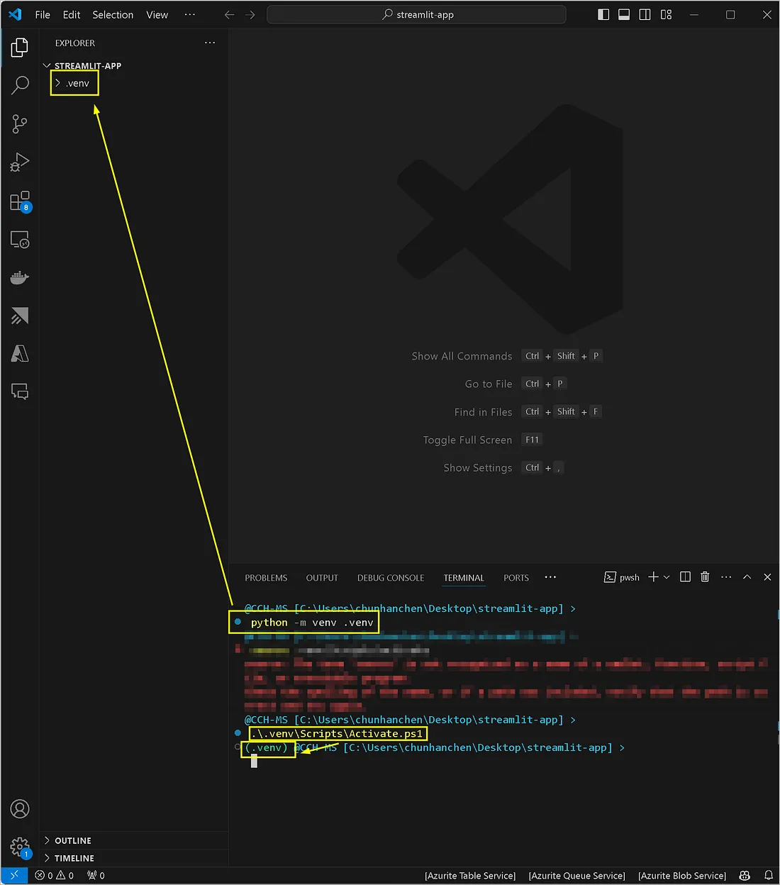
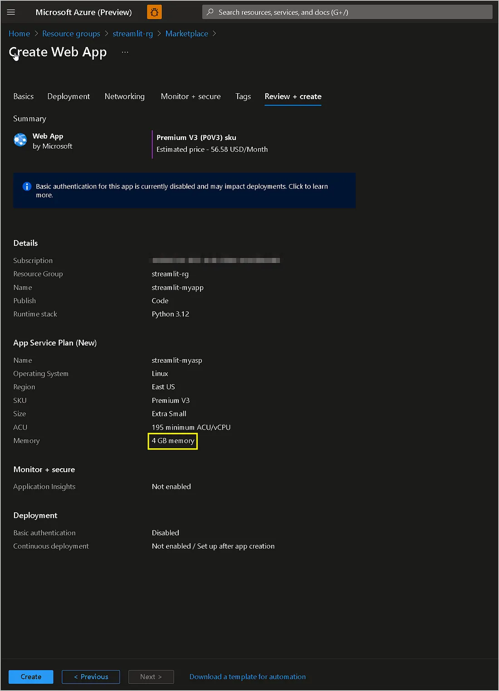
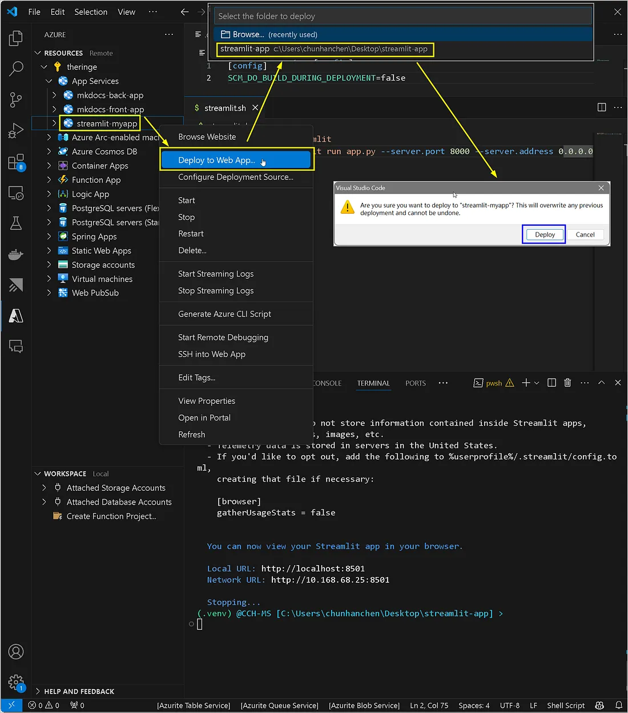
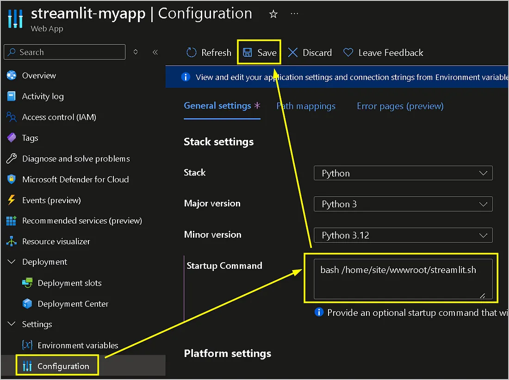
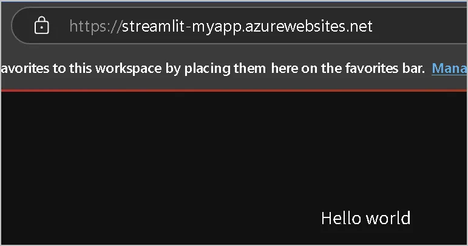

이 포스팅은 [theringe](https://techcommunity.microsoft.com/users/theringe/1357822) 님의 [Deploy Streamlit on Azure Web App](https://techcommunity.microsoft.com/blog/appsonazureblog/deploy-streamlit-on-azure-web-app/4276108) 글을 참고하여 한국 개발자들도 이해하기 쉽도록 작성하였습니다.

---

Streamlit은 오픈-소스 앱 프레임워크로 최소한의 코드 작성으로 데이터 기반 웹 어플리케이션을 작성할 수 있도록 해줍니다. 개발자로 하여금 Python 스크립트로부터 대화형 대시보드를 쉽게 작성할 수 있도록 해주기 때문에, 기계 학습 및 AI 관련 프로젝트에서 특히 인기가 높습니다.

이번 자습서에서는 로컬 및 Azure Web App에 Stramlit 어플리케이션을 배포하는 과정을 설명하고 있으며, 배포 중에 메모리 사용과 관련되어서 고려해야 하는 사항도 같이 설명이 이루어지고 있습니다.

### 목차

- 개발 환경에서 호스팅
- Azure Web App에서 호스팅
- 모듈 및 메모리 사용량
- 참조

### 개발 환경에서 호스팅

로컬의 개발 환경에서 Streamlit 어플리케이션을 실행하려면, 다음의 절차에 따라서 진행하시기 바랍니다.

### 단계 1:

VS Code에서 빈 폴더를 엽니다. 터미널을 시작하고, 다음의 명령을 입력하여 Python 가상 환경을 만들고 현재 세션을 해당 환경으로 전환합니다.



Windows

```
python -m venv .venv
.\.venv\Scripts\Activate.ps1
```

Linux

```
python -m venv .venv
source .venv/Scripts/activate
```

### 단계 2:

pip 명령을 입력하여 streamlit을 설치하고 “app.py” 파일을 작성합니다. 다음 명령을 실행하여 프로젝트를 호스팅하는 로컬 서버를 시작합니다. 브라우저에서 [http://127.0.0.1:8501](http://127.0.0.1:8501/)를 입력하면 프로제그트 페이지에 접근할 수 있습니다.

```
# Install Streamlit
pip install streamlit
# Launch server after app.py has been created
python -m streamlit run app.py
```


### Azure Web App에서 호스팅

Azure Web App에 Streamlit 애플리케이션을 배포하려면 다음의 단계를 수행합니다.

### 단계 1:

Azure에서 Linux Python Web App을 생성합니다.



### 단계 2:

VSCode를 사용하여 “streamlit.sh” 와 “.deployment”라는 두 개의 파일을, 프로젝트의 루트 디렉터리에 추가합니다.


streamlit.sh

```
pip install streamlit
python -m streamlit run app.py --server.port 8000 --server.address 0.0.0.0
```

.deployment

```
[config]
SCM_DO_BUILD_DURING_DEPLOYMENT=false
```

### 단계 3:

프로젝트의 루트 디렉터리를 방금 전에 VS Code로 작성한 Python 앱에 배포합니다.



### 단계 4:

Azure에서 Python 앱을 찾아 다음과 같이 시작 명령을 수정한 다음, 앱을 다시 시작합니다.



```
bash /home/site/wwwroot/streamlit.sh
```


### 단계 5:

프로젝트가 제대로 실행되는지 확인합니다.



### 모듈 및 메모리 사용량

Streamlit 자체는 간단한 pip 명령(pip install streamlit)으로 설치가 가능하지만, AI 및 기계 학습 라이브러리와 몇 개의 종속성을 가지고 있습니다. 이런 종속성들은 상당한 양의 메모리를 사용할 수 있는데, 특히 배포하는 동안과 Streamlit 어플리케이션을 실행할 때 많은 메모리를 사용하게 됩니다.

어플리케이션 프로세스가 예기치 않게 종료되거나, 종료 코드 137이 발생하면, 일반적으로 Web App은 사용 가능한 메모리가 부족함을 의미합니다. 이러한 경우, 더 많은 메모리를 제공하는 좀 더 높은 SKU로 업그레이드를 하여 배포와 운영에 문제가 발생되지 않도록 할 수 있습니다.


예를 들면 다음과 같습니다.


### 참조

[Azure Linux Web App and http server — Microsoft Community Hub](https://techcommunity.microsoft.com/t5/apps-on-azure-blog/azure-linux-web-app-and-http-server/ba-p/4224475)

[Deploy Mkdocs page on Azure Web App — Microsoft Community Hub](https://techcommunity.microsoft.com/t5/apps-on-azure-blog/deploy-mkdocs-page-on-azure-web-app/ba-p/4272895)

[Install Streamlit using command line — Streamlit Docs](https://docs.streamlit.io/get-started/installation/command-line)

[Troubleshoot Python function apps in Azure Functions - Microsoft Learn](https://learn.microsoft.com/en-us/azure/azure-functions/recover-python-functions?tabs=vscode%2Cbash&pivots=python-mode-decorators#troubleshoot-python-exited-with-code-137)

[python — Azure Function Exit code: 137 - Please review your requirements.txt — Stack Overflow](https://stackoverflow.com/questions/77661379/azure-function-exit-code-137-please-review-your-requirements-txt)

- 2024년 10월 21일 업데이트 됨.
- 2024년 11월 11일 번역 함. (by [JYSEONG(MSFT)](https://techcommunity.microsoft.com/users/ji%20yong%20seong/219866) / [GitHub](https://github.com/jiyongseong))