이 포스팅은 [Adam Saxton](https://blog.fabric.microsoft.com/en-us/blog/author/Adam%20Saxton)님의 [Fabric November 2024 Feature Summary](https://blog.fabric.microsoft.com/en-us/blog/fabric-november-2024-feature-summary) 글을 한글로 번역한 글입니다.

---

1. [Unified Data platform Fabric 기능 (1/4): 인증, Copilot과 AI, 리포팅](/azurekorea/udp-fabric-function1)
2. Unified Data platform Fabric 기능 (2/4): 모델링, 개발자+API, 시각화, 플랫폼
3. [Unified Data platform Fabric 기능 (3/4): OneLake, 미러링, 데이터베이스, 데이터 웨어하우스, 데이터 엔지니어링, 데이터 사이언스](/azurekorea/udp-fabric-function3)
4. [Unified Data platform Fabric 기능 (4/4): 실시간 인텔리전스, 데이터 팩토리](/azurekorea/udp-fabric-function4)

---

**목차**

- 모델링 (Modeling)
- 개발자 + API (Developers + API)
- 시각화 (Visualizations)
- 플랫폼 (Platform)

---

### **모델링** (Modeling)

**DAX 쿼리 뷰 빠른 쿼리(DAX query view quick queries)에서 새 측정값 정의**

DAX 쿼리 뷰에서 측정값을 만드는 것이 훨씬 더 쉬워졌습니다. 데이터 패널의 테이블, 열 또는 기타 항목의 상황에 맞는 메뉴에서 사용할 수 있는 **빠른 쿼리(quick quries)**옵션에 이제 **새 측정값 정의**가 포함됩니다.

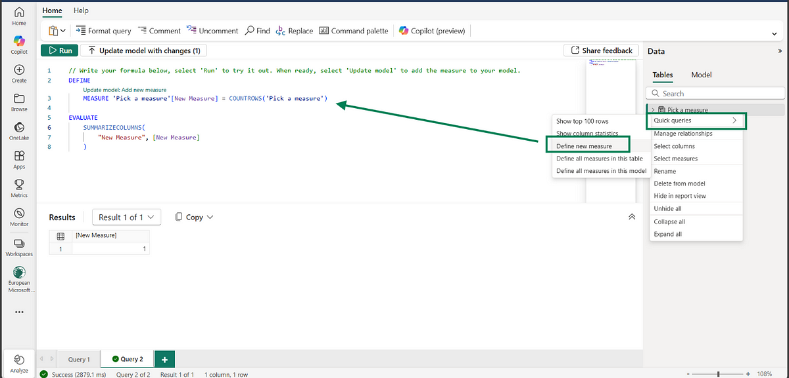

이렇게 하면 쿼리 범위 측정값 DAX 수식을 만들 수 있도록 구문이 시작된 새 쿼리 테이블이 만들어지고, 사용자 고유의 DAX 수식을 추가할 준비가 된 다음, 준비가 되면 실행할 수 있습니다.

DAX 쿼리 뷰와 DAX 쿼리 뷰에서 사용할 수 있는 기타 빠른 쿼리에 대해 자세히 알아보기 - [DAX query view Power BI - Microsoft Learn](https://learn.microsoft.com/power-bi/transform-model/dax-query-view#quick-queries).

**메트릭 세트(Metric sets): Fabric의 메트릭 관리의 새로운 시대 (Preview)**

메트릭 집합의 미리 보기는 이제 서비스와 데스크톱 모두에서 공식적으로 사용할 수 있습니다. 이는 조직이 메트릭을 관리하고 사용하는 방식을 재정의하기 위해 설계된 혁신적인 새로운 기능입니다.

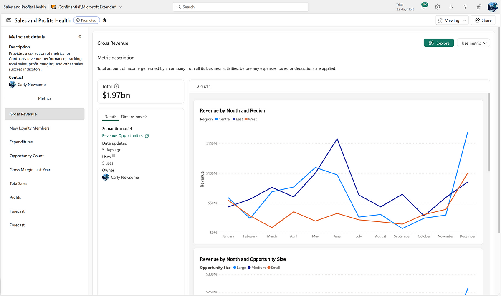

패브릭 메트릭 계층(Fabric Metric Layer)의 홈 베이스는 Power BI의 메트릭 허브이며, 메트릭 관리를 간소화하고, 일관성을 보장하고, 조직 전체에서 데이터에 대한 신뢰를 조성하는 강력한 기능을 제공합니다.

측정항목 집합은 소비자가 찾아볼 수 있고 작성자가 보고서에 사용할 수 있습니다. 시각화된 메트릭과 데이터 탐색으로 구성된 서비스 환경을 통해 최종 사용자는 데이터 질문에 답할 수 있습니다. 데스크톱 환경을 통해 작성자는 가장 신뢰할 수 있는 메트릭에 연결하여 보고서에서 시각화할 수 있습니다.

**주요 특징들:**

- **선별된 메트릭 컬렉션:** 메트릭 집합은 소스 시맨틱 모델에 대한 측정값 포인터 컬렉션 역할을 하며 주요 차원을 포함하므로 최종 사용자와 작성자 모두 메트릭을 그룹화하거나 사용하는 방법을 명확하게 이해할 수 있습니다.
- **풍부한 소비 경험:** 사용자는 메트릭 세트 자체에서 메트릭을 탐색하고 사용할 수 있으므로 심층적인 통찰력과 이해를 얻을 수 있습니다. Copilot 요약 및 여러 시각적 개체를 사용하여 사용자가 스크롤하여 몇 초 만에 데이터에서 인사이트로 이동할 수 있습니다.
- **효율성**: 소비자는 더 이상 질문에 답변하거나 특정 요구 사항에 맞는 사용자 지정 보고서를 작성하기 위해 보고서 작성자에게 의존할 필요가 없습니다. 소비자는 Explore 대화 상자를 활용하여 차원이 메트릭에 대해 특별히 선별되었기 때문에 데이터 패널의 모든 것이 ‘그냥 작동’하는 환경에서 지정된 메트릭을 더 자세히 살펴볼 수 있습니다.
- **발견 가능성 및 재사용:소비자 -** 메트릭은 검색을 통해 검색할 수 있으며, 메트릭 집합은 사용자가 신뢰할 수 있도록 다른 아티팩트와 마찬가지로 홍보, 보증, 인증할 수 있습니다. 또한 소비자는 탐색 대화 상자를 활용하여 차원이 지표에 대해 특별히 선별되었기 때문에 데이터 패널의 모든 것이 ‘그냥 작동’하는 안전한 환경에서 지정된 지표를 더 자세히 살펴볼 수 있습니다.***작성자 -* 데스크톱의 메트릭:** 데스크톱의 11월 릴리스에서는 데스크톱 리포팅에 연결하여 사용할 수 있는 메트릭 세트를 사용할 수 있습니다. OneLake 데이터 허브/데이터 카탈로그를 통해 모델에 포함하려는 메트릭에 액세스하고 연결할 수 있습니다. 이렇게 하면 보고서에서 사용 가능한 가장 최신의 신뢰할 수 있는 측정값을 사용할 수 있습니다.

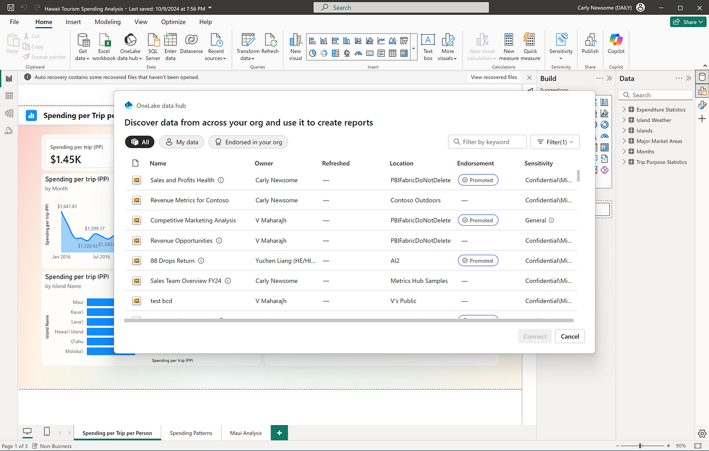

다가오는 마일스톤을 계속 지켜봐 주시고 Metrics Hub를 통해 메트릭 관리 경험을 혁신할 준비를 하세요!

**Excel에서 계산 그룹 및 형식 문자열이 있는 모델에 대한 성능 향상**

계산 그룹 및 형식 문자열이 있는 모델에 대한 MDX 쿼리의 상당한 성능 향상을 발표하게 되어 기쁩니다!

최신 변경 사항은 다음 중 하나 또는 둘 다를 포함하는 모델에 대한 Excel의 분석에서 작업의 성능과 안정성을 크게 향상시켜야 합니다.

1. 측정값에 대한 동적 형식 문자열
2. 형식 문자열이 있는 계산된 항목

이는 다른 MDX 시나리오에도 적용되므로 MDX를 사용하여 위와 같은 시맨틱틱 모델을 쿼리하는 모든 클라이언트 응용 프로그램은 동일한 성능 이점을 경험하게 됩니다.

**DLP 정책은 시맨틱 모델(Semantic model)에 대한 액세스 작업을 제한합니다 (Preview)**

이제 Fabric에 대한 Purview 데이터 손실 방지 정책을 통해 관리자는 시맨틱 모델(semantic model)의 데이터 내에서 감지된 중요한 정보를 기반으로 접근을 제한할 수 있습니다.

Purview 규정 준수 관리자가 Fabric에 대한 DLP 정책을 구성할 때 이제 중요한 정보를 감지하면 데이터에 대한 접근을 차단할지 여부를 결정할 수 있습니다. 게스트 사용자가 데이터에 접근하지 못하도록 하거나 데이터 관리자를 제외한 모든 사용자의 접근을 제한할 수 있습니다.

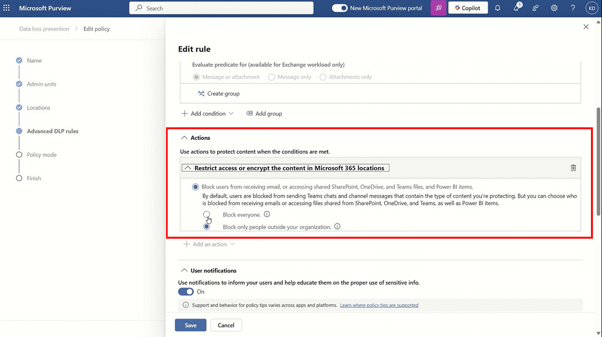

패브릭에서 데이터 관리자는 데이터가 제한되어 있다는 표시를 볼 수 있으며, 규정 준수 관리자에게 문제를 보고하거나 정책 규칙을 재정의하는 등의 조치를 취할 수 있습니다.

이제 이 정보를 볼 수 없도록 제한된 게스트 사용자와 같은 소비자에게도 조직 정책에 따라 접근 권한이 취소되었음을 알리는 표시가 표시되며, 해당 콘텐츠를 보려고 하면 볼 수 없습니다.

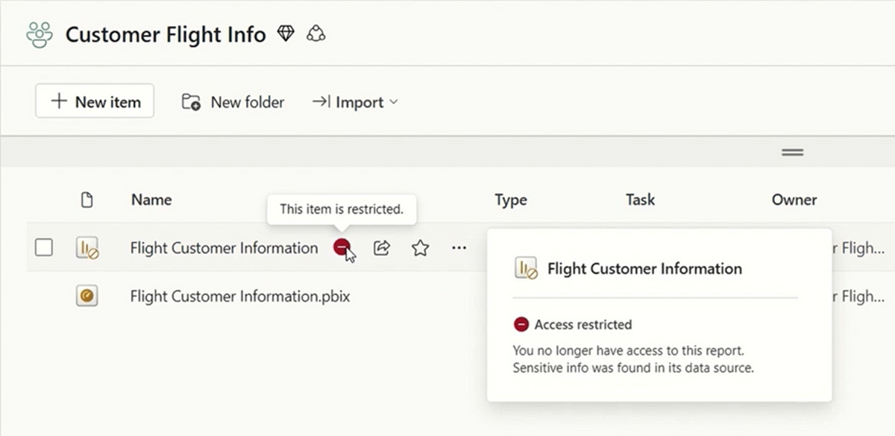

접근 제한 작업을 통해 규정 준수 관리자는 Fabric 테넌트에서 민감한 데이터를 발견할 때 추가 제어와 시행(enforcement)을 할 수 있습니다.

**새 TMDL 확장을 사용한 Visual Studio Code의 시맨틱(Semantic) 모델링 (Preview)**

Power BI 개발자를 위한 공개 미리 보기의 새로운 [TMDL(Tabular Model Definition Language)](https://learn.microsoft.com/analysis-services/tmdl/tmdl-overview?view=asallproducts-allversions) 확장은 TMDL 편집 환경을 개선하여 시맨틱 모델 개발을 향상시킵니다.

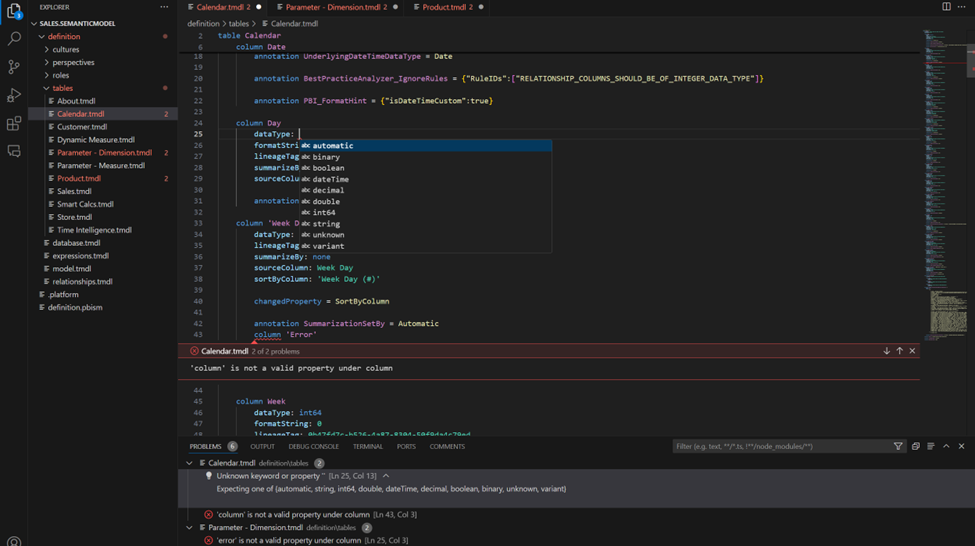

TMDL은 모델 표현을 읽고, 편집하고, 협업하고, 재사용할 수 있도록 설계되었습니다. TMDL 확장은 풍부한 개발 환경을 제공하는 몇 가지 주요 기능을 통해 TMDL의 이러한 강점을 기반으로 합니다.

- **시맨틱 하이라이팅(Semantic Highlighting**): 의미에 따라 코드 부분에 다양한 색상을 적용하여 가독성을 향상시켜 TMDL의 구조와 기능을 간략하게 쉽게 이해할 수 있도록 합니다.
- **오류 진단**: 오류를 명확하게 강조 표시하고 해결 방법을 안내하는 자세한 메시지를 제공하여 코드의 문제를 식별하고 해결하는 데 도움이 됩니다.
- **자동 완성**: 입력하는 동안 지능적인 제안을 제공하여 작업 속도를 높이고, 오류 가능성을 줄이고, 코드 옵션을 이해하는 데 도움을 줍니다.
- **더 많은 기능이 곧 제공될 예정입니다!**

Visual Studio Code에서 작업하면 다음과 같은 플랫폼의 다른 환상적인 도구도 활용할 수 있습니다.

- **소스 제어**: Git과 원활하게 통합되어 변경 사항을 추적하고, 팀 구성원과 협업하고, 시맨틱 모델의 버전을 제어할 수 있습니다.
- **GitHub Copilot**: 코드를 더 빠르게 작성하고, 자연어에서 TMDL을 생성하고, 모델에 고급 대량 편집을 빠르게 적용하는 데 도움이 되는 AI 코딩 도우미입니다.

[Visual Studio Marketplace에서 TMDL 확장을 다운로드](https://marketplace.visualstudio.com/items?itemName=analysis-services.TMDL)하고 바로 시맨틱 모델 개발을 가속화할 수 있는 방법을 알아보세요.

**모델링 데모**

### **개발자 + API** (Developers + APIs)

**Fabric Git: 시맨틱 모델 내보내기를 위한 TMDL 형식**

팀 협업을 향상시키는 개발자 친화적인 환경을 제공하기 위한 노력의 일환으로 [Fabric Git 통합](https://learn.microsoft.com/fabric/cicd/git-integration/intro-to-git-integration?tabs=azure-devops)은 앞으로 며칠 내에 시맨틱 모델 정의를 [TMDL(Tabular Model Definition Language)](https://learn.microsoft.com/analysis-services/tmdl/tmdl-overview)로 내보내기 시작할 예정입니다 . 이 변경으로 단일 JSON 파일(model.bim)의 사용이 TMSL(Tabular Model Scripting Language)로 바뀝니다.

폴더 표현과 읽을 수 있는 형식으로 인해 TMDL은 크게 향상된 소스 제어 환경을 제공합니다. 이 향상된 기능은 커밋 기록을 쉽게 추적할 수 있도록 하고 특히 TMSL과 비교할 때 병합 충돌의 해결을 단순화합니다.

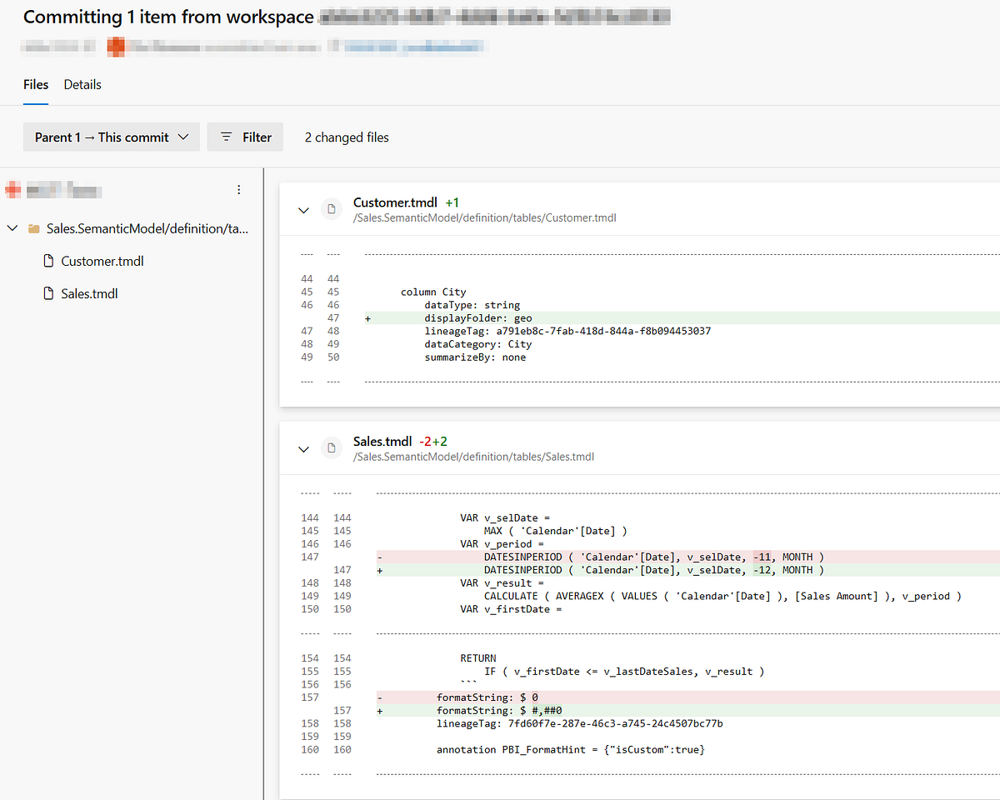

필요한 경우 [시맨틱 모델 정의 가져오기 REST API](https://learn.microsoft.com/rest/api/fabric/semanticmodel/items/get-semantic-model-definition?tabs=HTTP) 또는 [XMLA 엔드포인트](https://learn.microsoft.com/power-bi/enterprise/service-premium-connect-tools)를 사용하여 시맨틱 모델의 TMSL 표현을 계속 가져올 수 있습니다.

**시맨틱 모델 클라이언트 라이브러리 업데이트**

Power BI 시맨틱 모델에 연결하는 Excel 또는 Power BI Desktop과 같은 클라이언트 애플리케이션은 이제 레거시 연결 문자열(예: pbiazure://*)을 [XMLA 엔드포인트](https://learn.microsoft.com/power-bi/enterprise/service-premium-connect-tools#xmla-endpoints%5C)로 자동 변환하여 성능 향상의 이점을 누릴 수 있습니다. 요청은 XMLA 엔드포인트를 통해 직접 라우팅되므로 중간 단계가 줄어들고 요청 처리 속도가 빨라지며 오류 가능성이 줄어듭니다.

방화벽 규칙을 업데이트해야 할 수 있습니다. 자세한 내용은 [문제 해결 문서](https://learn.microsoft.com/power-bi/enterprise/troubleshoot-xmla-endpoint#live-connected-semantic-model-cannot-be-loaded)를 참조하하세요요.

Power BI 시맨틱 모델에 연결할 때 최적의 성능을 위해 최신 [분석 서비스 클라이언트 라이브러리를](https://learn.microsoft.com/analysis-services/client-libraries) 사용하고 있는지 확인하세요.

---

### 시각화 (Visualizations)

**Powerviz의 KPI**

Powerviz의 [KPI](https://appsource.microsoft.com/product/power-bi-visuals/truvizinc1674781244292.kpi-by-powerviz?tab=Overview)(Power-BI 인증)는 사용자가 눈길을 끄는 고급 KPI(핵심 성과 지표)를 시각화하고 만들 수 있는 Power BI를 위한 강력한 사용자 지정 시각적 개체입니다.

**주요 특징들:**

[**100개 이상의 사전 구축된 KPI 템플릿**](https://powerviz.ai/kpi-templates), 시각적 개체 및 자체 템플릿 생성 옵션.

**디자인:**

- 16개의 레이어와 40+ 차트 변형으로 인포그래픽 디자인을 만들 수 있습니다.
- 풍부한 사용자 지정, 서식 옵션 및 색상 스타일.
- 계층에서 KPI 개체를 만들고 차트, 메트릭과 아이콘을 결합합니다.

**분석:**

- **데이터 시각화 유형:**범주형: 범주 간에 값을 비교합니다.비교: 값 간의 차이를 분석합니다.컴포지션: 전체의 일부를 표시합니다.진행: 시간 경과에 따른 추세를 표시합니다.실제 대 목표값: 목표값과 실제 값을 비교합니다.
- **서식 기능:** 시각적 개체에 대한 순위, 정렬, 축, 숫자 서식, 도구 설명, 눈금선, 데이터 레이블과 계열 레이블을 구성합니다.
- **IBCS 테마 지원:** 편차 막대, 시리즈 레이블과 일관된 색 구성표가 포함됩니다.
- **Small Multiples:** 모든 차트 유형 지원 - 고정형/유동현, 변경 차트 기능 포함.

다른 기능으로는 다중 카테고리 비교, 하이라이트 값, 레이어 유연성 등이 있습니다.

**비즈니스 사용 사례:**

판매 성과, 재무 건전성, 고객 만족도.

- [**KPI Visual](https://appsource.microsoft.com/product/power-bi-visuals/truvizinc1674781244292.kpi-by-powerviz?tab=Overview)을 무료로 사용해 보세요!**
- [**시각적 개체](https://docs.powerviz.ai/powerviz/kpi/introduction)의 모든 기능을 확인하세요.**
- **단계별 [지침](https://docs.powerviz.ai/powerviz/kpi/introduction)**
- **YouTube 동영상 [링크](https://youtu.be/mCTBKDGpMrs?si=NaTX_Bpt8n2Y-eJw)**
- **시각적 개체에 대해 [자세히 알아보기](https://powerviz.ai/)**
- [**Powerviz 팔로우 하기**](https://www.linkedin.com/company/powerviz-powerbi-custom-visuals/)

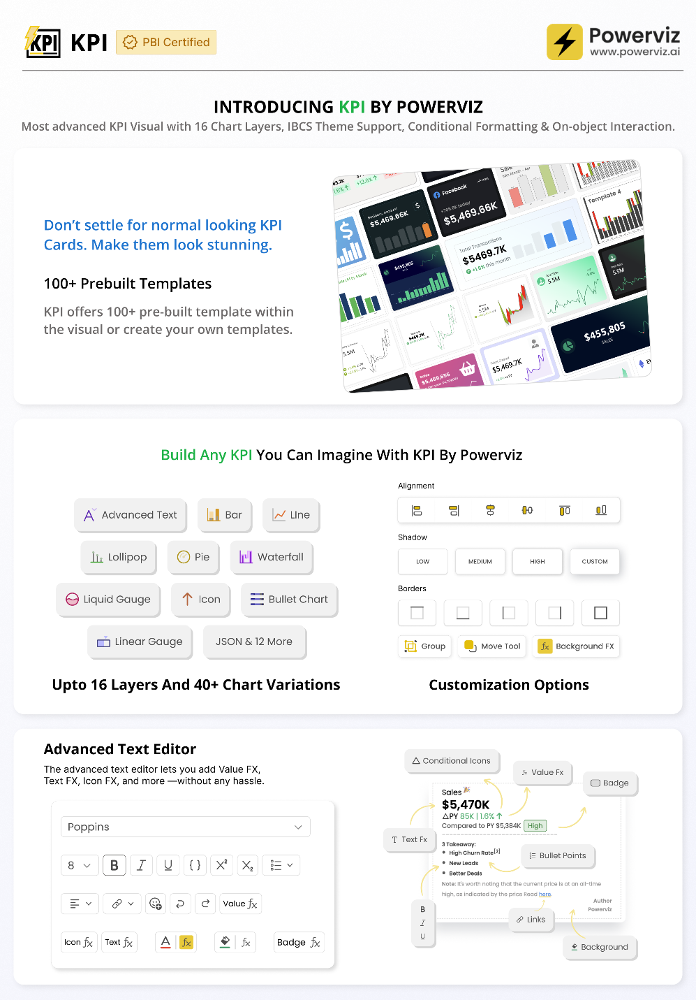

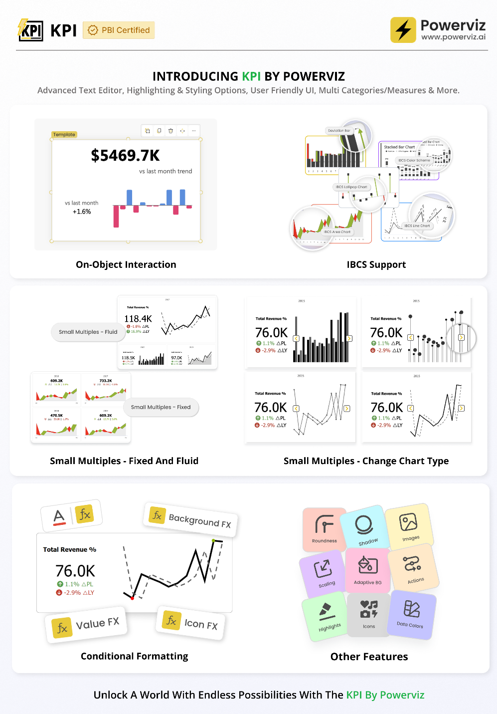

**Zebra BI 테이블 7.3**

[Zebra BI Tables 7.3](https://appsource.microsoft.com/product/power-bi-visuals/zebrabi1634048186304.zebra-bi-tables?tab=Overview)을 사용하면 서식 있는 텍스트 편집기(rich text editor)의 강력한 기능을 활용하여 놀라운 효율성으로 시각적 주석을 작성하고 업데이트할 수 있습니다. 이 기능을 사용하면 텍스트 스타일과 서식을 지정하고 글머리 기호를 추가하고 하이퍼링크를 삽입할 수 있기에 여러 이해관계자가 관심을 가질 만한 보고서와 문서에 대한 링크를 남기는 것만으로 팀 전체가 보고서를 원스톱으로 이용할 수 있습니다. 잘 구조화된 댓글은 보고서 내 커뮤니케이션을 간소화하여 독자들이 핵심 인사이트를 빠르게 파악할 수 있도록 도와줍니다.

중요한 것을 강조하고 왜 중요한지 설명함으로써 청중을 중요한 정보로 안내하고 명확성과 이해를 촉진합니다. 이러한 명확성은 시간이 제한되는 경우가 많고 전략적 결정을 신속하게 내려야 하는 모든 비즈니스 환경에서 매우 중요합니다. 효과적인 주석은 실행 가능한 통찰력을 생성하는 데 필요한 시간과 노력을 줄여 궁극적으로 보고서 품질과 효율성을 향상시킵니다.

사려 깊은 논평을 통합하면 표준 보고서를 의사 결정을 위한 강력한 도구로 바꿀 수 있습니다. Zebra BI Tables를 사용하면 의미 있는 댓글로 보고서를 개선하는 것이 그 어느 때보다 쉬워지므로 메시지를 보다 효과적으로 전달하고 청중의 참여를 더 잘 유도할 수 있습니다.

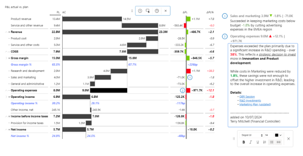

Zebra BI Tables 7.3의 서식 있는 텍스트 편집기에 대한 비디오 예제에서 [자세히 알아보세요](https://www.youtube.com/watch?v=m2rnuonCVaI).

**ZoomCharts의 Waterfall PRO: 금융 데이터를 위한 가장 인터랙티브한 폭포 비주얼**

ZoomCharts의 Waterfall PRO는 놀라운 사용자 경험과 사용자 정의 기능 및 강력한 기능을 결합하여 금융 데이터를 시각화하는 가장 사용자 친화적이고 통찰력 있는 방법입니다. 또한 여러 시각적 개체에서 데이터를 원활하게 교차 필터링하여 진정한 대화형 Power BI 보고서를 만들 수 있습니다.

**주요 기능 :**

- **사용자 지정 시퀀스:** Sequence *필드를* 사용하여 열 순서를 완전히 제어할 수 있습니다.
- **드릴다운:** 여러 범주를 사용하여 폭포 차트에서 직접 드릴다운 할 수 있습니다.
- **자동 부분합 계산:** 데이터에 부분합이 없는 경우에도 부분합을 표시합니다.
- **풍부한 사용자 정의:** X 및 Y 축, 범례, 도구 설명 내용을 사용자 지정하고 양수, 음수, 합계 열에 대한 모양 설정을 개별적으로 조정합니다.
- **임계값:** 최대 4개의 상수와 동적 임계값을 선 또는 영역으로 표시합니다.
- **교차 차트 필터링:** 여러 시각적 개체에서 데이터를 동적으로 필터링합니다.

[**AppSource에서 Drill Down Waterfall PRO 받기**](https://appsource.microsoft.com/product/power-bi-visuals/WA200000767?tab=Overview)

[**제품 페이지 방문**](https://zoomcharts.com/en/microsoft-power-bi-custom-visuals/custom-visuals/drill-down-waterfall-visual/?utm_source=microsoftcom&utm_medium=ms_blog&utm_campaign=feature_summary_november_2024&utm_term=product-page)

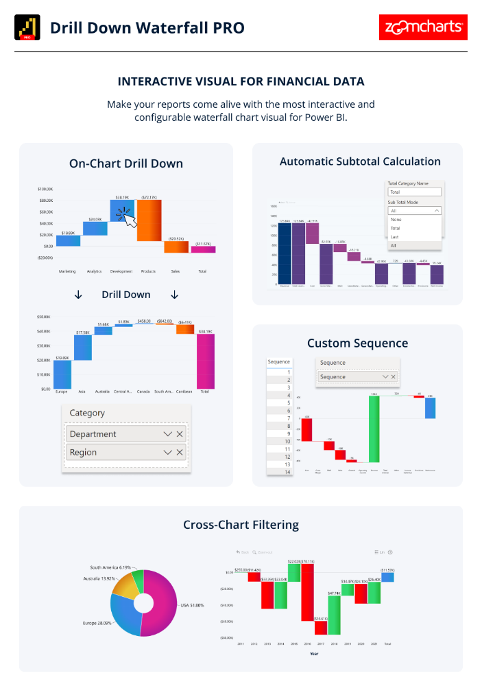

**Nova Silva의 롤리팝(Lollipop) 막대 차트**

여러분의 소중한 피드백을 계속 받을 수 있게 되어 기쁘며, 비주얼 개선에 도움을 주신 여러분의 기여에 감사드립니다.

Power BI에 대한 최신 롤리팝 막대 차트 릴리즈에는 많은 요청이 있었던 기능인 보조 마커 기능이 추가되었습니다. 이렇게 하면 기본 값 뿐만 아니라 보조 값 마커를 포함하여 컨텍스트를 추가할 수 있습니다.

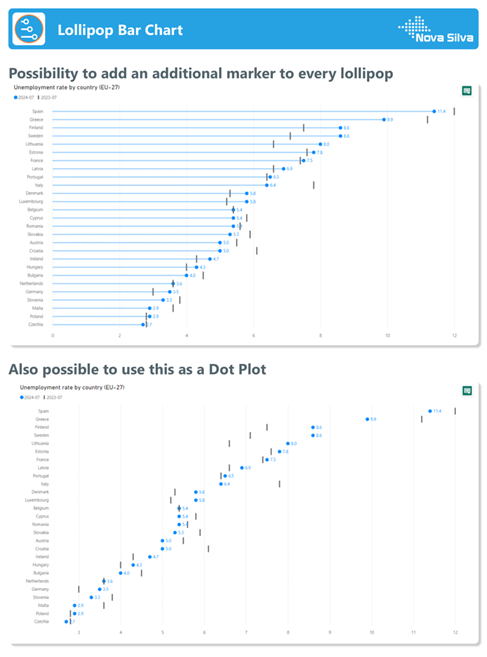

이 새로운 기능은 두 번째 이미지와 같이 연결 막대를 제거하여 롤리팝 막대차트를 도트 플롯으로 변환하는 것과 같은 다른 모든 롤리팝 막대차트 기능과 원활하게 통합됩니다. 이렇게 하면 숫자 눈금을 0에서 시작할 필요가 없기에 값과 그 차이점을 더 자세히 살펴볼 수 있습니다.

표준 막대 차트는 여러 범주에서 단일 측정값을 비교하는 데 유용하지만 더 큰 데이터 세트(10개 이상의 범주)로 인해 복잡해질 수 있습니다. 색상이 지정된 막대가 차트 공간을 너무 많이 채울 수도 있습니다. 이 문제를 해결하기 위해 롤리팝 막대 차트는 더 깔끔하고 효율적인 대안을 제공하며, 명확성을 유지하면서 혼란을 최소화 합니다.

지금 [AppSource](https://appsource.microsoft.com/product/power-bi-visuals/WA200002280?tab=Overview)에서 다운로드하여 자신의 데이터에 대해 롤리팝 막대 차트를 무료로 사용해 보세요.

질문이나 의견이 있으십니까? [https://visuals.novasilva.com/](https://visuals.novasilva.com/?mspbblg=2411) 에서 확인하세요.

**판매 속도 차트**

판매 속도 차트는 특정 국가의 제품 판매와 수익성을 분석하기 위한 고유한 도구입니다. 원형 차트, 바늘과 색상 코딩의 조합을 사용하여 주요 메트릭을 시각적으로 나타냅니다.

**주요 특징들:**

- **바늘:** 길이는 판매 비율을 나타내고 너비는 이익 마진을 나타냅니다.
- **파이 및 원 크기:** 한 국가의 전체 현재 매출을 반영합니다.
- **색상 코딩:** 녹색(높은 이익), 노란색(보통), 빨간색(낮은 이익).
- **판매 추세 점:** 회색(데이터 없음), 빨간색(매출 감소), 녹색(매출 증가).

**혜택:**

- **시각적 명확성:** 이해하기 쉬운 데이터 표현.
- **동적 및 확장성:** 대규모 데이터 세트를 처리하고 화면 크기에 맞게 조정됩니다.
- **대화형 기능:** 툴팁은 세부 정보를 표시하고 프리미엄 옵션은 필터링 및 로고 제거를 제공합니다.

**사용 사례:**

- 기업은 주요 판매 지역과 개선이 필요한 영역을 식별할 수 있습니다.
- 재무 분석가는 고수익 및 저수익 기여자를 정확히 찾아낼 수 있습니다.

**메모:**

자세한 내용 확인은 원하시면 [웹 사이트](https://innovationalofficesolution.com/power-bi-charts/sales-velocity-chart)를 방문하세요.

[짧은 동영상을 시청하세요](https://www.youtube.com/watch?v=JrLOUDcSNfc).

이 판매 속도 차트 [설명서](https://innovationalofficesolution.com/power-bi-charts/sales-velocity-chart)를 읽어보세요.

문의사항, 질문이나 요청이 있으시면 저희에게 [메일](mailto:admin@innovationalofficesolution.com)을 보내주세요.

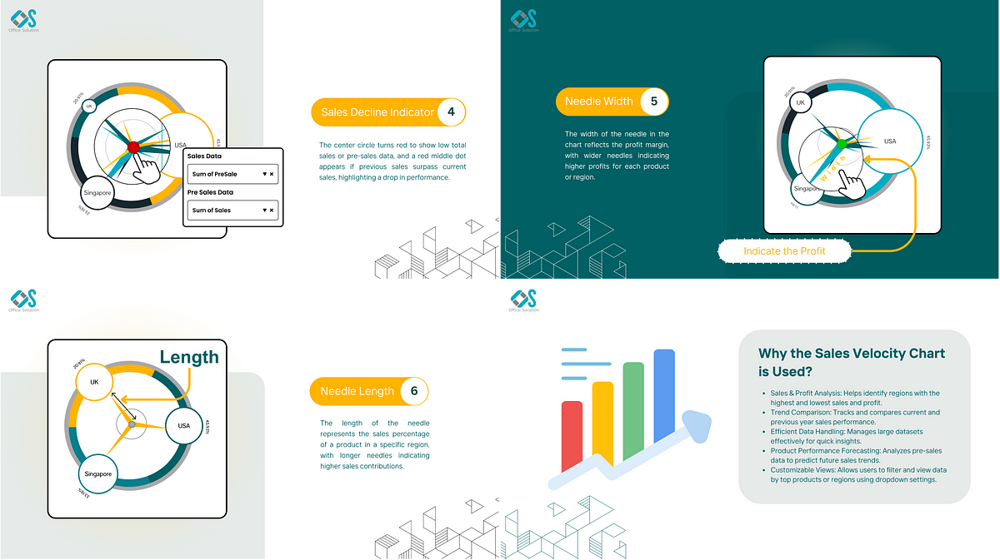

**신간 : Microsoft Power BI를 사용한 데이터 시각화**

Alex Kolokolov와 Maxim Zelensky가 공동 집필한 신간 ‘Data Visualization with Microsoft Power BI’는 Power BI에 대한 **DataViz 모범 사례**를 제공하는 첫 번째 책입니다.

- 다양한 차트 유형에 대한 25개의 챕터.
- 40개의 시각적 개체: AppSource 갤러리에서 기본에서 고급까지.
- 뛰어난 품질의 400 컬러 페이지.

이 책은 비기술 전문가와 숙련된 데이터 분석가에게 적합하며 3부로 구성되어 있습니다.

1. **클래식 시각적 개체 -** 작성자는 기본 분석 유형에 대한 차트를 선택하고 일반적인 실수를 피하는 방법을 설명합니다. 인터랙션을 설정하고 대시보드에 시각적 개체를 함께 배치하는 방법.
2. **신뢰할 수 있는 고급 비주얼 -** 폭포 및 불릿 차트, 간트, 토네이도, 퍼널, 산키(Sankey)등에 대한 다양한 옵션 및 데이터 요구 사항
3. **위험한 고급 비주얼** — 일반 사용자를 혼란스럽게 할 수 있는 ‘눈길을 끄는’ 차트입니다. 사용 사례를 설명하고 더 간단한 대안을 제공합니다.

도서 특징:

- 차트에 대한 아름다운 예, 특정 사용 사례.
- 앱에서 설정하는 방법에 대한 단계별 가이드.
- 데이터 준비 팁과 요령.
- 학습 자료를 통합하기 위한 퀴즈.

> “사람들이 Power BI를 단순한 보고 이상의 용도로 사용하도록 영감을 주고 싶습니다. 멋진 대시보드를 만들고 대화형 데이터 스토리를 전달하기를 원합니다!” - Alex Kolokolov
> 

이 책은 현재 [아마존](https://a.co/d/62X2hui)에서 구입할 수 있습니다[.](https://a.co/d/62X2hui)

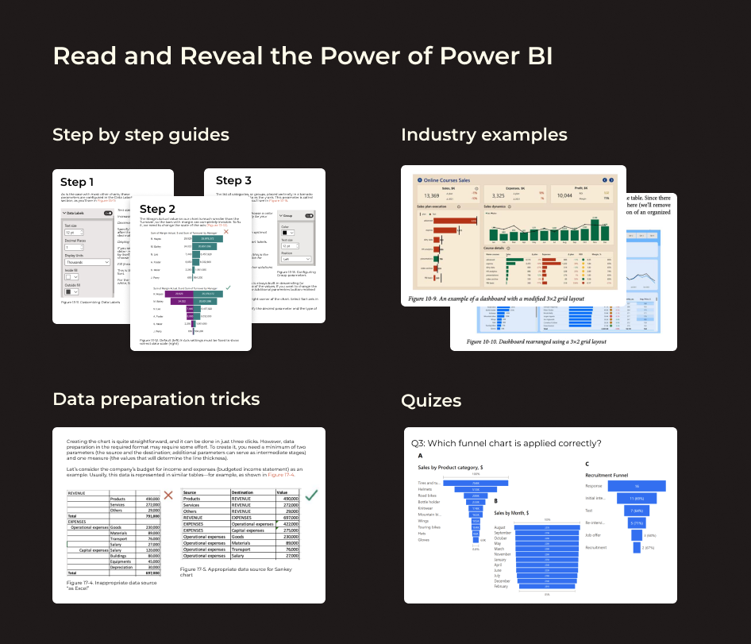

### 기타

**Power BI 서비스에서 페이지를 매긴 보고서를 볼 때 Power BI 언어 설정 지원**

지역화 된 페이지를 매긴 보고서가 Power BI 서비스에 게시되면 보고서 뷰어는 이제 Power BI/패브릭 설정 페이지에서 선택한 기본 설정 언어로 보고서를 볼 수 있습니다. 이전에는 보고서 렌더링이 서버 설정에 따라 결정되었습니다.

[Power BI 서비스에서 지역화된 페이지를 매긴 보고서를 보는 방법에 대해 자세히 알아보세요.](https://learn.microsoft.com/en-us/power-bi/paginated-reports/paginated-localization)

---

### **플랫폼** (Platform)

**OneLake 카탈로그 소개**

OneLake 카탈로그는 OneLake 데이터 허브의 차세대 진화 버전 입니다. 데이터 엔지니어, 데이터 사이언티스트, 분석가, 의사 결정권자가 직관적인 단일 위치에서 모든 데이터를 찾아, 관리 및 제어 할 수 있는 통합 환경을 제공합니다. 이제 OneLake 카탈로그에는 대시보드와 보고서(11월 말까지 사용 가능), 데이터 흐름, 파이프라인 등과 같은 Fabric의 다양한 항목 유형이 포함됩니다.

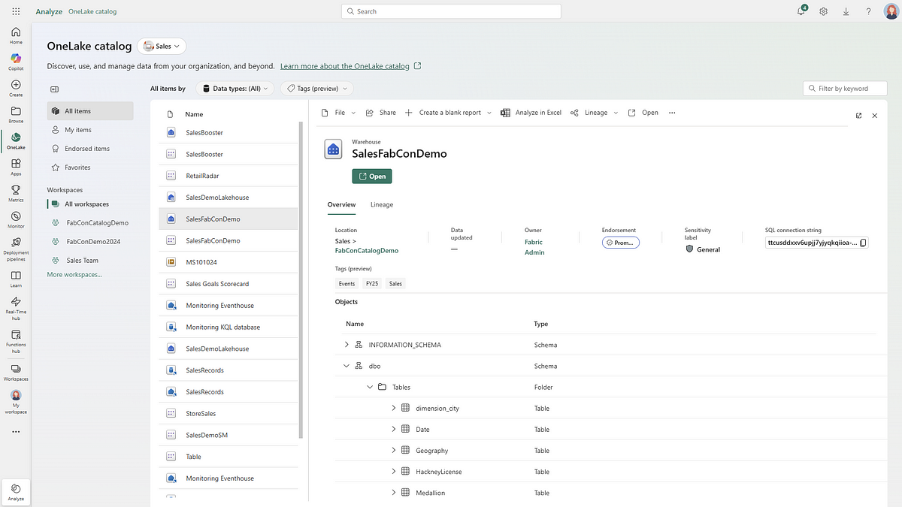

**협업을 위한 간소화**

OneLake 카탈로그는 사용자가 특정 항목을 효율적으로 찾을 수 있도록 필터링 기능을 제공합니다. 현업 부서 사용자는 보고서와 대시보드를 발견하여 질문에 대한 답을 얻을 수 있으며, 분석가는 데이터 항목과 프로세스를 탐색하여 심층적인 분석을 수행할 수 있습니다.

**현재 위치 데이터 관리**

OneLake 카탈로그를 사용하면 카탈로그 자체 내에서 직접 모든 항목을 보고 관리할 수 있기에 탐색이 단순화되고 효율성이 향상됩니다. 이러한 상황별 관리를 통해 데이터 에코시스템을 보다 효과적으로 처리할 수 있습니다.

**심층적인 항목 메타데이터**

OneLake 카탈로그의 항목을 클릭하면 설명, 태그, 보증, 민감도 레이블을 포함한 관련 메타데이터가 표시됩니다. 또한 카탈로그는 데이터 항목, 스키마 및 개체(예: 웨어하우스 테이블과 뷰)에 대한 세분화된 보기를 제공하여 더 나은 통찰력과 제어를 가능하게 합니다.

**통합 관리 및 거버넌스**

OneLake 카탈로그는 단일 인터페이스 내에서 교차 워크스페이스 간 아이템 계보(Lineage), 액세스 권한과 실시간 활동 모니터링과 같은 중요한 기능을 결합 합니다. 이 통합 접근 방식을 사용하면 모든 사용자가 거버넌스 및 관리 작업에 더 쉽게 접근 할 수 있습니다.

**지금 바로 카탈로그를 살펴보세요**

OneLake 카탈로그를 살펴보고 Fabric에서 데이터 관리의 미래를 경험해 보세요. OneLake 카탈로그는 사용자가 패브릭 내의 데이터에 연결하는 40개 이상의 시나리오에서 사용할 수 있습니다. 또한 Power BI Desktop과 Azure Ibiza와 같은 패브릭 서비스 애플리케이션 외부의 서비스 및 애플리케이션에서도 액세스할 수 있으며, 곧 Excel로 확장할 계획입니다. 이 업데이트에 대해 자세히 알아보려면 카탈로그의 모든 기능과 이점을 자세히 다루는 [자세한 정보](https://aka.ms/OneLakecatalogNov24Blog)를 확인해 보세요.

**테넌트 전환기(Tenant switcher) 제어**

이제 패브릭 포털에서 테넌트 전환기를 사용할 수 있습니다. 둘 이상의 Fabric 테넌트에 액세스할 수 있는 사용자는 Fabric 포털의 오른쪽 상단에 있는 계정 관리자에서 직접 테넌트 간에 쉽게 전환할 수 있습니다. 이는 Power BI 환경의 홈페이지에서 찾을 수 있는 기존 외부 조직에서(From External Orgs) 탭에 추가됩니다.

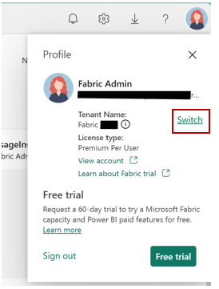

**Microsoft 패브릭 REST API와 GitHub 통합 자동화**

GitHub와 Git 통합을 위한 새로운 REST API를 소개합니다! 이러한 API를 사용하면 GitHub에 연결, 연결 세부 정보 검색, 연결된 GitHub 리포지토리에 대한 변경 사항 커밋, 리포지토리에서 업데이트 등과 같은 Git 통합 작업을 자동화할 수 있습니다.

[API에 대한 자세한 내용](https://learn.microsoft.com/fabric/cicd/git-integration/git-automation)과 사용 [가능한 코드 샘플](https://github.com/microsoft/fabric-samples/tree/main/features-samples/git-integration)을 찾아보세요.

**소스 제어 창에서 브랜치 전환**

이제 소스 제어 창을 통해 연결된 Git 브랜치를 직접 전환할 수 있습니다. 이제 모든 분기 작업을 브랜치 탭 내의 한 곳에서 접근 할 수 있습니다.

이를 통해 다음을 수행할 수 있습니다.

- **새 워크스페이스로 브랜치**를 만들어, ****새로운 연결된 브랜치가 있는 새 워크스페이스을 만듭니다.
- **체크아웃 브랜치(checkout branch)**를 사용하여 현재 작업 영역 상태를 유지하면서 새 브랜치를 만들 수 있으며, 이는 충돌을 해결하는 데 유용합니다.
- **브랜치 전환**을 사용하여 현재 워크스페이스 컨텐츠를 새 브랜치또는 기존 브랜치로 바꿉니다.

이 냉용에 대해 더 [자세히 알아보세요](https://review.learn.microsoft.com/fabric/cicd/git-integration/git-integration-process?branch=pr-en-us-5661&tabs=Azure%2Cazure-devops#branches).

**Fabric Workload Development Kit의 정식 출시(GA) 발표**

이제 Microsoft 패브릭 워크로드 개발 키트(Microsoft Fabric Workload Development Kit)가 정식 출시 됩니다. 이 기능을 통해 Fabric은 추가 워크로드를 확장할 수 있으며 프론트엔드 SDK(소프트웨어 개발 키트) 및 백엔드 RESTful API(애플리케이션 프로그래밍 인터페이스)를 사용하여 Microsoft Fabric을 설계, 개발하고 상호 운용하기 위한 강력한 개발자 도구 키트를 제공합니다. 자세한 내용은 [기능 블로그](https://aka.ms/FabricDevKit-GA-Blog)를 참조하세요.

이 릴리즈에는 새로운 기능이 포함되어 있으며 사용자는 앞으로 몇 주 안에 워크로드 허브에서 사용할 수 있는 파트너 워크로드를 사용할 수 있습니다.

[워크로드 허브로 이동](https://app.fabric.microsoft.com/workloadhub/more)

[https://dataplatformblogcdn.azureedge.net/wp-content/uploads/2024/11/a-screenshot-of-a-computer-description-automatica-20.png](https://dataplatformblogcdn.azureedge.net/wp-content/uploads/2024/11/a-screenshot-of-a-computer-description-automatica-20.png)