이 포스팅은 [Adam Saxton](https://blog.fabric.microsoft.com/en-us/blog/author/Adam%20Saxton)님의 [Fabric November 2024 Feature Summary](https://blog.fabric.microsoft.com/en-us/blog/fabric-november-2024-feature-summary) 글을 한글로 번역한 글입니다.

---

1. [Unified Data platform Fabric 기능 (1/4): 인증, Copilot과 AI, 리포팅](/azurekorea/udp-fabric-function1)
2. [Unified Data platform Fabric 기능 (2/4): 모델링, 개발자+API, 시각화, 플랫폼](/azurekorea/udp-fabric-function2)
3. [Unified Data platform Fabric 기능 (3/4): OneLake, 미러링, 데이터베이스, 데이터 웨어하우스, 데이터 엔지니어링, 데이터 사이언스](/azurekorea/udp-fabric-function3)
4. Unified Data platform Fabric 기능(4/4): 실시간 인텔리전스, 데이터 팩토리

---

**목차**

- 실시간 인텔리전스(Real-Time Intelligence)
- 데이터 팩토리(Data Factory)

---

### **실시간 인텔리전스(**Real-Time Intelligence)

실시간 인텔리전스가 이제 정식 버전으로 출시(GA) 되었습니다!

빌드 2024에서 발표된 실시간 인텔리전스에는 수집, 처리, 분석, 변환, 시각화, 조치 취하기 등 다양한 기능이 포함되어 있습니다. 이 모든 기능은 스트리밍 데이터를 검색, 관리하고 모든 관련 작업을 시작할 수 있는 중앙 공간 실시간 허브(Real-Time hub)에서 지원됩니다.

이번 달에는 다양한 개선 사항이 포함되어 있으므로, 각 기능에 대한 자세한 내용을 읽어보고 기능에 대해 자세히 설명하는 블로그 시리즈를 계속 지켜봐 주세.

[RTI ideas](https://aka.ms/rtiidea)에서 기능에 대한 피드백을 제공해 주세요.

**수집과 처리**

**실시간 허브(Real-Time Hub)의 정식 출시(GA)발표**

[패브릭 실시간 허브(Fabric Real-Time Hub](https://aka.ms/realtimehub)가 정식 출시 되었습니다! 사용자가 어디서나 스트리밍 데이터 및 이벤트를 발견, 연결, 탐색, 조치를 취할 수 있는 전사적 단일 카탈로그입니다. 모든 실시간 인텔리전스 서비스인 Fabric Eventstreams, Eventhouse, Activator와 원활하게 통합되어 인사이트를 얻는 시간을 크게 단축할 수 있습니다.

실시간 허브는 원래 Build 2024에서 공개 미리 보기로 출시되었으며, 이후 실시간 인텔리전스 제품군 내에서 가장 널리 채택된 기능 중 하나가 되었습니다. 동시에 고객들은 실시간 허브를 더욱 개선할 수 있도록 귀중한 피드백을 계속 제공하고 있습니다. 그리고 저희는 귀를 기울이고 있습니다!

최근 개선 사항 중 일부는 다음과 같습니다.

**새로운 기능**

- **Azure Event Hubs 소스 연결 간소화:** 기존 Azure Event Hub에 연결할 때의 환경을 간소화 했습니다. 사용 가능한 Azure Event Hubs에 액세스할 수 있는 권한이 있는 사용자의 경우 한 번의 클릭만으로 패브릭이 소스에 대한 연결을 자동으로 설정하는 데 도움이 됩니다
- **새 소스:** Azure Service Bus, Apache Kafka, VM DB의 SQL Server CDC와 Azure SQL Managed Instance의 CDC가 “데이터 소스 연결” 옵션에 추가되었습니다.
- **풍부한 샘플 시나리오:** 패브릭 실시간 인텔리전스를 처음 사용하는 사용자를 위해 시작할 수 있는 세 가지 스트리밍 데이터 샘플을 제공합니다.
- **읽기(또는 그 이상) 권한이 있는 스트림과 KQL 테이블:** 사용자는 실시간 허브 내에서 읽기(또는 그 이상) 접근 권한이 있는 스트림과 KQL 테이블을 검색할 수 있으며, 이를 통해 공유된 더 많은 데이터 스트림을 검색할 수 있습니다.
- **실시간 대시보드 생성 (Preview):** 이제 사용자는 KQL 테이블에서 ‘실시간 대시보드 만들기’를 선택하여, 실시간 대시보드를 빠르고 자동으로 만들 수 있습니다. 이 Copilot 지원 기능은 사용자 입력을 받아 몇 초 내에 가장 일반적인 실시간 대시보드를 생성할 수 있습니다.
- **패브릭 이벤트 (Preview):** 고객은 OneLake 파일/테이블 생성, 삭제 또는 이름 바꾸기(OneLake 이벤트) 작업이 시작되거나 완료(작업 이벤트)될 때 이벤트 기반 애플리케이션을 구축하고, 노트북과 워크플로를 트리거 하거나, 전자 메일과 Teams 메시지를 보낼 수 있습니다.
- **KQL 테이블에서 데이터 탐색 작업 (출시 예정):** 고객은 곧 코드 없는 환경으로 KQL 테이블의 데이터를 탐색할 수 있고, 현재 컨텍스트를 벗어나지 않고 데이터와 상호 작용할 수 있습니다
- **ADX(Azure Data Explorer) 데이터베이스 Shortcut (출시 예정):** 고객은 곧 ADX 클러스터에 대한 데이터베이스 Shortcut를 만들 수 있습니다. 이를 통해 고객은 패브릭에서 직접 ADX 클러스터를 보다 효율적으로 관리할 수 있습니다.

실시간 허브는 실시간 인텔리전스 여정의 시작점 역할을 합니다. Ask Fabric Real-time Hub [askrth@microsoft.com](mailto:askrth@microsoft.com) 를 통해 자유롭게 사용해 보고 의견을 보내주세요.

**향상된 이벤트스트림(Enhanced Eventstream)의 정식 출시(GA) 발표**

이제 향상된 이벤트스트림(Enhanced Eventstream)이 정식 출시 되었습니다! 이것은 패브릭 실시간 인텔리전스 내에서 스트림 흐름을 구축하는 경험을 개선하는 새로운 기능을 제공합니다. 향상된 기능에는 편집, 라이브 뷰 모드, 기본 및 파생 스트림, 스마트 라우팅이 포함되어, 데이터 엔지니어가 실시간 데이터 스트림을 처리하는 방식을 보다 유연하고 효율적으로 변환합니다.

- **편집 모드 및 라이브 뷰:** Eventstream은 **편집 모드(Edit mode)**와 **라이브 뷰(Live View)**의 두 가지 별도 모드를 제공하여, ****데이터 스트림에 대한 유연성과 제어를 제공합니다. **편집 모드**를 사용하면 활성 데이터 스트림을 중단하지 않고, 데이터 스트리밍 흐름을 설계하고 수정할 수 있습니다. **라이브 뷰**는 데이터 흐름에 대한 실시간 통찰력을 제공하여 패브릭 내에서 데이터 스트림의 수집, 처리, 배포를 모니터링 할 수 있도록 합니다. 오른쪽 상단 모서리에 있는 버튼을 사용하여 두 모드 간에 전환할 수 있습니다.자세한 내용은 [Microsoft 패브릭이벤트 스트림 편집 및 게시 — Microsoft Fabric - Microsoft Learn](https://learn.microsoft.com/fabric/real-time-intelligence/event-streams/edit-publish)를 참고해 주세요.
- **기본 및 파생 스트림:** 데이터 스트림은 동적이고 연속적인 데이터 흐름으로, 실시간 알림을 설정하고 다양한 유형의 데이터 저장소에 공급할 수 있습니다. 데이터 스트림은 실시간 알림과 다양한 데이터 저장 옵션을 허용하는 동적 데이터의 연속적인 흐름입니다. **기본 스트림(Default stream)**은 스트리밍 소스가 이벤트 스르림에 추가될 때 자동으로 생성되어, 소스에서 직접 원시 이벤트 데이터를 캡처하고 변환 또는 분석을 준비합니다. **파생 스트림(Derived stream)**은 사용자가 이벤트 스트림내에서 대상으로 설정할 수 있는 특수 스트림입니다. 필터링, 집계와 같은 작업을 수행한 후 파생된 스트림은 실시간 허브를 통해 다른 조직 구성원이 추가 분석하거나 사용할 수 있습니다.자세한 내용은 [기본 및 파생 패브릭이벤트 스트림 만들기 — Microsoft Fabric - Micrsoft Learn](https://learn.microsoft.com/fabric/real-time-intelligence/event-streams/route-events-based-on-content)을 참고하세요
- **컨텐츠 기반 라우팅**: 이제 고객은 이벤트 스트림의 편집 모드 내에서 직접 스트림 작업을 설계하여 실시간 데이터 스트림을 변환하고 라우팅할 수 있습니다. 이를 통해 스트림 처리 로직을 생성하고 이벤트 스트림 편집기에서 바로 컨텐츠 기반으로 데이터 스트림을 지시할 수 있습니다.자세한 내용은 [패브릭 이벤트 스트림의 콘텐츠를 기반으로 이벤트 라우팅 — Microsoft Fabric - Microsoft Learn](https://learn.microsoft.com/fabric/real-time-intelligence/event-streams/route-events-based-on-content)을 참고해 주세요.

**이벤트 스트림에서 커넥터 소스의 정식 출시(GA) 발표**

이제 향상된 이벤트 스트림의 커넥터 소스가 정식 출시 되었습니다! 이 기능을 사용하면 외부 실시간 데이터 스트림을 패브릭에 원활하게 연결할 수 있어, 즉시 사용 가능한 최적의 경험과 다양한 소스에서 실시간 인사이트를 얻을 수 있는 더 많은 선택권이 제공 됩니다. Google Cloud, Amazon Kinesis와 같은 잘 알려진 클라우드 서비스는 물론, 새로운 메시징 커넥터를 통해 데이터베이스 변경 데이터 캡처(CDC) 스트림을 지원합니다. 이러한 커넥터는 Kafka Connect와 Camel Kafka 커넥터를 활용하여, 데이터 통합에 대한 유연한 접근 방식을 통해 주요 플랫폼 간에 광범위한 연결을 보장합니다. 또한 Debezium은 정확한 CDC 스트림 캡처를 위해 통합 됩니다.

다음은 일반적으로 사용할 수 있는 커넥터 소스 목록입니다.

- Confluent Cloud Kafka
- Amazon Kinesis Data Streams
- Google Cloud Pub/Sub
- Amazon MSK Kafka
- Azure SQL Database Change Data Capture (CDC)
- Azure SQL Managed Instance (CDC)
- SQL Server on VM DB (CDC)
- PostgreSQL DB (CDC)
- Azure Cosmos DB (CDC)
- MySQL DB (CDC)

구성 세부 정보와 관련된 소스에 대한 자세한 내용은 [이벤트 스트림 소스 추가 및 관리 — Microsoft 패브릭 - Microsoft Learn](https://learn.microsoft.com/fabric/real-time-intelligence/event-streams/add-manage-eventstream-sources?pivots=enhanced-capabilities)을 참고하세요. 새 커넥터 소스를 요청하려면 [askeventstreams@microsoft.com](mailto:askeventstreams@microsoft.com)에 문의 하세요.

**Eventstream용 Azure Service Bus 커넥터 소개 (Preview)**

많은 엔터프라이즈 고객이 대기열 관리와 구독 주제 게시를 위한 핵심 메시지 브로커로 Azure Service Bus를 사용합니다. 이들은 메시징 인프라를 패브릭과 통합하여 원활한 데이터 스트리밍, 고성능 처리, 실시간 대시보드를 사용하고자 합니다.

이제 이벤트 스트림용 Azure Service Bus 커넥터를 소개합니다! 이 커넥터를 사용하면 Azure Service Bus 주제와 대기열의 메시지를 이벤트 스트림으로 직접 스트리밍할 수 있습니다. 이벤트 스트림에 메시지가 들어오면 실시간으로 처리하고 패브릭 내의 여러 대상으로 라우팅할 수 있습니다. 이 새로운 커넥터는 통합 프로세스를 간소화하고 Azure 메시징 소스에서 확장 가능한 실시간 데이터 스트리밍을 지원합니다.

아래에서 이벤트 트스트림의 편집 모드에서 Azure Service Bus 소스를 추가하는 방법을 확인할 수 있습니다.

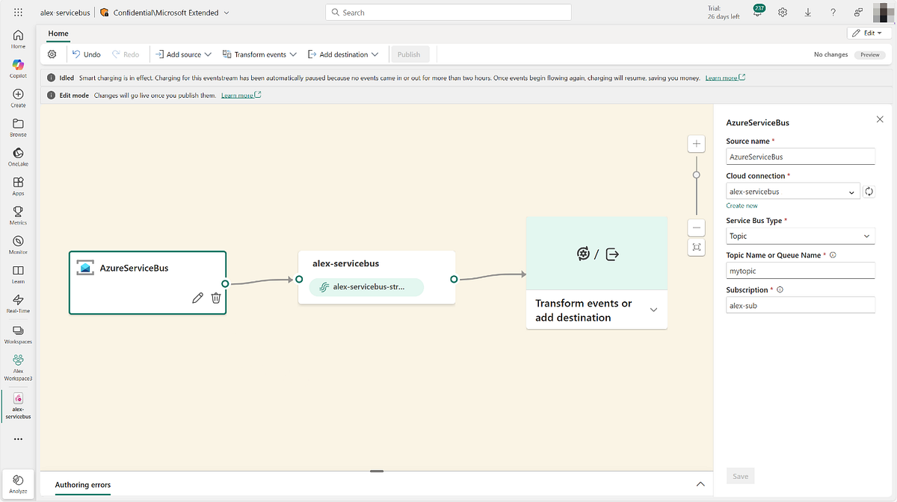

**새로운 패브릭 이벤트(Fabric events)(Preview)**

새로운 패브릭 이벤트 카테고리, 즉 OneLake 이벤트와 작업 이벤트는 11월 말에 실시간 허브의 Preview에서 사용할 수 있습니다. 이러한 이벤트는 Reflex 트리거를 통한 실시간 알림과 데이터 처리에 사용할 수 있으며 이벤트 스트림를 통해 다른 대상으로 전송할 수 있습니다.

OneLake 이벤트를 사용하면 OneLake에서 변경 사항이 발생할 때 알림을 받을 수 있습니다. 예를 들어, 새 파일이나 폴더를 만들거나 삭제할 때 입니다. 사용자는 이러한 이벤트를 사용하여 Reflex를 통해 데이터 파이프라인을 트리거하는 것과 같은 워크플로우를 자동화 할 수 있습니다.

작업 이벤트는 패브릭 내의 다양한 작업 활동과 상태에 대한 자세한 정보를 제공합니다. 예를 들어, 데이터 파이프라인 또는 노트북이 실행될 때의 상태입니다. 이러한 이벤트에는 작업 시작, 완료, 실패, 중간 상태 또는 변경에 대한 업데이트가 포함될 수 있습니다.

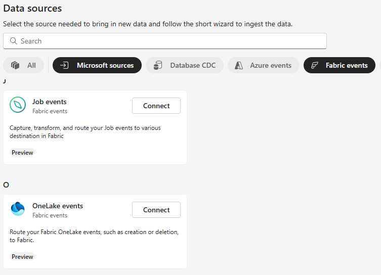

[Fabric 이벤트에 대해 자세히 알아보세요](https://learn.microsoft.com/fabric/real-time-hub/).

이벤트 스트림의 사용자 지정 대상 엔드포인트를 통해 이벤트하우스, 레이크하우스 또는 사용자 지정 애플리케이션을 비롯한 다양한 대상에 이러한 이벤트를 전달하려는 경우, 두 가지 새로운 패브릭 이벤트를 소스로서 이벤트 스트림에 통합할 수 있습니다. 이러한 소스를 추가하고 구성하는 방법에 대해 자세히 알아보려면 [이벤트 스트림 소스 추가 및 관리 — Microsoft Fabric - Microsoft Learn](https://learn.microsoft.com/fabric/real-time-intelligence/event-streams/add-manage-eventstream-sources?pivots=enhanced-capabilities)을 참조하세요.

**데이터베이스 CDC 소스에 대한 이벤트 스트림 데이터 미리 보기**

이제 향상된 이벤트 스트림에 데이터베이스 CDC 소스에 대한 데이터 미리 보기가 포함됩니다. 이 기능을 사용하면 편집 모드와 라이브 뷰 모드 모두에서 소스의 데이터 스냅샷을 볼 수 있습니다. 이벤트 스트림의 편집 모드에서 데이터 미리 보기는 구성한 CDC 소스에서 스냅샷을 캡처하므로, 먼저 게시한 다음 편집 모드로 돌아갈 필요 없이 후속 연산자 또는 대상을 구성하기 위한 스키마를 유추할 수 있습니다. 편집 모드에서 캔버스의 소스 노드를 선택하여 아래쪽 창의 ‘테스트 결과’ 탭에서 데이터 미리보기에 액세스할 수 있습니다.

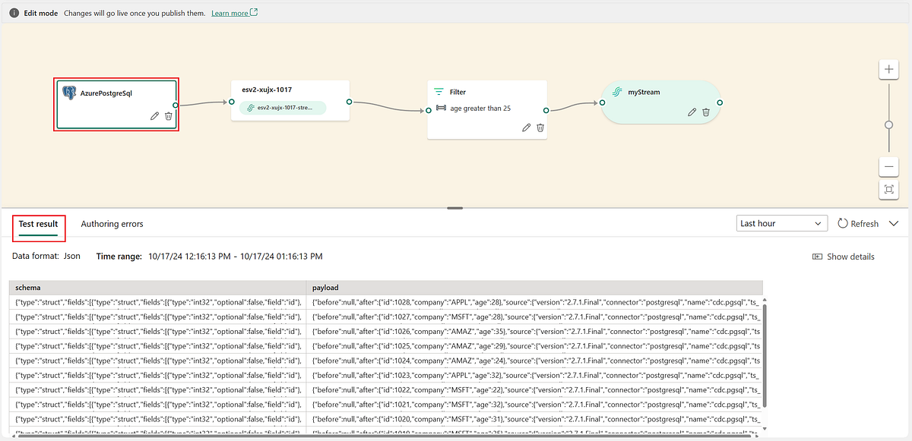

마찬가지로 라이브 뷰 모드에서 데이터 미리보기는 소스의 스냅샷을 제공하여, 소스 내부의 데이터가 어떻게 보이는지 이해할 수 있습니다.

지원되는 커넥터 소스는 다음과 같습니다.

- Azure SQL Database Change Data Capture (CDC)
- Azure SQL Managed Instance (CDC)
- SQL Server on VM DB (CDC)
- PostgreSQL DB (CDC)
- Azure Cosmos DB (CDC)
- MySQL DB (CDC)

**이벤트 스트림의 런타임 로그와 데이터 인사이트를 통한 커넥터 소스의 환경 모니터링**

이벤트 스트림은 이제 라이브 뷰 모드에서 커넥터 소스에 대한 **런타임 로그**와 **데이터 인사이트**를 제공합니다. 런타임 로그를 사용하면 특정 커넥터에 대해 커넥터 엔진에서 생성된 자세한 로그를 검사할 수 있으며, 이는 실패 원인 또는 경고를 식별하는 데 도움이 됩니다. 라이브 뷰 모드의 캔버스에서 관련 커넥터 소스 노드를 선택하여 이벤트 스트림의 아래쪽 창에서 이 기능에 액세스할 수 있습니다.

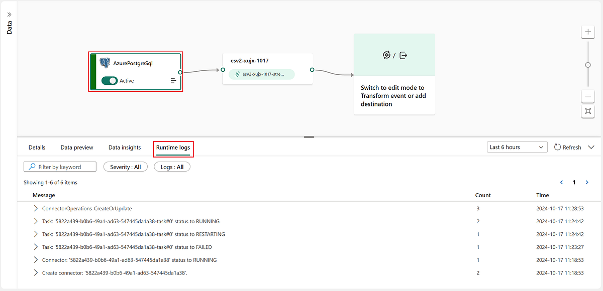

Data Insights는 커넥터 엔진 메트릭을 제공하여 사용자가 커넥터 소스의 상태와 성능을 모니터링 할 수 있도록 지원합니다. Source Incoming/Outgoing Events는 작업자의 지정된 소스 커넥터에 할당된 작업에 의해 폴링되거나 생성된 레코드의 수를 표시합니다.

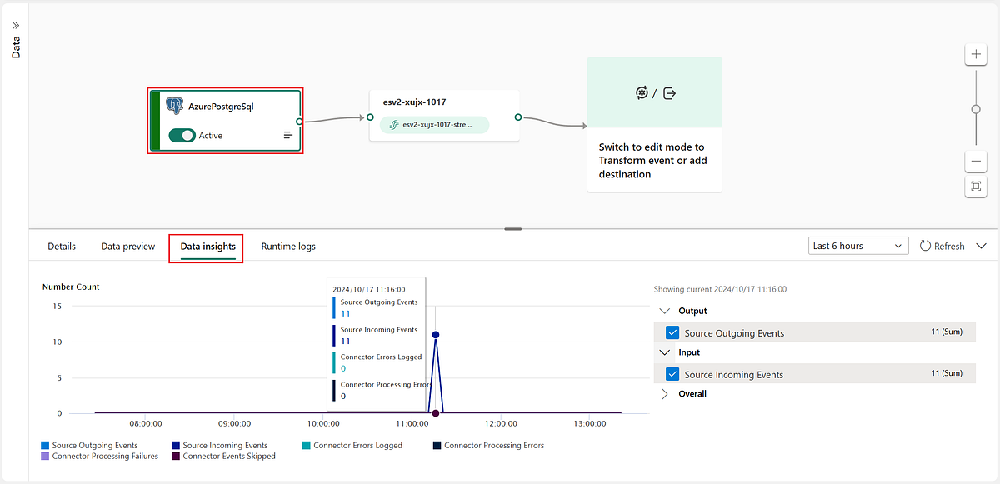

자세한 내용은 [이벤트 스트림 항목의 상태 및 성능 모니터링](https://learn.microsoft.com/fabric/real-time-intelligence/event-streams/monitor)을 참조하십시오.

**이벤트 스트림을 사용하여 Activator로 이벤트 처리와 라우팅 (Preview)**

패브릭 Activator(이전의 Data Activator)는 데이터에서 패턴이나 조건이 감지될 때 자동으로 조치를 취하는 노코드 환경입니다. Activator 항목(이전의 reflex 항목)을 사용하여 규칙과 작업을 관리합니다. 패브릭 항목으로 ‘Eventstream’으로 표현되는 실시간 인텔리전스 아래의 패브릭 이벤트 스트림은 다양한 소스에서 실시간 이벤트를 원활하게 캡처, 변환하고, 다양한 대상으로 라우팅하기 위해 패브릭 플랫폼에 중앙 집중식 위치를 구축하는 것을 목표로 합니다.

이제 이벤트 스트림은 이벤트를 대상인 Activator로 라우팅하기 전에 비즈니스 요구 사항에 따라 **이벤트를 처리하고 변환**할 수 있도록 지원합니다. 이러한 변환된 이벤트가 Activator에 도달하면, 이벤트를 모니터링하기 위해 알림에 대한 규칙 또는 조건을 설정할 수 있습니다. 이 대상을 추가하려면 편집 모드에 있는 동안 리본의 대상 메뉴에서 Activator를 선택하기만 하면 됩니다.

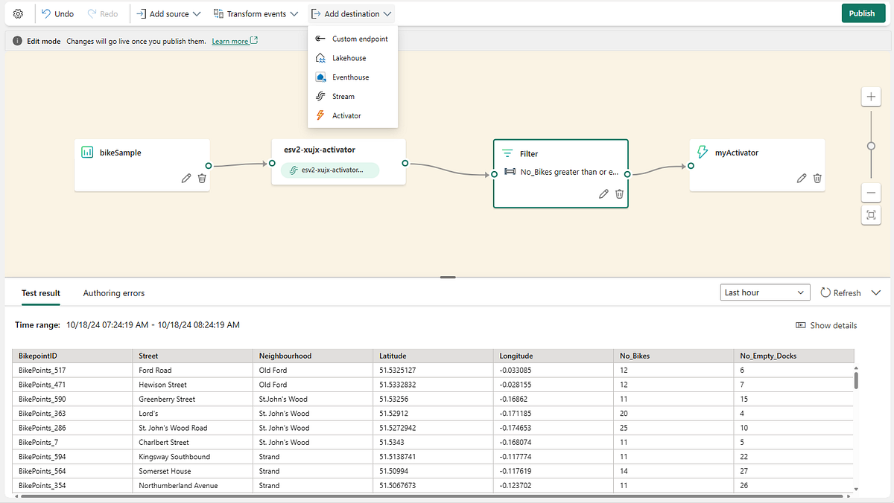

구성 세부 정보와 관련된 소스에 대한 자세한 내용은 [이벤트 스트림에 Activator 대상 추가](https://learn.microsoft.com/fabric/real-time-intelligence/event-streams/add-destination-reflex?pivots=standard-capabilities)를 참조하세요.

**이벤트 스트림 CI/CD 지원 소개**

데이터 스트리밍 솔루션에 대한 협업은 특히 여러 개발자가 동일한 환경에서 작업하는 경우 어려울 수 있습니다. 충돌, 버전 관리 문제, 배포 비효율성이 자주 발생합니다. Microsoft 패브릭의 이벤트 스트림용 패브릭 CI/CD 도구 통합은 이러한 문제를 해결하고, 팀 협업을 개선하기 위해 개발 되었습니다.

패브릭은 **Git 통합**과 **배포 파이프라인**을 포함한 다양한 도구를 통해 완벽한 CI/CD 경험을 제공합니다. 이벤트 스트림을 이러한 도구와 통합함으로써, 개발자는 웹 기반 환경에서 이벤트 스트림 항목을 처음부터 끝까지 효율적으로 빌드하고, 유지 관리하는 동시에 프로젝트 전반에 걸쳐 소스 제어와 원활한 버전 관리를 보장할 수 있습니다.

**주요 기능:**

- **이벤트 스트림을 위한 Git 통합**: 개발자는 GitHub, Azure DevOps와 같은 즐겨 사용하는 git 도구와 함께 버전 관리와 분기를 사용하여 자유롭게 협업할 수 있기에, 충돌을 방지하고 원활한 팀워크를 가능하게 할 수 있습니다.
- **이벤트 스트림용 배포 파이프라인**: 패브릭 UI에서 최소한의 수동 작업으로 테스트와 프로덕션과 같은 다양한 단계에 대한 이벤트 스트림 배포를 가속화하고 표준화 합니다.

아래에서 이벤트 스트림 변경 사항을 git 리포지토리에 커밋하는 방법을 찾을 수 있습니다.

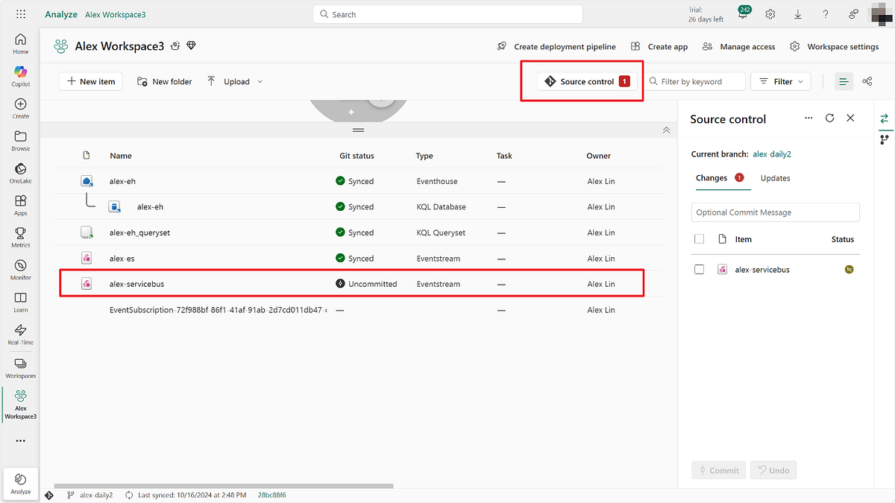

이러한 강력한 CI/CD 기능을 통해 이벤트 스트림의 개발 워크플로우 간소화, 개발 환경을 격리하고, 팀과 손쉽게 협업할 수 있습니다. 이벤트 스트림의 CI/CD 지원을 통해 더 빠르고 안정적인 개발을 경험하세요.

**이벤트 스트림 REST API를 사용하여 이벤트 스트림 항목 작업 자동화**

**이벤트 스트림 REST API**를 도입하면 이벤트 스트림 항목을 프로그래밍 방식으로 자동화하고 관리할 수 있어, CI/CD 워크플로우를 간소화하고 이벤트 스트림을 외부 애플리케이션과 쉽게 통합할 수 있습니다.

이벤트 스트림 REST API를 사용하여 다음을 수행할 수 있습니다.

- CI/CD 파이프라인 내에서 이벤트 스트림배포를 자동화 합니다.
- 프로그래밍 방식으로 이벤트 스트림 항목에 대한 전체 CRUD(Create, Read, Update, Delete) 작업을 수행합니다.
- 패브릭 이벤트 스트림을 외부 애플리케이션에 원활하게 통합 합니다.
- 스트리밍 솔루션을 빠르고 효율적으로 확장하십시오.

이러한 REST API를 활용하면 이벤트 스트림 항목의 품질, 안정성,생산성을 향상시키는 완전히 자동화된 워크플로우를 생성할 수 있습니다.

**Entra ID 인증을 사용하여 이벤트 스트림으로 안전하게 데이터 스트리밍 (출시 예정)**

이벤트 스트림의 **사용자 지정 엔드포인트(Custom Endpoint)**에 대한 **Entra ID 인증**을 소개합니다! 이 기능은 사용자가 SAS 키 또는 연결 문자열에 의존하지 않고 데이터를 이벤트 스트림으로 스트리밍할 수 있도록 하여, 무단 접근의 위험을 줄임으로써 보안을 강화합니다. **Entra ID 인증**은 사용자 권한을 패브릭 워크스페이스 접근에 직접 연결하여, 권한이 있는 사용자만 워크스페이스에 접근하고 데이터를 이벤트 스트림으로 스트리밍할 수 있도록 합니다. 아래 스크린샷에서 이 기능이 이벤트 스트림의 사용자 지정 엔드포인트에 어떻게 나타나는지 확인하세요!

또한 **테넌트 관리자**는 이제 테넌트 설정에서 이벤트 스트림의 키 기반 인증을 비활성화할 수 있는 옵션을 사용할 수 있기에, Entra ID 인증만 사용하도록 적용하여 이벤트 스트림을 더욱 안전하게 보호할 수 있습니다.

**분석과 변환 (Analyze & Trnasform)**

**이벤트하우스 모니터링 (Preview)**

패브릭 워크스페이스 모니터링은 패브릭의 중앙 집중식 로깅 솔루션입니다. 워크스페이스 모니터링은 모든 패브릭 항목에 대한 엔드 투 엔드(end to end)가시성을 통해 원활하고 일관된 모니터링 경험을 제공하도록 설계 되었습니다.

워크스페이스 모니터링은 실시간 인텔리전스 이벤트하우스 KQL 데이터베이스를 기반으로 합니다. 패브릭 모니터링을 사용하도록 설정하면, 모든 작업 영역 항목 이벤트 로그를 저장하기 위해 KQL 데이터베이스가 만들어집니다. KQL 데이터베이스는 시계열 로그와 메트릭 모니터링 솔루션에 적합합니다.

지원되는 각 항목에 대해 하나 이상의 이벤트 또는 메트릭 테이블이 생성됩니다. 여기에서 이벤트하우스 쿼리, 명령, 수집 모니터링, 시맨틱 모델 쿼리 로그를 지원하는 테이블을 볼 수 있습니다.

이벤트하우스 모니터링은 5개의 이벤트와 메트릭 테이블을 제공합니다.

- EventhouseQueryLogs — 모든 이벤트하우스 KQL 쿼리를 기록합니다.
- EventhouseCommandLogs- 모든 이벤트하우스 명령(command)을 기록합니다.
- EventhouseDataOperations — 일괄 처리, 스트리밍 봉인(seal) 작업(스트리밍 데이터를 데이터베이스 확장에 저장하는 작업), 구체화된 뷰(Materialized views) 업데이트와 업데이트 정책 테이블 업데이트를 포함하여 성공한 모든 데이터 작업을 기록합니다.
- EventhouseIngestionResultLogs — 모든 성공과 실패한 수집을 기록합니다.
- EventhouseMetrics- 수집, 구체화된 뷰(Materialized views), 연속 내보내기(continuous exports)에 대한 심층 모니터링을 제공하는 메트릭 집합입니다.

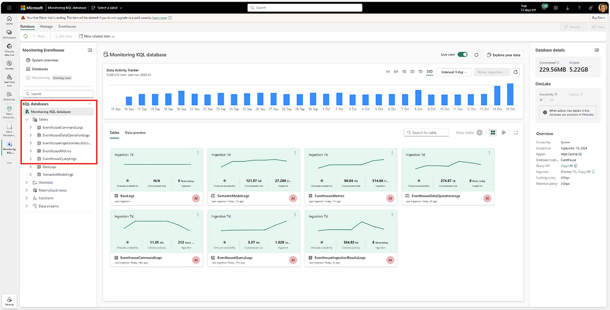

사용자는 설명서에서 사용할 수 있는 예제 쿼리와 함께 KQL 또는 SQL을 사용하여 작업 영역 모니터링 테이블을 탐색하고 직접 쿼리할 수 있습니다. 다음은 이벤트하우스 KQL QuerySet에 저장된 쿼리 모니터링의 예입니다.

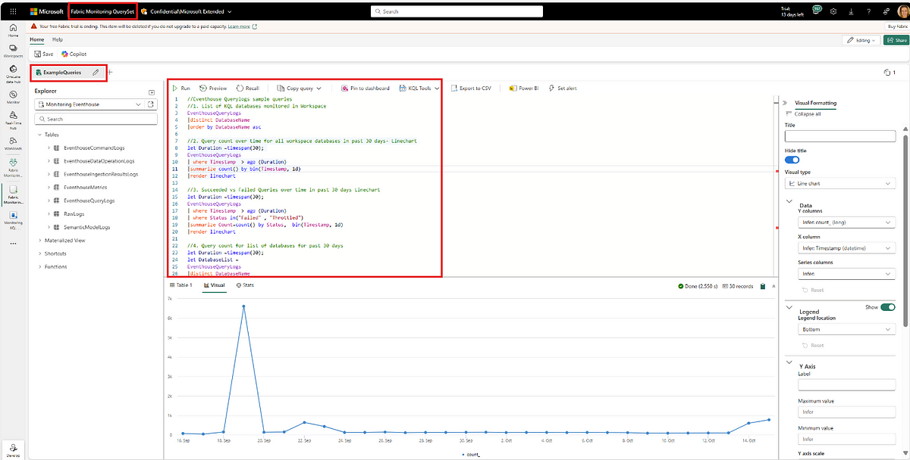

워크스페이스 모니터링 솔루션은 워크스페이스에서 만든 모든 Power BI 보고서, 시맨틱 모델과 이벤트하우스 항목을 중앙에서 모니터링 합니다. 경우에 따라 Power BI 시맨틱 모델은 KQL 데이터베이스 소스에서 데이터를 읽지만, 시맨틱 모델 쿼리는 Power BI 보고서 데이터 소스에 관계없이 워크스페이스 모니터링 솔루션에 기록됩니다.

워크스페이스 모니터링 KQL 데이터베이스 위에 실시간 대시보드를 만들 수 있어, 간편한 그래픽 모니터링 사용자 환경을 제공합니다. 실시간 대시보드 템플릿을 가져와서 즉시 사용 가능한 모니터링 환경을 제공할 수 있습니다.

이 예제 실시간 대시보드에서는 Power BI 보고서에서 실행되는 기본 KQL 쿼리에 대한 직접 링크를 사용하여, 시맨틱 모델 CPU 사용량 모니터링을 볼 수 있습니다. 사용자는 시맨틱 모델과 기본 데이터베이스 간에 이벤트를 상호 연결하여 문제를 해결할 수 있습니다.

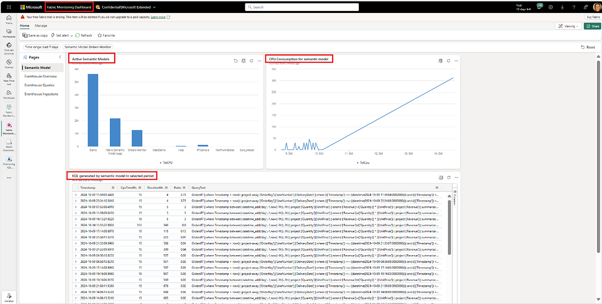

사용자는 급증 및 활동 문제를 해결하고, 이러한 리소스를 소비하는 사용자를 조사할 수 있습니다. 사용자는 정확한 급증 시간을 쉽게 확대하여 어떤 사용자 또는 애플리케이션이 사용량 피크를 발생시켰는지 확인할 수 있습니다. 그런 다음 특정 쿼리 로그 레코드로 드릴다운 할 수 있습니다.

요약하면, 워크스페이스 모니터링은 중앙 집중식 모니터링 솔루션을 제공하여, 사용자가 워크스페이스 항목을 효율적으로 모니터링하고 문제를 해결할 수 있도록 합니다. 특히 이벤트하우스의 경우 쿼리, 명령, 수집 이벤트, 메트릭 로깅을 통해 고급 이벤트하우스 모니터링 기능을 사용할 수 있습니다.

**Shortcuts에 대한 이벤트하우스 쿼리 가속(Query Acceleration) (Preview)**

Shortcut은 소스 데이터를 이동하지 않고, 다른 파일의 저장 위치를 가리키는 OneLake 내에 포함된 참조입니다.

이전에는 [이벤트하우스를 사용하여 OneLake 델타 테이블에 대한 Shourtcut을 만들고](https://learn.microsoft.com/fabric/real-time-intelligence/onelake-shortcuts?tabs=onelake-shortcut) 데이터를 쿼리할 수 있었지만, Shortcut 쿼리에는 이벤트하우스의 강력한 인덱싱과 캐싱 기능이 없었기 때문에 이벤트하우스에서 직접 수집할 때 성능이 저하되었습니다.

쿼리 가속은 OneLake에 도착하는 데이터를 즉시 인덱싱하고 캐시하여, 고객이 대량의 데이터에 대해 고성능 쿼리를 실행할 수 있도록 합니다. 고객은 이 기능을 사용하여 이벤트하우스로 직접 들어오는 실시간 스트림을 분석하고 미러링된 데이터베이스, 웨어하우스, 레이크하우스 또는 Spark에서 오는 OneLake에 랜딩되는 데이터와 결합할 수 있습니다.

고객은 이 기능을 활성화하여 경우에 따라 최대 50배 이상의 상당한 개선을 기대할 수 있습니다.

**쿼리 가속을 활성화하는 방법은 무엇입니까?**

이제 이벤트하우에서 새 Shourcut를 만드는 동안 가속을 활성화하는 옵션이 표시됩니다.

[실시간 인텔리전에 대해 자세히 알아보기](https://go.microsoft.com/fwlink/?linkid=2286363)

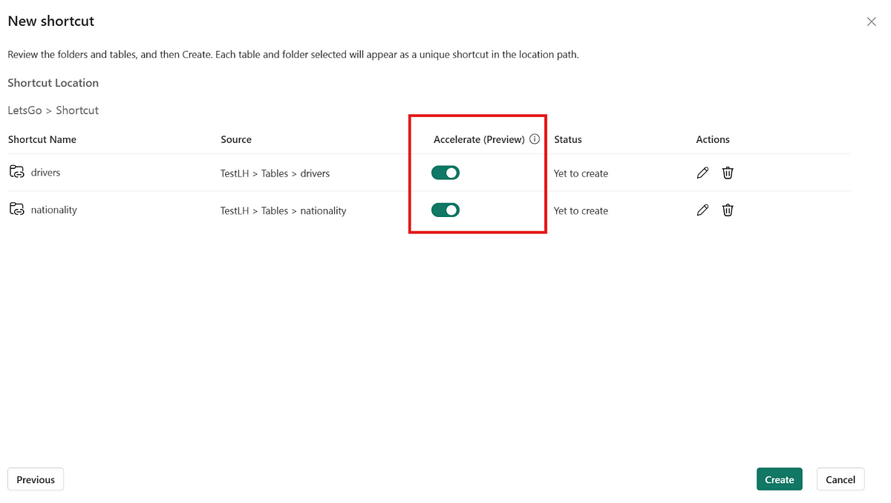

**Synapse Data Explorer에서 이벤트하우스로 마이그레이션 (Preview)**

Azure Synapse Analytics의 일부인 Synapse Data Explorer(SDX)는 친숙한 KQL(Kusto 쿼리 언어)을 사용하여 대량의 데이터를 탐색, 분석, 시각화 할 수 있는 엔터프라이즈 분석 서비스입니다. SDX는 2019년부터 공개 미리 보기로 제공되고 있습니다.

차세대 SDX 제품이 패브릭 [실시간 인텔리전스](https://learn.microsoft.com/fabric/real-time-intelligence/overview)의 일부인 [이벤트하우스](https://learn.microsoft.com/fabric/real-time-intelligence/eventhouse)로 진화하고 있습니다. 이벤트하우스는 SDX와 동일한 강력한 기능을 제공하면서 확장성, 성능, 보안이 향상되었습니다.

SDX에서 이벤트하우스로 마이그레이션하려는 고객을 위해 원활한 마이그레이션 기능을 발표하게 되어 기쁩니다. 고객은 마이그레이션 API를 사용하여 중단을 최소화하면서, SDX 클러스터를 이벤트하우스로 원활하게 이동할 수 있습니다. 더 자세한 내용은 [설명서](https://aka.ms/Fabric.Kusto.Migration)를 참고해 주세요.

**KQL Queryset의 데이터베이스 개체에 대한 새 탐색기**

현재 Queryset이 연결되어 있는 데이터베이스를 손쉽게 탐색하여 테이블, 함수, 구체화된 뷰 등을 볼 수 있습니다.

개체를 두 번 클릭하면 해당 이름이 쿼리 편집기에 즉시 복사되어, 쿼리 작성이 그 어느 때보다 쉬워집니다.

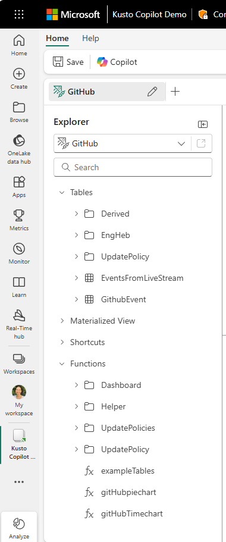

데이터 소스 전환기를 열 때, 데이터를 쉽게 새로 고치거나 더 이상 필요하지 않은 경우 KQL Qeuryset에서 연결을 끊을 수 있습니다.

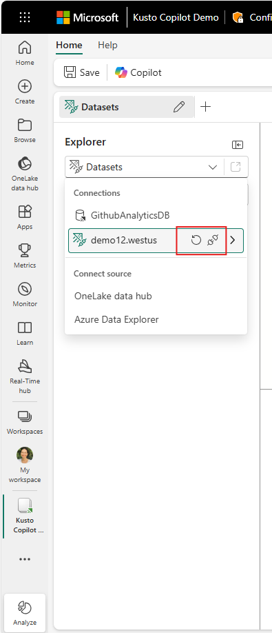

또한 이제 탐색기에서 직접 작업을 적용할 수 있습니다. 개체 옆에 있는 줄임표를 클릭하기만 하면 선택 항목에 맞게 조정된 옵션이 있는 메뉴에 접근 할 수 있습니다.

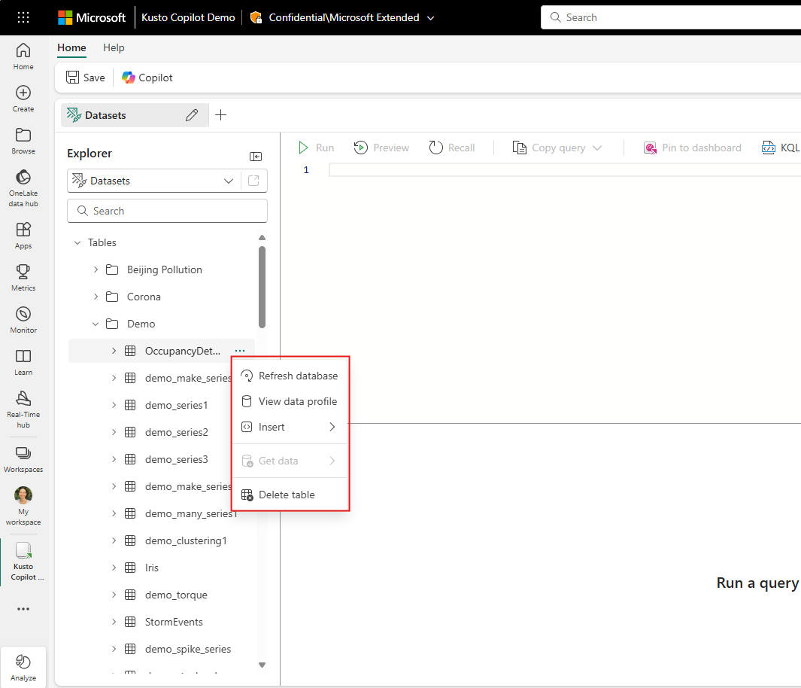

**KQL 데이터베이스의 엔터티 다이어그램(Entity Diagram) 보기**

이제 KQL 데이터베이스 페이지의 새로운 기능을 사용하면 대화형 그래프 시각화를 통해 테이블, 함수, 구체화된 뷰, 업데이트 정책, 외부 테이블, 연속 내보내기와 같은 데이터베이스 엔터티 간의 관계를 시각적으로 탐색할 수 있습니다. 이렇게 하면 데이터베이스를 효율적으로 관리하고 이러한 엔터티가 상호 작용하는 방식을 보다 명확하게 이해할 수 있습니다.

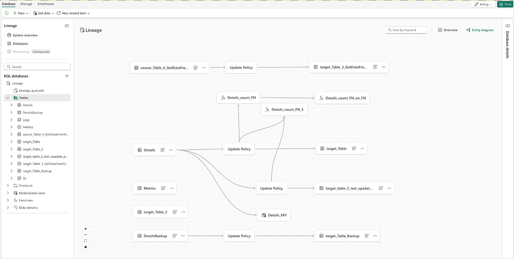

**샘플 시나리오**

**선제적으로 종속성 관리**

이 시각적 표현을 사용하면 테이블, 함수와 같은 엔터티 간의 종속성을 쉽게 관리할 수 있습니다. 예를 들어, 테이블의 이름을 바꾸거나 스키마를 수정할 때 해당 테이블을 KQL 본문의 일부로 사용하는 함수를 즉시 확인할 수 있습니다. 이러한 사전 예방적 접근 방식은 의도하지 않은 결과를 방지하고, 데이터베이스 구조를 보다 원활하게 업데이트하는 데 도움이 됩니다.

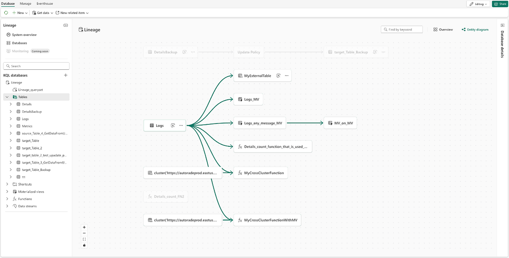

**구체화된 뷰(Materialized Views) 뒤의 데이터 소스 추적**

또한 새로운 기능을 사용하면 구체화된 뷰와 기본 소스 테이블 간의 관계를 추적할 수 있습니다. 이렇게 하면 원래 데이터 원본을 쉽게 식별할 수 있어, 데이터 흐름을 보다 효과적으로 추적하고 문제를 해결할 수 있습니다.

**요소와 상호 작용하고 행동하기**

그래프에서 아무 요소나 클릭하면 관련 항목을 볼 수 있고, 그래프의 나머지 부분은 회색으로 표시되어 특정 관계에 더 쉽게 집중할 수 있습니다.

테이블과 외부 테이블의 경우 테이블 쿼리, 테이블을 기반으로 Power BI 보고서 만들기 등과 같은 추가 옵션을 사용할 수 있습니다.

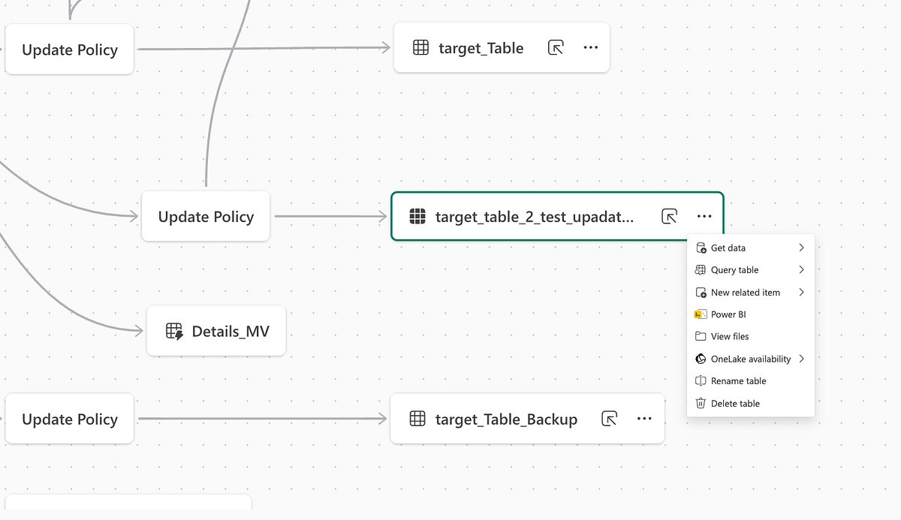

**트랙 레코드 수집**

또한 각 테이블과 구체화된 뷰에 얼마나 많은 레코드가 수집되었는지 쉽게 추적할 수 있습니다. 데이터 흐름에 대한 이러한 명확한 보기를 통해 수집 크기와 볼륨을 파악하여, 데이터베이스가 데이터를 올바르게 처리하도록 하는 데 도움이 됩니다.

**요약**

이 시각적 기능을 사용하면 데이터베이스 관리가 간소화되고 데이터 구조가 최적화 되어, 종속성을 쉽게 추적하고 신속하게 조치를 취할 수 있습니다.

**시각화 & 행동**

**실시간 대시보드를 다른 사람과 쉽게 공유**

Microsoft 패브릭의 새로운 실시간 대시보드 권한 기능은 사용자가 실시간 분석과 상호 작용하는 방식을 세부적으로 제어할 수 있도록 합니다. 대시보드와 기본 데이터에 대한 별도의 사용 권한이 도입됨에 따라, 관리자는 이제 사용자가 원시 데이터에 대한 액세스 권한을 부여하지 않고도 대시보드를 볼 수 있도록 유연하게 허용할 수 있습니다. 이러한 분리는 데이터 보안을 보장하는 동시에 더 광범위한 대상에게 실행 가능한 통찰력을 제공해야 하는 조직에 중요합니다.

패브릭 권한은 사용자가 대시보드 자체와 상호 작용하는 방식에 중점을 두어 대시보드를 보고, 편집하고, 공유할 수 있는 사용자를 결정합니다. 한편, 데이터 소스 권한은 권한이 있는 사용자만 이러한 시각화를 지원하는 원시 데이터에 액세스할 수 있도록 합니다. 이 구분은 사용자에게 필요한 수준의 접근 권한만 부여하여 전반적인 보안 태세를 개선합니다.

이 기능의 또 다른 장점은 데이터 접근을 처리할 때 패스 스루(Pass-through)와 편집자 ID 중에서 선택할 수 있는 옵션 입니다. 패스 스루는 사용자가 자신의 자격 증명을 사용하여 데이터에 액세스할 수 있는 반면, 편집자 ID는 대시보드 편집자의 권한을 사용합니다. 이를 통해 다양한 협업 시나리오에 맞게 시스템을 조정할 수 있고 조직의 요구 사항에 맞게 조정할 수 있습니다.

전반적으로, Microsoft 패브릭의 실시간 대시보드 권한에 대한 이러한 개선 사항은 데이터와 대시보드에 대한 안전하고 효율적이며, 맞춤화 된 접근을 촉진합니다. 이러한 유연성을 통해 팀은 데이터 접근에 대한 엄격한 제어를 유지하면서, 더 효과적으로 공동 작업할 수 있어 실시간 인텔리전스를 활용하는 조직에 유용한 기능을 추가할 수 있습니다.

[실시간 대시보드 권한](https://learn.microsoft.com/fabric/real-time-intelligence/dashboard-permissions)에 대해 자세히 알아보기 (Preview).

**실시간 대시보드(Real-Time Dashboards)의 정식 출시(GA) 발표**

이제 Microsoft 패브릭에서 실시간 대시보드가 정식 출시 되어 빠르고 실행 가능한 인사이트를 손쉽게 확인할 수 있습니다. 실시간 대시보드를 사용하면 조직이 그 어느 때보다 쉽게 주요 지표를 실시간으로 추적하고, 조치를 취할 수 있어, 복잡한 코딩 없이도 더 빠른 의사 결정과 더 깊은 통찰력을 얻을 수 있습니다.

**Live Insights의 강력한 기능 활용**

실시간 대시보드를 사용하면 중요한 데이터 이벤트가 발생할 때 이를 모니터링할 수 있습니다. 이제 사용자는 **자동 새로 고침 빈도를 10초로 낮게 설정하거나,** 실시간 데이터 스트림에 대한 지속적인 업데이트를 설정할 수 있어, 모든 주요 지표를 최신 상태로 유지할 수 있습니다.

**유연하고 안전한 데이터 공유**

실시간 대시보드 정식 출시의 일부로 발표된 새로운 기능은 대시보드와 기본 데이터에 대한 권한을 분리 하는 것입니다. 이제 **관리자는 원시 데이터를 노출하지 않고 대시보드 접근 권한을 부여**할 수 있어, 팀은 엄격한 데이터 보안을 유지하면서 데이터 기반 의사 결정을 내릴 수 있습니다. 이러한 권한 분리는 규정 준수를 보장하고 중요한 정보를 보호하는 동시에, 주요 인사이트를 광범위하게 공유해야 하는 조직에 특히 유용합니다.

**간편한 노코드 데이터 탐색(No-Code Data Exploration)**

노코드 ‘**데이터 탐색’** 기능을 사용하면, 모든 기술적 배경을 가진 사용자가 대시보드의 인사이트를 뛰어넘을 수 있습니다. 이제 누구나 KQL을 알거나 쿼리를 작성할 필요 없이 메트릭에 대해 자세히 알아보고, 기본 데이터를 탐색하고, 추세를 분석할 수 있습니다. “데이터 탐색”을 사용하면, 사용자 친화적인 UI를 사용하여 데이터를 필터링, 드릴다운, 상호 작용할 수 있어, 변경이나 변동을 주도하는 요소를 명확하게 이해할 수 있습니다.

**지금 바로 실시간 인사이트를 확보하세요**

Microsoft 패브릭의 실시간 대시보드는 데이터를 더 빠르게 작업으로 변환하려는 사용자를 위해 설계되었습니다. 실시간 대시보드는 지속적인 업데이트를 제공, 보안을 강화하고, 직관적인 데이터 탐색을 제공함으로써 라이브 데이터의 힘을 활용하는 데 필요한 모든 것을 제공합니다.

지금 바로 사용해보고 데이터의 잠재력을 최대한 활용해 보세요!

**Activator의 정식 출시(GA) 발표**

이제 실시간 인텔리전스 Activator가 정식 출시 되었습니다! 조직이 인사이트에서 행동으로 전환할 수 있도록 지원하는 Data Activator의 개발 과정에서 보여준 귀중한 파트너십과 피드백에 감사의 말씀을 전합니다.

이번 정식 출시로, 다음을 수행할 수 있습니다.

- 비즈니스 개체를 모니터링하여 중요한 지표를 파악하세요. 개별 패키지, 가구, 냉장고 등과 같은 주요 비즈니스 개체를 실시간으로 추적하고 분석하여 정보에 입각한 의사결정을 내리는 데 필요한 인사이트를 확보할 수 있습니다. 비즈니스 개체의 개별 인스턴스가 판매량, 재고 수준 또는 고객 상호 작용에 미치는 영향을 파악하는 등 모니터링 시스템은 세부적인 인사이트를 제공하여 세분화된 수준의 비즈니스 환경 변화에 선제적으로 대응할 수 있도록 도와줍니다.
- 고급 데이터 필터링과 모니터링 기능을 통해 데이터에 대한 비즈니스 규칙을 생성할 수 있는 잠재력을 최대한 활용하세요. 이 업데이트는 데이터 필터링, 요약, 범위 지정을 위한 다양한 옵션을 제공하기에 특정 요구 사항에 맞게 분석을 조정할 수 있습니다. 데이터 값이 변경되거나, 특정 임계값 초과, 지정된 기간 내에 새 데이터가 도착하지 않는 경우를 추적하기 위해 복잡한 조건을 설정할 수 있습니다.
- 이메일과 Teams 메시지의 미리보기를 확인하여 보내기를 누르기 전에 커뮤니케이션이 완벽한지 확인하세요. 이렇게 하면 수신자에게 표시되는 대로 정확하게 메시지의 미리보기를 볼 수 있습니다. 콘텐츠를 검토하고, 서식을 확인하고, 명확성을 보장하기 위해 필요한 조정을 수행합니다. 이 기능을 사용하면 Data Activator가 의도한 대로 보인다는 것을 알고 사용자를 대신하여 메시지를 보내도록 자신 있게 할 수 있습니다.
- 데이터 스트림에 들어오는 모든 새로운 이벤트와 함께 자동으로 트리거되는 규칙을 설정합니다. 알림을 보내야 하거나 워크플로를 시작해야 하는 경우 이 기능을 사용하면 프로세스가 항상 최신 상태로 유지되고 응답할 수 있습니다.
- 기능이 무엇이며 어떤 역할을 하는지 명확하게 알 수 있도록 기능의 이름을 변경했습니다. Reflex를 보는 데 익숙하다면 이제 **Activator**라고 불립니다. 따라서 규칙과 작업을 설정하기 위해 만드는 항목은 **Activator** 입니다. 따라서 규칙과 작업을 설정하기 위해 생성하는 항목이 바로 **Activator** 입니다. Activator 타일은 패브릭 실시간 인텔리전스 섹션에서 찾을 수 있습니다. 이러한 변경 사항이 Data Activator를 시작하는 과정을 간소화하는 데 도움이 되기를 바랍니다.

이제 Activator 청구를 사용할 수 있으며 다음 네 가지 미터를 기반으로 합니다.

**계산 리소스 (Compute resources)**

- 실행 중인 규칙의 수와 이러한 규칙이 실행된 기간 입니다. 각 활성 규칙에는 균일한 ‘가동 시간(uptime)’ 비용이 제공됩니다.수집된 초당 이벤트 수입니다.규칙을 평가하고 조건이 충족되면 정의된 작업을 트리거 합니다.

**스토리지 (Storage)**

- 패브릭 스토리지 요금은 이벤트와 활성화 보존에 사용된 스토리지를 기준으로 합니다. 보존 정책은 기본적으로 30일로 설정 됩니다.

계정의 용량이 부족하면 제품 내 배너를 표시하고, 이메일 알림을 보내 드립니다. 언제든지 Activator 용량 사용량을 추적 및 검토할 수 있으며, 필요한 경우 비즈니스 요구 사항에 맞게 업데이트할 수 있습니다. Activator 사용에 대한 공식 청구는 11월 18일 정식 출시 발표와 함께 시작됩니다.

자세한 내용은 [Activator](https://learn.microsoft.com/fabric/data-activator/) 설명서를 참조하세요. 언제나 그렇듯이 여러분의 [피드백](https://aka.ms/ga_blog_community_forum)과 여러분의 의견을 기다리고 있습니다. 자세한 내용은 자세한 RTI 청구 블로그 게시물을 계속 지켜봐 주세요.

**실시간 인텔리전스(Real-time Intelligence) 데모**

### **데이터 팩토리 (Data Factory)**

**시맨틱 모델(Semantic model) 새로 고침에 테이블과 파티션 새로 고침 추가**

패브릭 데이터 팩토리(Fabric Data Factory)에서 구축한 가장 인기 있는 기능 중 하나는 ADF(Azure Date Factory)와 커뮤니티에서 관찰한 고객 패턴에서 비롯되었습니다. 이것이 시맨틱 모델 새로 고침 작업 입니다. 이 파이프라인 활동을 처음 릴리즈 한 후, 시맨틱 모델에서 특정 테이블과 파티션을 새로 고치는 옵션을 포함하여 ELT 파이프라인 처리를 개선해 달라는 요청을 들었습니다. 이제 이 기능을 활성화하여 파이프라인 활동을 패브릭 시맨틱 모델을 새로 고치는 가장 효과적인 방법으로 만들었다는 사실을 발표하게 되어 매우 기쁩니다.

[시맨틱 모델 새로 고침 작업에 대해 자세히 알아보세요](https://learn.microsoft.com/fabric/data-factory/semantic-model-refresh-activity)

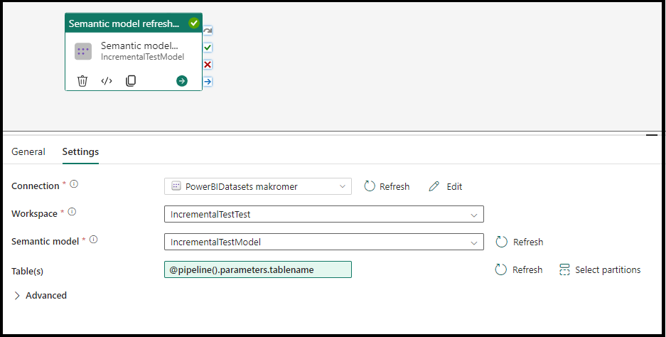

**패브릭 데이터 팩토리(Fabric Data Factory) 파이프라인 가져오기/내보내기**

데이터 팩토리 파이프라인 개발자는 파이프라인 정의를 내보내 다른 개발자와 공유하거나 다른 작업 영역에서 다시 사용하려는 경우가 많습니다. 이제 패브릭 작업 영역에서 데이터 팩토리 파이프라인을 내보내고 가져오는 기능을 추가했습니다. 이 강력한 기능은 훨씬 더 많은 협업 기능을 가능하게 하며 , 지원 팀과 함께 파이프라인 문제를 해결할 때 매우 유용할 것입니다.

**새 커넥터 사용 가능**

데이터 팩토리에서 데이터 파이프라인과 dataflow Gen 2는 이제 기본적으로 패브릭 SQL 데이터베이스 커넥터를 원본과 대상으로 지원합니다.

또한 데이터 파이프라인은 ServiceNow 커넥터(소스)와 MariaDB 커넥터(소스)를 포함하도록 연결을 확장합니다.

언급할 가치가 있는 것은 Iceberg 형식이 데이터 파이프라인에 먼저 새로 도입되었다는 것입니다. 이제 첫 클릭으로 데이터 파이프라인을 사용하여 Azure Data Lake 2세대 커넥터를 통해 데이터를 Iceberg 형식으로 쓸 수 있습니다.

이러한 새로운 커넥터와 함께 기존 커넥터에 대한 다양한 기능 개선이 이루어졌습니다. 주요 개선 사항으로는 다음과 같은 커넥터의 지속적인 개선이 있습니다:

- 데이터 파이프라인과 dataflow gen2에서 중국 도메인에 대한 지원이 추가된 Snowflake 커넥터
- 데이터 파이프라인에서 인증 유형 지원이 강화된 Dataverse 커넥터
- 데이터 파이프라인에서 쿼리 시간 제한을 사용자 지정할 수 있는 기능을 갖춘 PostgreSQL 커넥터 및 Azure PostgreSQL 커넥터

**복사 작업(Copy Job)으로 데이터 수집 간소화 — CI/CD upsert와overwrite**

Copy Job은 데이터 수집을 간소화하여 모든 소스에서 모든 대상에 이르기까지 원활한 환경을 제공합니다. 일괄 복사가 필요하든 증분 복사가 필요하든 Copy Job은 작업을 간단하고 직관적으로 유지하면서 데이터 요구 사항을 충족할 수 있는 유연성을 제공합니다.

9월 말 FabCon Europe에서 공개 미리 보기가 출시된 이후 강력한 새 기능으로 Copy Job을 빠르게 개선하고 있습니다. 최신 업데이트는 다음과 같습니다.

- Copy Job은 이제 소스 제어와 ALM 배포 파이프라인을 위한 Git 통합을 포함하여 패브릭에서 CI/CD 기능을 지원합니다. 더 자세한 내용은 [Data Factory의 Copy Job에 대한 CI/CD에서 세부 정보 확인 — Microsoft 패브릭 - Microsoft Learn](https://learn.microsoft.com/fabric/data-factory/cicd-copy-job)에서 확인하세요.

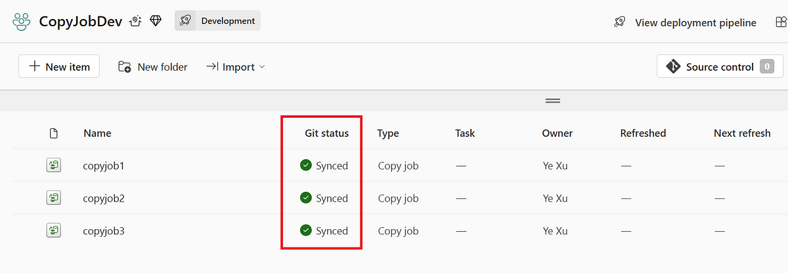

- Copy Job은 이제 SQL DB와 SQL Server에 대한 Upsert 기능과 패브릭 레이크하우스에 대한 overwrite 옵션과 같은 확장된 쓰기 옵션을 제공하여, 데이터 이동에 대한 유연성과 제어 기능을 강화합니다. 더 자세한 내용은 [데이터 팩토의 Copy Job이란(미리 보기)](https://learn.microsoft.com/fabric/data-factory/what-is-copy-job#copy-behavior)에서 확인하세요.

**데이터 파이프라인을 효율적으로 빌드하고 유지 관리하기 위한 데이터 팩토리용 Copilot(Copilot for Data Factory)의 새로운 기능**

이제 데이터 팩토리용 Copilot(Copilot for Data Factory)의 새로운 데이터 파이프라인 기능을 사용할 수 있습니다. 새로운 기능은 현재 프리뷰 상태이며, 사용자가 데이터 파이프라인을 사용하여 데이터 통합 솔루션을 손쉽게 생성하고, 복잡한 데이터 파이프라인을 쉽게 이해하며, 데이터 파이프라인 오류 메시지를 효율적으로 해결할 수 있도록 지원하는 AI 도우미 역할을 합니다.

새 데이터 파이프라인을 만들고 홈 탭에서 Copilot 버튼을 클릭하여 시작합니다. 세 가지 시작 옵션과 명확한 지침을 통해 파이프라인 구축을 쉽게 시작할 수 있습니다.

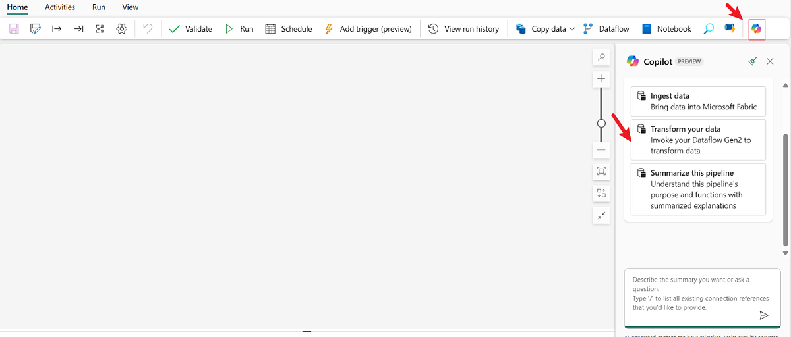

데이터 팩토리용 Copilot은 사용자의 의도와 비즈니스 요청을 쉽게 이해하여 데이터 통합 솔루션으로 변환할 수 있습니다. 미리 입력된 프롬프트를 사용하여 단계별로 데이터 파이프라인을 쉽게 설정하거나 포괄적인 프롬프트를 사용하여, 데이터 파이프라인을 효율적으로 생성할 수 있습니다.

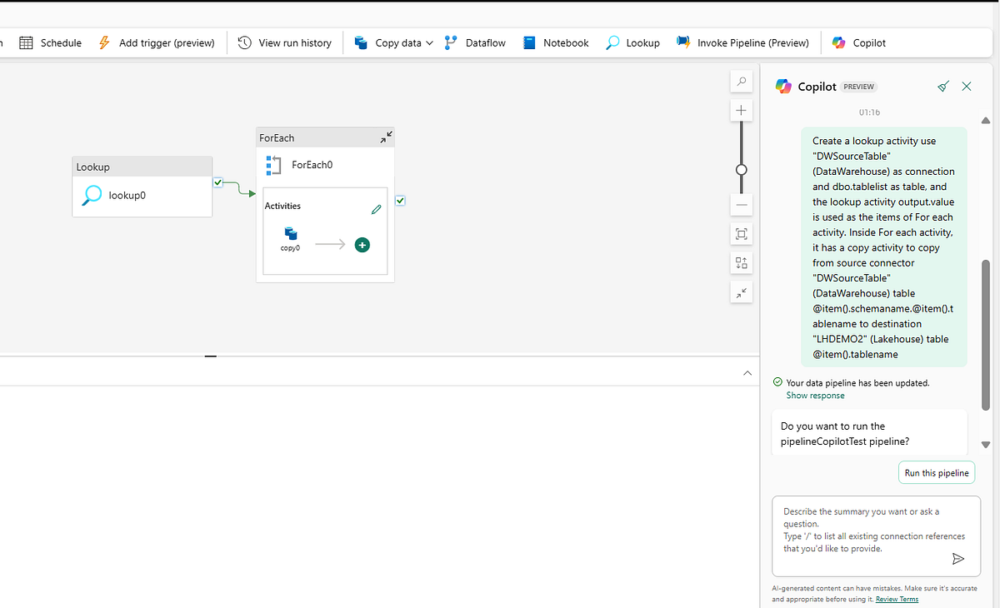

또한 데이터 팩토리용 Copilot은 데이터 파이프라인 문제 해결 오류 메시지 환경을 개선합니다. 데이터 파이프라인 오류를 쉽게 식별하고 해결할 수 있도록 명확한 설명과 실행 가능한 권장 사항을 제공합니다.

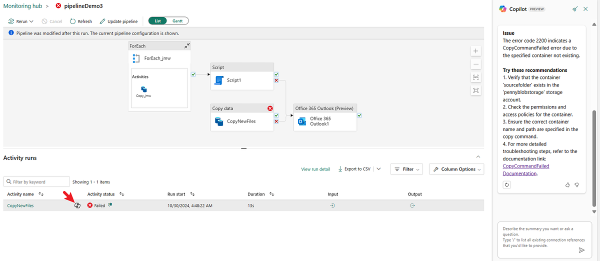

데이터 팩토리용 Copilot은은 더 나은 이해를 위해 파이프라인을 빠르게 요약할 수 있으며, 이는 복잡한 데이터 파이프라인과 관련된 공동 작업 시나리오에서 매우 유용합니다. ‘Summarize this pipeline(이 파이프라인 요약)’ 옵션을 클릭하거나 ‘Summarize this pipeline’ 프롬프트를 전송하여 복잡한 파이프라인 요약을 얻을 수 있습니다. 그러면 다른 팀 구성원이 개발한 복잡한 파이프라인에 대한 매우 명확한 설명을 얻을 수 있습니다.

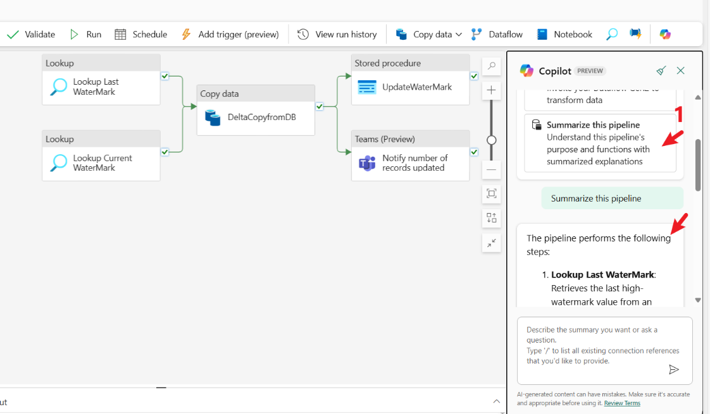

**OneLake 데이터 허브는 이제 최신 데이터 가져오기 환경의 OneLake 카탈로그 입니다.**

최신 데이터 가져오기(Modern Get Data)에서 OneLake 데이터 허브가 OneLake 카탈로그로 브랜드가 변경되었음을 알려드립니다. 파이프라인, 복사 작업, 미러링과 dataflow gen 2 내에서 데이터 가져오기를 사용하면 OneLake 데이터 허브가 OneLake 카탈로그로 이름이 변경된 것을 확인할 수 있습니다.

OneLake 카탈로그는 OneLake 데이터 허브의 차세대 진화 버전으로, 일관된 플랫폼을 제공합니다. 현재 최신 데이터 가져오기에서 OneLake 카탈로그는 이전 OneLake 데이터허브와 동일한 기능을 유지합니다. 향후에는 데이터 엔지니어, 과학자, 분석가, 의사 결정권자가 하나의 종합적이고 사용자 친화적인 위치에서 데이터를 원활하게 탐색, 구성, 감독할 수 있도록 OneLake 카탈로그 기능을 확장할 예정입니다.

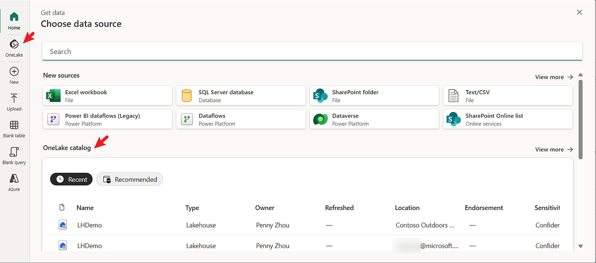

**이제 Dataflows 가 CI/CD를 지원합니다. (Preview)**

이제 Dataflows Gen2를 통해 GIT 통합과 CI/CD 지원의 이점을 활용할 수 있습니다. 워크스페이스 내에서 GIT 통합을 사용하도록 설정하면 dataflow definition을 Git에 저장하고 다른 워크스페이스로 분기(brnach)하여 동일한 데이터 흐름에서 협업할 수 있습니다. 이렇게 하면 특히 개발, 테스트, 프로덕션 작업 영역에서 작업할 때 엔드 투 엔드(end to end)환경이 향상됩니다.

[지금 바로 시작해 보세요](https://aka.ms/dfgen2CICD)!

경험을 개선하기 위해 귀하의 피드백에서 더 많은 것을 배울 수 있기를 기대합니다.

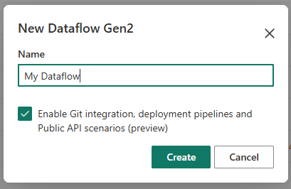

**데이터 팩토리(Data Factory) 데모**

