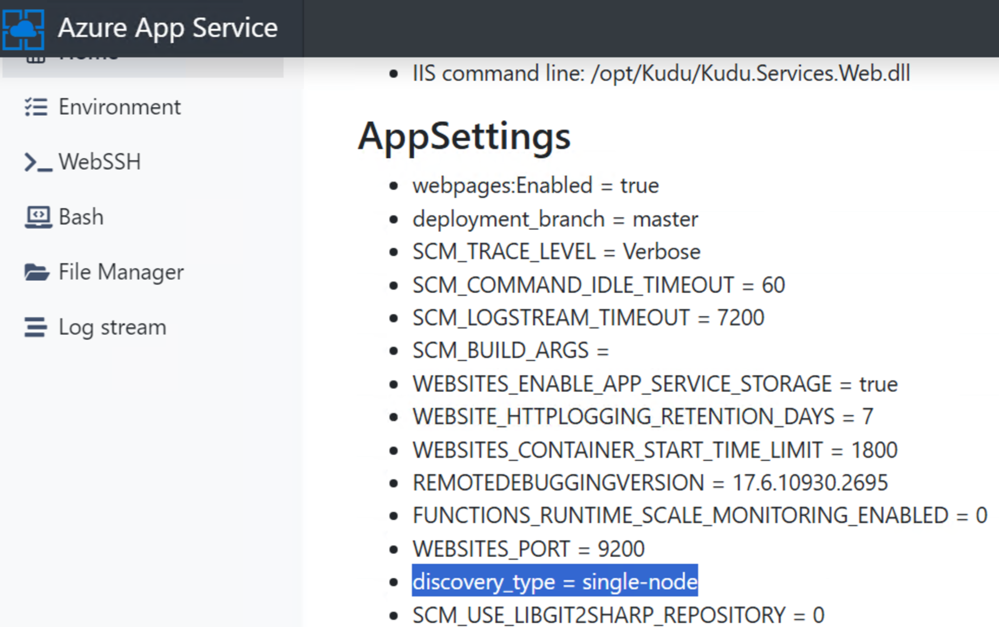
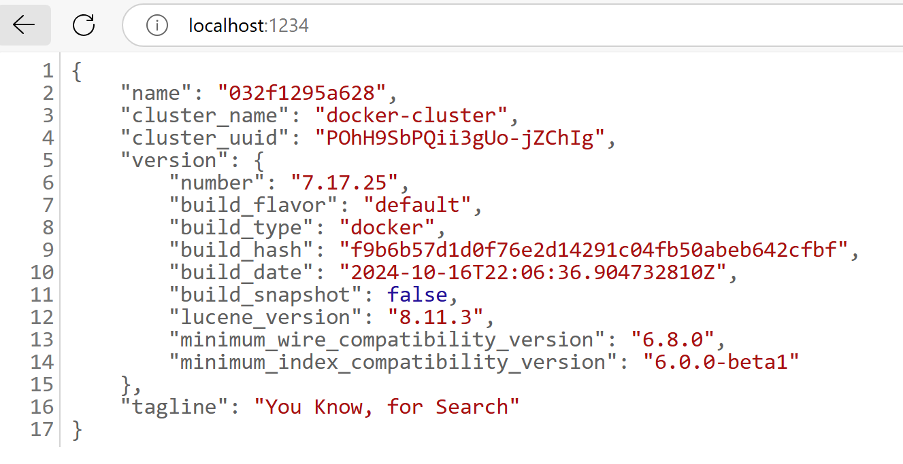
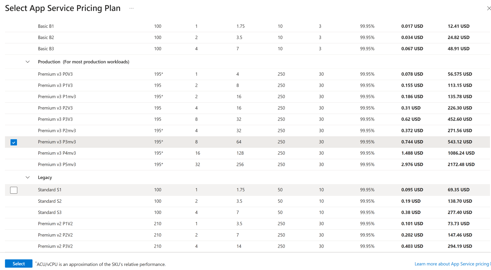

### 작성자 : [Susan_Arej](https://techcommunity.microsoft.com/users/susan_are/1811695)
### 원본 : [Elasticsearch custom container on Azure App Services](https://techcommunity.microsoft.com/blog/appsonazureblog/elasticsearch-custom-container-on-azure-app-services/4351148)

# Azure App Services 상의 Elasticsearch 사용자 정의 컨테이너
이번 블로그에서는, Azure App Service에 Elasticsearch 컨테이너를 배포하는 방법에 대해서 살펴보겠습니다.

다음의 설명에서는 **elasticsearch:7.17.25** 컨테이너 이미지를 사용하게 됩니다. 해당 이미지는 Docker Hub [elasticsearch - Official Image | Docker Hub](https://hub.docker.com/_/elasticsearch/)에서 사용할 수 있습니다.

Azure App Service에 컨테이너 이미지를 배포하는 동안, Docker 컨테이너에는 다음과 같은 오류가 발생하게 됩니다:

```
2024-11-14T12:37:41.643855847Z {"type": "server", "timestamp": "2024-11-14T12:37:41,643Z", "level": "INFO", "component": "o.e.x.m.Monitoring", "cluster.name": "docker-cluster", "node.name": "e6413475d15a", "message": "creating template [.monitoring-es] with version [7]" }
2024-11-14T12:37:41.645055848Z {"type": "server", "timestamp": "2024-11-14T12:37:41,644Z", "level": "INFO", "component": "o.e.x.m.Monitoring", "cluster.name": "docker-cluster", "node.name": "e6413475d15a", "message": "creating template [.monitoring-kibana] with version [7]" }
2024-11-14T12:37:41.646677131Z {"type": "server", "timestamp": "2024-11-14T12:37:41,646Z", "level": "INFO", "component": "o.e.x.m.Monitoring", "cluster.name": "docker-cluster", "node.name": "e6413475d15a", "message": "creating template [.monitoring-logstash] with version [7]" }
2024-11-14T12:37:41.650269656Z {"type": "server", "timestamp": "2024-11-14T12:37:41,650Z", "level": "INFO", "component": "o.e.x.m.Monitoring", "cluster.name": "docker-cluster", "node.name": "e6413475d15a", "message": "creating template [.monitoring-beats] with version [7]" }
2024-11-14T12:37:41.733555119Z {"type": "server", "timestamp": "2024-11-14T12:37:41,733Z", "level": "INFO", "component": "o.e.b.BootstrapChecks", "cluster.name": "docker-cluster", "node.name": "e6413475d15a", "message": "bound or publishing to a non-loopback address, enforcing bootstrap checks" }
2024-11-14T12:37:41.738339565Z
2024-11-14T12:37:41.738374780Z ERROR: [2] bootstrap checks failed. You must address the points described in the following [2] lines before starting Elasticsearch.
2024-11-14T12:37:41.738387734Z bootstrap check failure [1] of [2]: max virtual memory areas vm.max_map_count [65530] is too low, increase to at least [262144]
2024-11-14T12:37:41.738395509Z bootstrap check failure [2] of [2]: the default discovery settings are unsuitable for production use; at least one of [discovery.seed_hosts, discovery.seed_providers, cluster.initial_master_nodes] must be configured
2024-11-14T12:37:41.738446001Z ERROR: Elasticsearch did not exit normally - check the logs at /usr/share/elasticsearch/logs/docker-cluster.log
2024-11-14T12:37:41.740094676Z {"type": "server", "timestamp": "2024-11-14T12:37:41,739Z", "level": "INFO", "component": "o.e.n.Node", "cluster.name": "docker-cluster", "node.name": "e6413475d15a", "message": "stopping ..." }
2024-11-14T12:37:41.748283513Z {"type": "server", "timestamp": "2024-11-14T12:37:41,748Z", "level": "INFO", "component": "o.e.n.Node", "cluster.name": "docker-cluster", "node.name": "e6413475d15a", "message": "stopped" }
2024-11-14T12:37:41.748398709Z {"type": "server", "timestamp": "2024-11-14T12:37:41,748Z", "level": "INFO", "component": "o.e.n.Node", "cluster.name": "docker-cluster", "node.name": "e6413475d15a", "message": "closing ..." }
2024-11-14T12:37:41.755743691Z {"type": "server", "timestamp": "2024-11-14T12:37:41,755Z", "level": "INFO", "component": "o.e.n.Node", "cluster.name": "docker-cluster", "node.name": "e6413475d15a", "message": "closed" }
2024-11-14T12:37:41.757215226Z {"type": "server", "timestamp": "2024-11-14T12:37:41,756Z", "level": "INFO", "component": "o.e.x.m.p.NativeController", "cluster.name": "docker-cluster", "node.name": "e6413475d15a", "message": "Native controller process has stopped - no new native processes can be started" }
```

Azure App Service는 [Platform as a Service (PaaS)](https://learn.microsoft.com/en-us/azure/app-service/overview#why-use-app-service)이기 때문에, ***vm.max_map_count***를 수정할 수 있는 권한이 없습니다.

이 문제는 ***discovery.type=single-node*** 앱 설정을 추가함으로서 영향을 최소화할 수 있습니다. 자세한 내용은 [Bootstrap Checks | Elasticsearch Guide [8.16] | Elastic](https://www.elastic.co/guide/en/elasticsearch/reference/current/bootstrap-checks.html#single-node-discovery)을 참고하시기 바랍니다.

앱 설정을 변경하여도 컨테이너는 같은 오류를 발생시키게 될 것입니다. 앱 설정은 kudu ***"newui"*** 포털을 통해서 확인이 가능합니다.

https://<AppServiceName>.scm.azurewebsites.net/newui 에서  Environment 탭으로 이동합니다.



기본적으로 Linux Azure App Service 또는 WebApp for Container는 앱 설정의 모든 마침표를 밑줄(_)로 바꿉니다.

```
노트
기본 Linux 앱 서비스 또는 사용자 지정 Linux 컨테이너에서는 앱 설정 이름에 있는 중첩된 JSON 키 구조(예: ApplicationInsights:InstrumentationKey)를 ApplicationInsights__InstrumentationKey와 같이 구성해야 합니다. 즉, :는 __(밑줄 두 개)로 대체되어야 하며, 앱 설정 이름에 있는 모든 점(.)은 _(밑줄 하나)로 대체됩니다.
```
자세한 내용은 [Configure apps - Azure App Service | Microsoft Learn](https://learn.microsoft.com/en-us/azure/app-service/configure-common?tabs=portal#configure-app-settings)를 참고하시기 바랍니다.

해당 문제를 해결하려면, 컨테이너 이미지를 생성하는 동안 elasticsearch.yml 파일에서 discovery.type을 구성하여야 합니다.

이미지를 빌드하고 실행하고 저장소에 푸시하는 단계는 다음과 같습니다.

1. **"** **test** **"** 라는 이름의 폴더를 생성하고, ***Dockerfile*** 과 ***elasticsearch.yml*** 파일을 추가하고 다음의 내용을 입력합니다.

<ins>***Dockerfile***</ins>

```dockerfile
Use the Elasticsearch base image
FROM elasticsearch:7.17.25
# Set the environment variable path to override the default configuration
COPY elasticsearch.yml /usr/share/elasticsearch/config
```

<ins>***elasticsearch.yml***</ins>

```yml
cluster.name: "docker-cluster"

network.host: 0.0.0.0

discovery.type: single-node
```

test 폴더 구조는 다음과 같습니다.


2. docker 이미지 빌드 및 실행

Docker 빌드 명령: **docker build -t custom-elasticsearch:7.17.25**

Docker 실행 명령: **docker run -d -p 1234:9200 custom-elasticsearch:7.17.25**


3. [https://localhost:1234](https://localhost:1234)를 통해서 어플리케이션으로 이동합니다.



4. 다음에는, 실행 중인 Docker 이미지를 Azure Container Registry(ACR)나 여러 분이 선호하는 repository에 푸시 합니다.

```cli
az acr login -n <ACRname>

docker tag custom-elasticsearchlatest:7.17.25 acrname.azurecr.io/custom-elasticsearch:1

docker push acrname.azurecr.io/custom-elasticsearch:1
```


5. Elasticsearch Docker 이미지는 리소스를 많이 사용하므로 충분한 메모리를 제공하기 위해 고-메모리(high-memory) 구성 App Service Plan(ASP)을 사용해야 합니다.



6. 컨테이너가 포트 9200에서 수신 중이므로 앱 서비스를 최신 Docker 이미지와 태그로 업데이트하고 애플리케이션 설정 **WEBSITES_PORT=9200**을 추가해야 합니다.

7. 컨테이너가 성공적으로 시작되었고, 앱 서비스는 아무런 문제 없이 동작하게 될 것입니다.


즐거운 배움이 되었길 바랍니다. :smile: