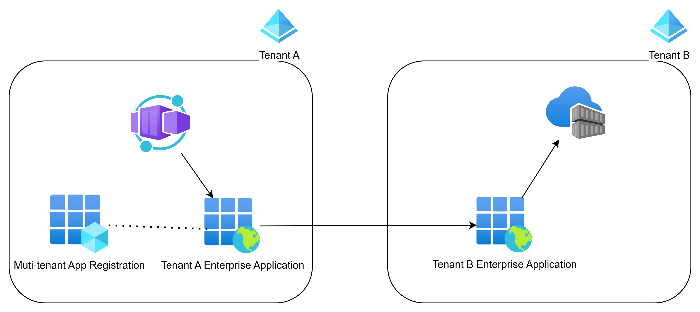
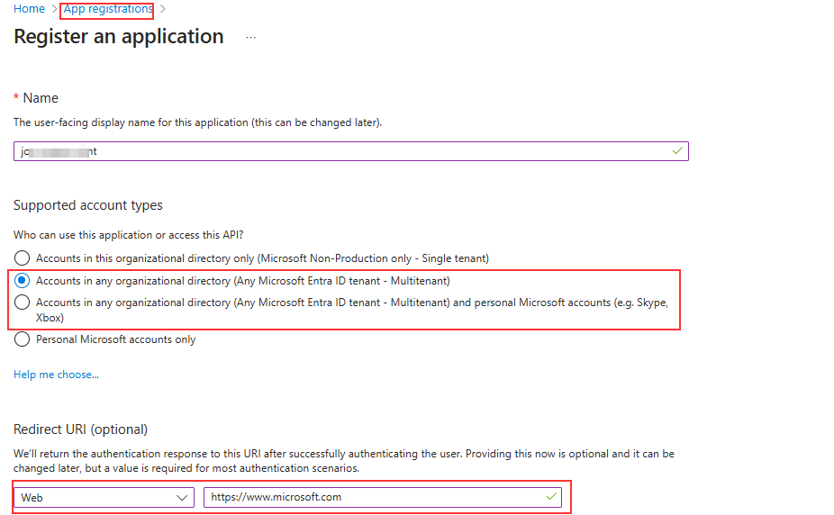
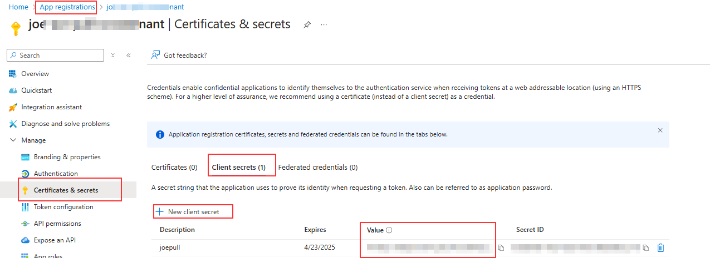
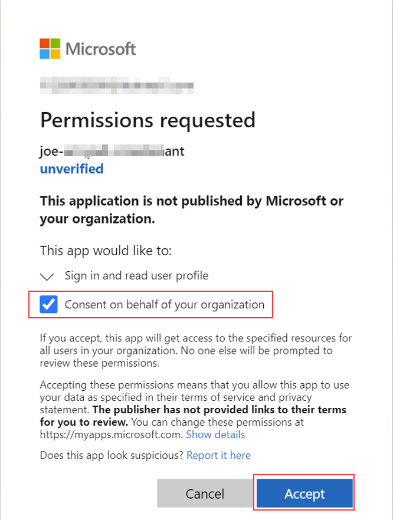
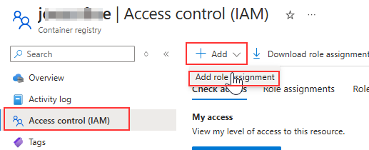
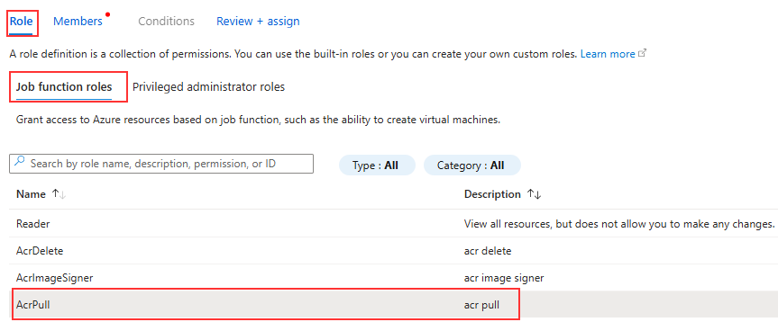
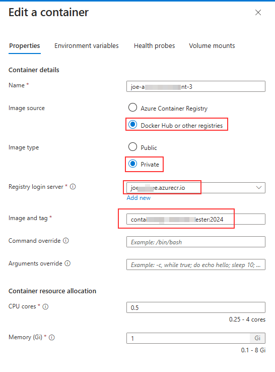

### 작성자 : [Joe_Chen](https://techcommunity.microsoft.com/users/joe_chen/1542074)
### 원본 : [Configuring Azure Container App to Pull Images from Different Tenants' Azure Container Registry](https://techcommunity.microsoft.com/blog/appsonazureblog/configuring-azure-container-app-to-pull-images-from-different-tenants-azure-cont/4279099)



# 머리말

많은 기업들이 팀, 프로젝트 또는 부서별로 각기 다른  Azure 테넌트를 사용하고 있습니다. 이렇게 테넌트가 분리되면 보안 및 제어 계층의 추가가 필요하게 되지만, 리소스가 테넌트 간에 상호 동작해야 하는 문제를 유발할 수도 있습니다.

일반적으로 발생되는 문제 중에 하나로, 개발자가 Azure Container App와 Azure Container Registry (ACR)가 서로 다른 테넌트에 있는 경우를 둘 수 있습니다. 여기서 소개하는 방법은 (DevOps 팀에 의해서 관리되는) 공유된 레지스트리에 컨테이너 이미지를 중앙 집중화하여 관리하고, 다른 테넌트를 사용하는 개별 팀은 해당 이미지를 이용하여 어플리케이션을 배포하는 조직에 유용하게 사용될 수 있습니다. 자 그럼, 설정 방법에 대해서 살펴보도록 하겠습니다.

## 방법
**단계 1 : 멀티테넌트 앱 등록(Multitenant App Registration) 생성**

1. 신규 앱 등록 생성
    - 이름 : 쉽게 기억할 수 있는 이름을 입력합니다.
    - 지원되는 계정 유형 : "멀티테넌트(Multitenant)"를 선택합니다. 필요에 따라서, 개인 Microsoft 계정을 허용할지 여부를 선택하면 됩니다. 
    - 리디렉션 URI : "웹(Web)"을 선택하고 "[https://www.microsoft.com](https://www.microsoft.com)"을 입력합니다. 

    

2. 앱 등록 섹션으로 이동합니다. "개요" 블레이드에서, **애플리케이션(클라이언트) ID**를 찾아서 저장해 놓습니다.

    

3. "인증서 & 비밀" 블레이드로 이동합니다. 새로운 클라이언트 비밀(client secret)을 만들고 **클라이언트 비밀의 값**을 바로 저장해 놓습니다. 해당 페이지를 벗어나면, 값을 다시 가져오거나 복사할 수 없게 됩니다:

    

**단계 2 : Azure Container Registry 테넌트에서 서비스 주체 만들기**

1. Azure Container Registry 테넌트로 이동하여 관리자 계정으로 로그인 합니다. 다음의 링크에서 <ACR-Tenant-ID>와 <Multitenant-application-ID> 값을 여러 분의 환경의 값으로 변경한 뒤에 해당 링크로 이동합니다.

    https://login.microsoftonline.com/<ACR-Tenant-ID>/oauth2/authorize?client_id=<Multitenant-application-ID>&response_type=code&redirect_uri=https://www.microsoft.com

2. 팝업창이 나타나면, "조직을 대신하여 동의"에 체크하고 "수락"을 클릭합니다.

    

**단계 3 : Azure Container Registry에서 가져오기 작업을 할 수 있도록 서비스 주체에 "AcRPull"권한을 부여**

1. Azure Container Registry의 "액세스 제어(IAM)" 블레이드로 이동하여 "역할 할당 추가"를 클릭:

    

2. "AcrPull" 권한 선택:

    

3. Azure Container Registry의 테넌트에서 Enterprise Application을 선택합니다. 이름이나 개체 ID로 검색이 가능합니다:

    

**단계 4 : 새로운 Azure Container App을 만들고 서비스 주체를 이용하여 다른 테넌트에 있는 리미즐 가져오기 합니다.**

1. 다음의 Azure CLI 명령을 실행합니다. *참고 : 포털에서는 해당 기능이 아직 지원되지 않습니다.

    - \<application-id>: 1-2단계의 값을 사용하세요.
    - \<client-secret-value>: 1-3단계의 값을 사용하세요.

    ```
    az containerapp create -n <name-of-container-app> -g <resource-group-of-container-app> --image <acr-name>.azurecr.io/<image-name>:<image-tag> --environment <container-app-enviroemnt-name> --ingress external --target-port <your-container-expose-port> --registry-server <acr-name>.azurecr.io --registry-username <application-id> --registry-password <client-secret-value> --query properties.configuration.ingress.fqdn
    
    ```

2. 명령을 실행하면, 출력 콘솔에는 클라이언트 비밀 값을 저장하는데 사용되는 비밀이 생성되었고, 컨테이너 앱도 성공적으로 설정되었음을 보여줍니다.

    

이로서 모든 단계가 완료되었습니다. 축하합니다. 이제 Container App 어플리케이션의 URL을 방문하여 모든 것이 제대로 동작하는지 확인해보도록 합니다.

# 추가 참고 사항
- 새로운 이미지로 업데이트 하려면, 다음의 Azure CLI 명령을 실행합니다:

    ```
    az containerapp update -n <name-of-container-app> -g <resource-group-of-container-app> --image <acr-name>.azurecr.io/<image-name>:<image-tag>
    ```

    - 포털에서는 서비스 주체를 사용하여 다른 테넌트의 Azure Container Registry에서 이미지를 가져오는 것을 지원하지 않으므로 다음과 같이 수동으로 입력하여 새 이미지로 변경해야 합니다.

    

# 참조

- [Cross-Tenant Authentication from AKS to ACR - Azure Container Registry - Microsoft Learn](https://learn.microsoft.com/en-us/azure/container-registry/authenticate-aks-cross-tenant#step-by-step-instructions)
- [Update or rotate the credentials for an Azure Kubernetes Service (AKS) cluster - Azure Kubernetes Service - Microsoft Learn](https://learn.microsoft.com/en-us/azure/aks/update-credentials#update-aks-cluster-with-service-principal-credentials)


- 2024년 12월 3일 업데이트 됨.
- 2024년 12월 9일 번역 함. (by [JYSEONG(MSFT)](https://techcommunity.microsoft.com/users/ji%20yong%20seong/219866) / [GitHub](https://github.com/jiyongseong))