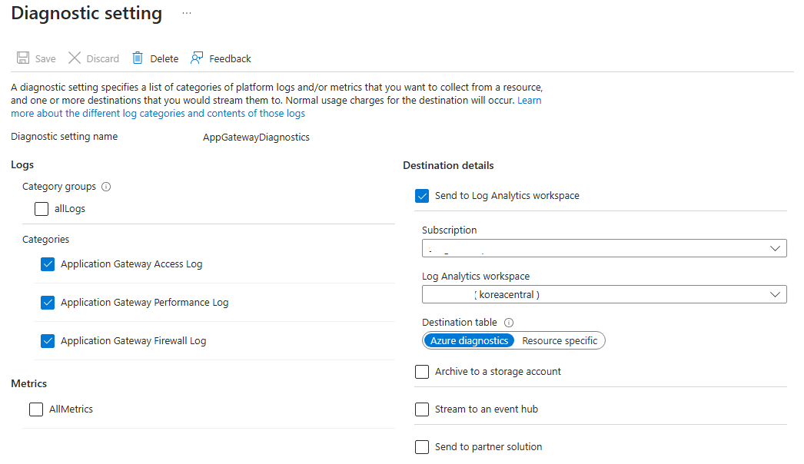

# Azure Web Application Firewall(Azure WAF)이해하기(2/2) 

[Azure Web Application Firewall(Azure WAF)이해하기(1/2)](https://medium.com/azure-tech-blog-kr/azure-web-application-firewall-azure-waf-%EC%9D%B4%ED%95%B4%ED%95%98%EA%B8%B0-1-2-b29b11d55c01)의 후속으로 2편에서는 Custom Rule 소개, Monitoring 가이드, 유용한 WAF Monitoring Workbook, 권장 학습 경로에 대하여 소개 드리도록 하겠습니다.

## Azure WAF Custom Rule
    
Azure WAF의 주요 기능 중 하나는 사용자 정의 규칙(Custom Rule)을 생성하여 애플리케이션의 요구 사항에 맞는 특정 보안 정책을 정의할 수 있다는 점입니다.
Azure WAF의 Custom Rule은 사용자가 정의하는 정책으로, 웹 요청을 처리하는 방식을 지정할 수 있습니다. 이러한 규칙은 다음과 같은 조건에 따라 구성할 수 있습니다:

- IP 주소: 특정 IP 주소 또는 범위에서의 트래픽 차단 또는 허용.
- 요청 헤더: 특정 값이나 패턴이 포함된 헤더 검사.
- 쿼리 매개변수: 쿼리 문자열 매개변수를 분석하고 논리 적용.
- 지리적 위치: 특정 국가나 지역에서의 트래픽 제한 또는 허용.
- 요청 메서드: HTTP 메서드(GET, POST 등)에 따라 접근 제어.

Custom Rule은 관리 규칙(예: OWASP Core Rule Set 또는 DRS)보다 먼저 평가되며, 기본 동작을 재정의할 수 있습니다.

관련 문서 : [https://learn.microsoft.com/en-us/azure/web-application-firewall/ag/custom-waf-rules-overview](/azure/web-application-firewall/ag/custom-waf-rules-overview)

Azure WAF Custom Rule에 Rate Limit rule이 추가되었습니다.
Rate Limit Rule은 단일 클라이언트(일반적으로 IP 주소)를 기준으로 트래픽 요청의 빈도를 제한하여 과도한 요청으로부터 애플리케이션을 보호하는 데 사용됩니다. 이는 DDoS 공격 완화, 자원 남용 방지, 또는 트래픽 조정에 유용합니다.

상세한 설명은 [Azure Network Security Blog](https://techcommunity.microsoft.com/blog/azurenetworksecurityblog/rate-limiting-feature-for-azure-waf-on-application-gateway-now-in-preview-/3934957 
)와 Learn의 [Azure WAF Rate Limiting](https://learn.microsoft.com/en-us/azure/web-application-firewall/ag/rate-limiting-overview)내용을 참고하시기 바랍니다. 


## Azure WAF Monitoring Guide
Azure Web Application Firewall (WAF)은 SQL Injection, XSS 등 OWASP Top 10 위협으로부터 웹 애플리케이션을 보호하기 위한 강력한 도구입니다. 
WAF의 효과를 극대화하고 성능을 최적화하려면 적절한 모니터링이 필수적입니다. 
이 가이드는 Azure WAF 모니터링 방법과 로그 설정에 대한 간략한 정보를 제공합니다.

상세한 설명은 [Azure Web Application Firewall 모니터링 및 로깅](https://learn.microsoft.com/ko-kr/azure/web-application-firewall/ag/application-gateway-waf-metrics)을 참고하시기 바랍니다.

### 1. Azure WAF Monitoring을 위해 사용되는 Azure의 서비스는 아래와 같습니다.
- **Azure Monitor**: Collects and analyzes logs and metrics. Log Analytics에 Log 수집을 구성합니다.
- **Azure Application Insights**: application performance를 측정하기 위한 도구로 Web Service의 성능을 측정할 수 있습니다.
- **Diagnostics Logs**: WAF의 상세 Log 수집에 대한 설정, Log Analytics, Event Hub, Storagr Account와 같은 서비스로 로그를 전달하도록 설정합니다.
- **Metrics in Azure Portal**: 기본적인 App GW의 성능을 모니터링 합니다.

### 2. Key Monitoring Metrics 

| **Metric**           | **Description**                | **Reason for Monitoring**       |
|-----------------------|---------------------------------|----------------------------------|
| WAF Total Requests        | WAF 엔진이 처리한 성공적인 요청 수       | 작업, 국가/지역, 메서드, 모드, 정책 이름, 정책 범위 |
| WAF Managed Rule Matches    | 관리되는 총 규칙 일치 수     | 작업, 국가/지역, 모드, 정책 이름, 정책 범위, 규칙 그룹, 규칙 ID, 규칙 집합 이름       |
| WAF Custom Rule Matches     | 사용자 지정 규칙 일치 수     | 작업, 국가/지역, 모드, 정책 이름, 정책 범위, 규칙 이름           |
| WAF Bot Protection Matches              | 악성 IP 주소에서 차단되거나 기록된 총 봇 보호 규칙 수. IP 주소는 Microsoft 위협 인텔리전스 피드에서 제공됩니다.        | 작업, 국가/지역, 봇 유형, 모드, 정책 이름, 정책 범위   |
| WAF JS Challenge Request Count          | JS Challenge WAF 규칙과 일치하는 요청 수를 계산합니다. | 작업, 정책 이름, 정책 범위, 규칙       |

### 3. Diagnostics Logs 구성 방법

1) Azure Portal에서 WAF가 구성된 Application Gateway로 이동
2) **Diagnostics Settings** 선택
3) Click **Add diagnostic setting** and configure:
   - **Log Categories**: "ApplicationGatewayAccessLog", "ApplicationGatewayFirewallLog".
   - **Destination**: Log Analytics, Storage Account, or Event Hub 중 선택 - Log Ananytics 구성 권장




### 4. Log Analytics Query Samples 
Diagnostics Log 설정을 통해 Log Analytics로 전달된 WAF Log는 Query를 이용하여 원하는 로그를 검색하고 모니터링에 이용할 수 있습니다.

Query Sample : [Use Log Analytics to examine Application Gateway Logs](https://learn.microsoft.com/en-us/azure/application-gateway/log-analytics)

#### Example Queries

Matched/Blocked requests by IP

```kusto
AzureDiagnostics
| where ResourceProvider == "MICROSOFT.NETWORK" and Category == "ApplicationGatewayFirewallLog"
| summarize count() by clientIp_s, bin(TimeGenerated, 1m)
| render timechart
```

Top matched rules

```kusto
AzureDiagnostics
| where ResourceProvider == "MICROSOFT.NETWORK" and Category == "ApplicationGatewayFirewallLog"
| summarize count() by ruleId_s, bin(TimeGenerated, 1m)
| where count_ > 10
| render timechart
```


### 5. 유용한 Azure WAF Monitoring Workbook
Azure WAF는 모니터링을 위한 몇가지 Monitoring Workbook을 Github에서 제공하고 있습니다.
Github Link에서 Azure로 직접 Deploy할 수 있어 모니터링을 위해 유용하게 사용할 수 있습니다.

- [Azure Monitor Workbook for WAF](https://github.com/Azure/Azure-Network-Security/blob/master/Azure%20WAF/Workbook%20-%20WAF%20Monitor%20Workbook/README.md#azure-monitor-workbook-for-waf) 


- [Application Gateway WAF Triage Workbook](https://github.com/Azure/Azure-Network-Security/blob/master/Azure%20WAF/Workbook%20-%20AppGw%20WAF%20Triage%20Workbook/README.md)
WAF 규칙이 어떤 방식으로 트리거되었는지, 애플리케이션 트래픽에 어떤 영향을 미쳤는지, 규칙이 무엇을 감지 또는 방지하려고 했는지 한눈에 파악할 수 있도록 설계된 새로운 통합 문서


관련 블로그 링크 : [Introducing the Application Gateway WAF Triage Workbook](https://techcommunity.microsoft.com/blog/azurenetworksecurityblog/introducing-the-application-gateway-waf-triage-workbook/2973341)


## 권장 학습 경로

Azure WAF를 좀 더 상세하게 학습하고 싶다면 Azure 공식 문서인 Learn 사이트의 [Azure Web Application Firewall](https://learn.microsoft.com/ko-kr/azure/web-application-firewall/) 부분을 먼저 살펴 보시기 바랍니다.

Demo 환경 구성과 Test를 원하실 경우 Azure Security Team에서 작성한 공식 블로그를 참고하셔서 Demo 환경 구성 및 Test를 진행해 보실 것을 권장드립니다.
이 블로그에는 Azure Network Security에 관한 Deployment template이 제공되어 Azure WAF, Firewall, DDos Protection등 기본적인 Test 환경을 Template 기반으로 자동으로 배포할 수 있어 환경 구성에 소요되는 시간을 줄 일 수 있습니다.
이 블로그의 Azure WAF 설정 및 모니터링 화면은 아래 Lab 환경에서 제공되는 설정 및 Test 환경을 사용하였습니다.

*Lab 환경 Architecture


- [Tutorial Overview: Azure Web Application Firewall Security Protection and Detection Lab](https://techcommunity.microsoft.com/blog/azurenetworksecurityblog/tutorial-overview-azure-web-application-firewall-security-protection-and-detecti/2030423)
- [Part 1 - Lab Setup: Azure WAF Security Protection and Detection Lab](https://techcommunity.microsoft.com/blog/azurenetworksecurityblog/part-1---lab-setup-azure-waf-security-protection-and-detection-lab/2030469)
- [Part 2 - Reconnaissance Playbook: Azure WAF Security Protection and Detection Lab](https://techcommunity.microsoft.com/blog/azurenetworksecurityblog/part-2---reconnaissance-playbook-azure-waf-security-protection-and-detection-lab/2030751)
- [Part 3 - Vulnerability Exploitation Playbook: Azure WAF Security Protection and Detection Lab](https://techcommunity.microsoft.com/blog/azurenetworksecurityblog/part-3---vulnerability-exploitation-playbook-azure-waf-security-protection-and-d/2031047)


