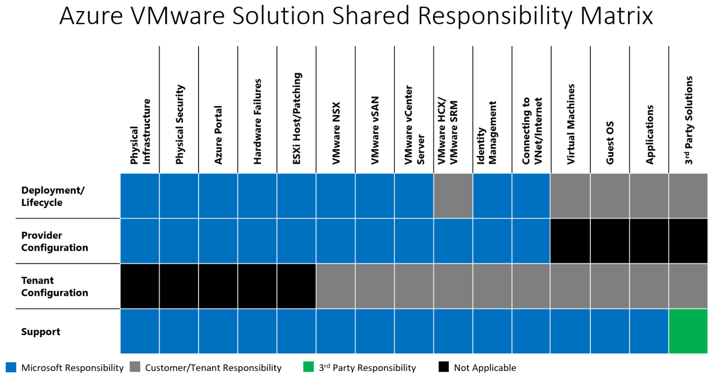
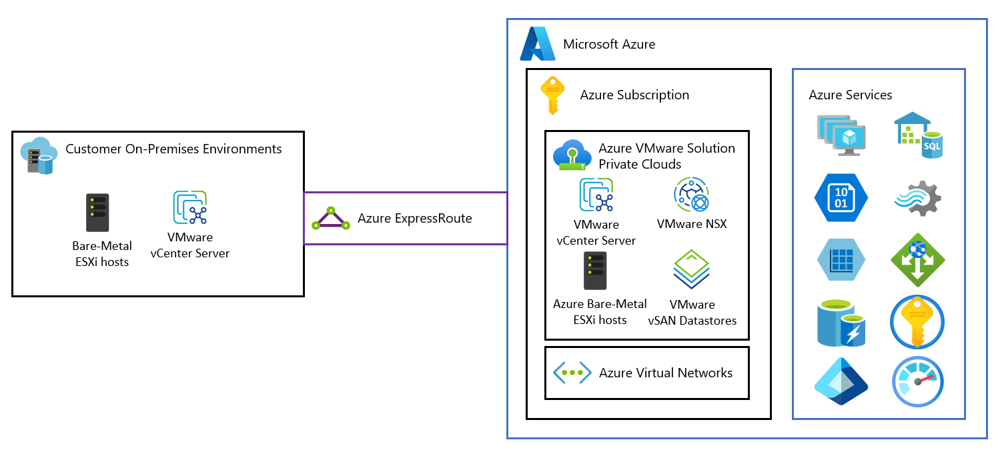
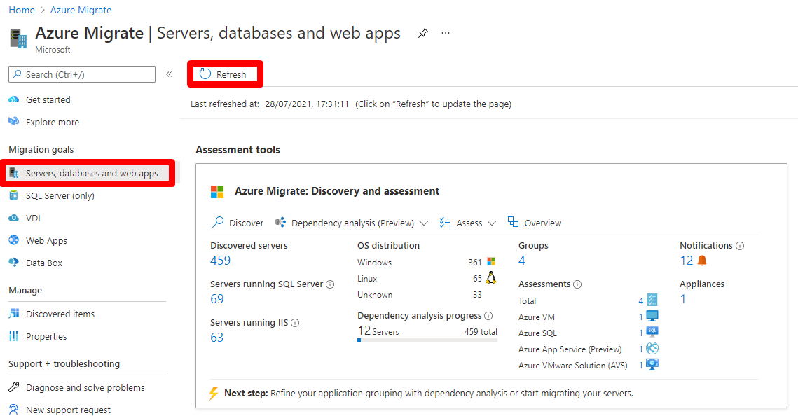
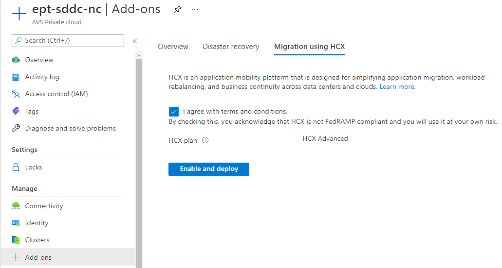

본 블로그는 On-Premise VMware 워크로드를 AVS로 마이그레이션하는 과정을 다루고 있습니다. 

AVS 개념에 대해 간단히 알아본 후, Azure Migrate를 활용한 마이그레이션에 대해 차근차근 살펴보도록 하겠습니다. 

1. [AVS](#avs)
2. [Azure Migrate](#azure-migrate)
3. [Migration with Azure Migrate](#migration-with-azure-migrate)
4. [Wrap-Up](#wrap-up)

&#160;
 
## AVS

**AVS(Azure VMware Solution)**는 VMware 기반 엔터프라이즈 워크로드를 Azure 환경에서 네이티브하게 실행할 수 있도록 지원하는 **관리형 가상화 솔루션**을 말합니다. AVS는 Microsoft 차원에서 관리되기 때문에 성능, 가용성, 보안 및 컴플라이언스를 보장합니다. 

*AVS 관리에서의 Microsoft/고객/서드파티 솔루션의 책임 범위*

위 그림에서 확인할 수 있듯이, AVS 관리의 대부분을 Microsoft가 책임지고 있기 때문에 고객은 운영 및 관리에 대한 부담을 최소화 할 수 있습니다. 

AVS는 표준 VMware 제품을 기본으로 하기 때문에, 기존 VMware 워크로드를 AVS로 이관하더라도 운영 및 사용 환경을 일관적으로 유지할 수 있습니다. 운영 관리자는 VMware 인터페이스에 직접 접근할 수 있으며, 실무자는 추가적인 학습 없이 VMware에 대한 기존 경험을 토대로 AVS를 바로 활용할 수 있습니다. (단, 배포 및 관리를 위해서는 VMware 인터페이스가 아닌 **Azure Portal**을 활용해야 합니다.)

그리고 AVS는 Microsoft의 first-party 솔루션이기 때문에 다양한 Azure native 서비스와 통합하여 사용할 수 있습니다. 

AVS와 통합하여 사용할 수 있는 대표적인 Azure native 서비스에는 Microsoft Defender for Cloud와 Log Analytics가 있습니다.
- **Microsoft Defender for Cloud**: Microsoft Defender for Cloud는 인프라를 위한 통합 보안 관리 서비스로, 지능형 위협 방지 시스템을 제공합니다.
- **Log Analytics**: Log Analytics는 Azure Monitor를 통해 발생하는 로그 데이터를 수집하고 분석하는 모니터링 솔루션입니다.

뿐만 아니라, Microsoft를 단일 창구로 하여 AVS 개발 및 운영에 대한 지원을 받을 수 있습니다. 

지금까지 한국 리전에서는 AV36, AV52, AV64 등의 옵션만을 사용할 수 있었지만, 이번에 AV48이 한국 리전에 도입되기 때문에 앞으로는 고객의 요구사항을 더욱 다양하게 충족할 수 있게 될 것입니다. 

새롭게 추가되는 AV48 스펙은 아래와 같습니다. 

| SKU | AV48 |
| :------: | :------: |
| Core | 48Cores |
| CPU | Intel Xeon Gold 6442Y - 2.6GHz (3.3GHz with Turbo) |
| Memory | 1TB |
| Storage | 25.6T (running under vSAN ESA) |

&#160;

## Azure Migrate

Azure Migrate는 On-Premise VMware 또는 Hyper-V 워크로드를 Azure 환경으로 마이그레이션 하고자 하는 고객을 위한 솔루션입니다. end-to-end 마이그레이션을 지원하는 Azure Migrate를 통해 마이그레이션 절차를 간소화 할 수 있으며, 최신 버전의 Azure Migrate는 Agentless 환경에서의 마이그레이션도 지원합니다. 뿐만 아니라, Azure Migrate를 활용해 마이그레이션 진행 상황에 대한 모니터링도 가능합니다. 

&#160;
 
## Migration with Azure Migrate

On-Premise 워크로드를 Azure로 마이그레이션 하는 시나리오는 다양하겠지만, 본 블로그에서는 **On-Premise VMware VM to Azure** 케이스를 중점적으로 살펴보도록 하겠습니다. 

*일반적인 마이그레이션 과정*

1️⃣ **Decide** 
    Decide 단계에서는 마이그레이션 여부를 결정합니다. 이를 위해, 마이그레이션 대상이 될 워크로드의 구성 및 성능에 대해 분석합니다. 마이그레이션에 드는 비용 및 마이그레이션 이후에 절감될 비용 등을 비교분석하여 의사결정에 활용합니다.

2️⃣ **Plan** 
    Plan 단계에서는 구체적인 마이그레이션 계획을 수립합니다. 워크로드를 Azure로 옮기기 전에, Azure Migrate에서 제공하는 평가 도구로 워크로드를 평가할 수 있습니다. 평가 결과를 토대로, 리소스 별 마이그레이션의 우선순위를 설정하는 등의 방식으로 계획을 세우게 됩니다. 

3️⃣ **Execute** 
    Execute 단계에서는 워크로드의 migration 또는 modernization 작업을 수행합니다. 실제 운영 환경에서의 작업을 진행하기 전에, 미리 테스트를 진행하여 전반적인 프로세스를 익혀야 합니다. 프로덕션 환경에서의 migration 또는 modernization 시, 작업으로 인한 서비스 중단 시간을 최소화 해야 합니다. 

이제부터는 본격적으로 **Azure Migrate를 활용한  VMware to AVS 마이그레이션**에 대해 알아보겠습니다. 

*Azure Migrate 프로세스*

### Prerequisites

Azure Migrate 솔루션을 활용하기 위한 사전 준비 단계입니다. 

Azure Migrate를 사용하기 위해서는 반드시 **Azure 구독**이 필요합니다. 따라서, 구독 정보가 올바르게 설정되어 있는지 먼저 확인해야 합니다. 

그리고 Azure Migrate에서 제공하는 평가 도구를 활용하여 워크로드를 평가하기 위해서는 **올바른 권한 설정**이 필요합니다. 기존 워크로드에서 발생하는 로그 데이터를 Azure로 전송할 수 있도록 권한이 제대로 설정되어 있는지 확인해야 합니다. 

*Azure Migrate를 사용한 마이그레이션은 Windows 서버 및 Linux 서버에서만 지원되는 점 참고 부탁드립니다.*

### Azure Migrate Setup

Azure Portal에서 Azure Migrate 프로젝트를 구성하는 단계입니다. 

*Azure Portal > Azure Migrate*

위 화면에서 *Discover, assess and migrate*를 선택하여 검색 및 평가에 대한 설정을 시작합니다. 

*Azure Portal > Azure Migrate*

새로운 Azure Migrate 프로젝트를 만들면, 이렇게 기본적으로 Assessment tool과 Migration tool이 설정됩니다. 새로운 도구를 추가하고 싶다면, **Click here**를 클릭해 더 많은 도구를 확인할 수 있습니다. 각 도구는 한 번에 하나씩만 설정할 수 있고, 도구를 여러 개 설정하고 싶다면 여러 번 반복하여 추가하면 됩니다. 

Azure Migrate 프로젝트 설정을 마쳤다면, 이를 통해 기존 VMware 워크로드로부터 검색 및 평가에 대한 정보를 제공 받을 수 있습니다. 

*최초에는 단일 어플리케이션이나 소규모 워크로드를 활용하여, Azure Migrate 프로젝트가 제대로 설정되었는지 간단히 테스트 해보는 것을 권장합니다.*

### Discover VMs

기존 워크로드의 기본적인 구성 및 dependency에 대해 파악하는 단계입니다. 기존 워크로드에 대한 검색 과정을 통해 이를 파악하는데, 검색 과정에는 Virtual Appliance가 활용됩니다. Virtual Appliance는 연속 검색을 통해 기존 워크로드의 모든 구성 정보를 파악하고, 검색 결과 기반으로 도출된 서버 구성 및 성능 데이터를 Azure Migrate로 전달합니다. 뿐만 아니라, On-Premise 서버 간 dependency 정보도 함께 Azure Migrate로 전달합니다. 

dependency를 분석하는 대표적인 이유는 아래와 같습니다. 
- 함께 이관해야 하는 서버들을 그룹화 할 수 있습니다. 
- 누락된 서버의 유무를 확인할 수 있습니다. 
- 서버 별 현재 사용 여부를 파악하고, 사용되지 않는 서버는 이관 대상에서 제외할 수 있습니다. 

### Review Assessment

기존 VMware 워크로드를 평가하는 기준은 크게 2가지로 나뉩니다. 

1️⃣ **성능** 
    On-Premise VMware 워크로드의 성능을 기준으로 평가할 수 있습니다. 일정 주기마다 수집되는 성능 패턴을 평가합니다. 성능 기준으로 평가하기 위해서는, 패턴 수집을 위한 기간 확보가 필수적입니다.

2️⃣ **크기** 
    On-Premise VMware 워크로드의 크기를 기준으로 평가할 수 있습니다. 기존 vSphere 구성의 snapshot 데이터를 기준으로 평가합니다.

위와 같은 기준으로 검색 결과 데이터를 평가하여, 마이그레이션 여부를 결정합니다. 

추가적으로 검토하는 사항은 아래와 같습니다. 
- On-Premise 환경에서의 비용 대비 Azure 비용
- 클라우드 환경 적합 여부 
- migration 또는 modernization 직후에 예상되는 성과

### Replicate VMs

Azure로의 마이그레이션이 결정되었다면, 이제는 본격적인 마이그레이션 작업에 들어가게 됩니다. 

*Azure Portal > Azure Migrate*

Azure Migrate 영역 내 Migration tools에서, 기존 VMware 워크로드의 복제 작업을 수행할 수 있습니다. (Discover 단계를 완료하면, Replicate 버튼이 활성화됩니다.)

복제 작업 절차에 대한 자세한 설명은 [여기](https://learn.microsoft.com/en-us/training/modules/m365-azure-migrate-replicate-virtual-servers/replicate-virtual-machines)에서 확인할 수 있습니다. 

복제가 완료된 VMware 워크로드는 Azure Storage에 저장됩니다. 

### Test Migration

프로덕션 환경으로의 마이그레이션 이전에, 테스트 환경에서 전체 확인을 진행합니다. Azure Portal 상에서 바로 테스트가 가능합니다. 

테스트 절차에 대한 자세한 설명은 [여기](https://learn.microsoft.com/en-us/training/modules/m365-azure-migrate-replicate-virtual-servers/test-migrated-virtual-machines)에서 확인할 수 있습니다. 

*테스트에 활용하는 Azure Virtual Network는 non-production을 권장합니다.*

### Migrate to Production

테스트까지 완료했다면, 이제 프로덕션 환경으로의 마이그레이션 작업을 수행하게 됩니다.

우선, 테스트를 위해 사용한 리소스는 모두 정리합니다. 정리가 완료되면, 프로덕션 환경으로의 마이그레이션 작업을 수행하게 됩니다. 이때, 데이터 손실을 최소화 하기 위해 최종 버전에 대한 replication 작업이 이루어집니다. 

*replication 작업을 수행하는 동안에는 VM이 중단되는 점 유의해야 합니다.*

*Azure VMware Solution을 적용한 아키텍처*

성공적으로 마이그레이션 된 워크로드는 Azure 상에 존재하기 때문에 Microsoft Defender for Cloud, Azure Monitor 등의 Azure native 서비스와 통합하여 사용할 수 있습니다. 

&#160;

## Wrap-Up

지금까지 Azure Migrate를 활용하여 On-Premise VMware 워크로드를 AVS로 마이그레이션 하는 과정 전반에 대해 살펴봤습니다. 복잡한 마이그레이션 과정의 처음부터 끝까지 Azure Migrate를 활용할 수 있으니, On-Premise 워크로드를 Azure 환경으로 간편하게 마이그레이션 하는 데 본 블로그가 도움이 되기를 바랍니다. 🙇‍♀️

&#160;

## References

* [What is Azure VMware Solution?](https://learn.microsoft.com/en-us/azure/azure-vmware/introduction)
* [Azure VMware Solution expands SKUs](https://blogs.vmware.com/vmware-japan/2025/03/avs-riupdates.html)
* [Azure Migrate Overview](https://learn.microsoft.com/en-us/azure/migrate/migrate-services-overview)
* [Start here to migrate from VMware to Azurew](https://learn.microsoft.com/en-us/azure/migrate/vmware/start-here-vmware)
* [Set up Azure Migrate for server migration](https://learn.microsoft.com/en-us/training/modules/m365-azure-migrate-set-up/)
