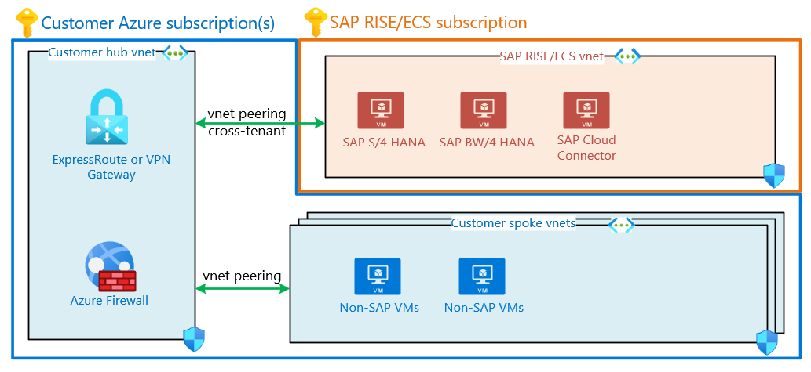
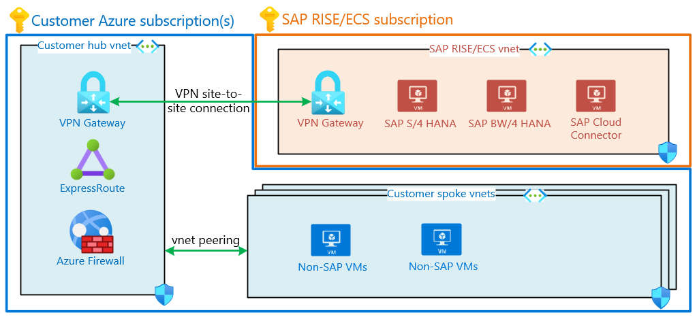
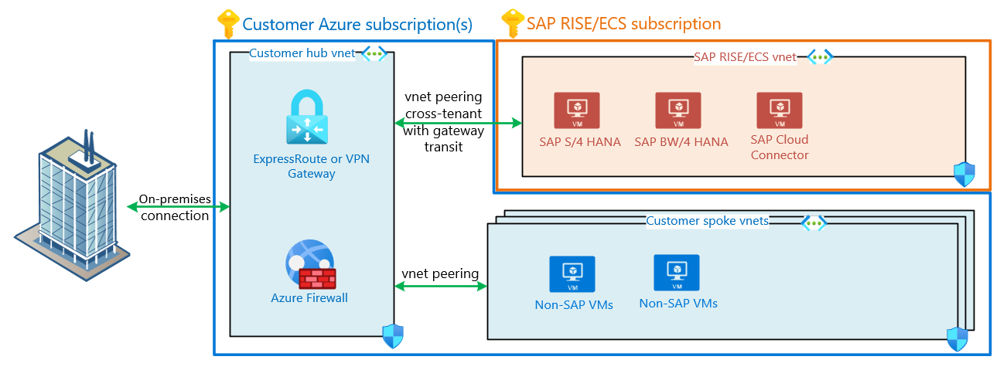

이번 블로그 포스팅은 다음 링크의 내용을 편집 및 각색하였습니다.  
링크 : [기존 Azure 환경과 SAP RISE 환경간 네트워크 연결하기](https://learn.microsoft.com/en-us/azure/sap/workloads/rise-integration-network)

RISE with SAP는 일반적으로 대다수의의 엔터프라이즈급 기업이 사용중인 ERP 솔루션입니다. RISE with SAP 도입시 하이퍼스케일러로 Azure를 선택하게 되면 아래 두 가지 옵션이 있습니다.  
  
1) 기존 Azure 랜딩존과 연결하여 사용   
2) 단독으로 RISE with SAP 환경만 사용   
  
기존 Azure 랜딩존과 연결하게 되면 DB암호화 솔루션 / 수출입신고서 / 세금계산서 등의 주변부 애플리케이션과 손쉽게 네트워크 경로를 확보할 수 있습니다. 네트워크 연결성은 SAP 시스템과 Azure 환경 간의 원활한 통신을 보장하여 비즈니스 운영의 효율성을 극대화합니다. 이번 포스팅은 기존 Azure 환경과 네트워크 연결성을 확보하는 방법에 대해 소개합니다.

SAP RISE 환경과 기존 사용자 환경 간 가상네트워크 피어링 (Virtual network peering with SAP RISE)
--------------------
가상 네트워크 피어링은 프라이빗 네트워크 주소 공간에 있는 두 가상 네트워크를 안전하게 연결하는 가장 효율적인 방법입니다. 피어링된 네트워크에 배포된 애플리케이션끼리 직접 통신할 수 있으며, 단일 가상 네트워크의 트래픽과 마찬가지로 인터넷을 통과하지 않습니다. SAP RISE/ECS 배포의 경우, 가상네트워크 피어링은 사용자의 기존 Azure 환경과 연결을 설정하는 데 가장 선호하는 방법입니다. 주요 이점은 다음과 같습니다.
  
- SAP RISE 환경과 Azure에서 실행되는 애플리케이션 및 서비스 간의 네트워크 지연 시간 최소화  
- SAP RISE 워크로드를 위한 전용 온프레미스 통신 경로를 사용하므로 복잡성과 비용 최소화 (기존 Azure 연결 네트워크 활용)  
  
가상네트워크 피어링은 SAP 환경이 배포된 리전에서 설정하실 수 있지만 간혹 글로벌 피어링을 구성하는 경우도 있습니다. 대개는 네트워크 지연을 최소화 하기 위해 같은 리전 내 구성하는 것이 일반적이나, 세계 각지에 오피스가 있는 경우 글로벌 피어링으로 구성할 수 있습니다.  
  
  
  
위 그림에서 파란색으로 표시된 부분은 사용자의 테넌트 내 기존 Azure 환경을 나타내고, 주황색으로 표시된 부분은 SAP의 테넌트에 배포된 SAP RISE 환경을 나타냅니다. 서로 다른 테넌트에 리소스가 배포돼 있기 때문에 cross-tenant vnet peering을 설정하여 네트워크 경로를 확보 후 양쪽에서 통신할 수 있습니다. 이러한 네트워크 설정을 위해서는 SAP사사 담당자와 사전 논의가 필요합니다. 가상네트워크 피어링 후 네트워크 경로를 파악했다고 하더라도, 양쪽 환경의 가상네트워크는 Network Security Group으로 보호돼 있어서 허용된 트래픽에 대해서만 통신을 허용합니다.  
  
VPN을 통한 연결 (vnet-to-vnet)
-------------
가상네트워크 피어링을 사용하지 않을 경우 VPN을 통해 연결할 수 있습니다. 사용자의 가상네트워크와 SAP 가상네트워크에 각각 가상네트워크게이트웨이 리소스를 배포한 후 vnet-to-vnet 연결성을 확보합니다. 가상네트워크 피어링 시나리오와 마찬가지로 서로 다른 리전에 위치한 가상네트워크끼리도 연결할 수 있습니다.
  
  
  
위 그림과 같이 구성할 경우 네트워크 스루풋은 양쪽 환경에 배포된 가상네트워크게이트웨이(Virtual Network Gateway)에 의해 결정됩니다. 위와 같은 구성에서도 역시 양쪽의 가상네트워크는 Network Security Group에 의해 보호되기 때문에 허용된 트래픽에 대해서만 통신할 수 있습니다. 역시 이러한 네트워크 구성을 위해서는 SAP사 담당자와 사전 논의가 필요합니다.
  
온프레미스 환경과 네트워크 연결
-------------
기존에 Azure 환경을 가지고 있던 사용자라면, 온프레미스 환경과 Azure 환경 간 전용선(ExpressRoute) 혹은 VPN을 통해 네트워크가 연결돼 있을 가능성이 매우 높습니다. 기존에 구성했던 해당 네트워크 경로를 통해 RISE환경에 액세스할 수 있습니다. 
  
  

이 아키텍쳐를 사용하면, 사용자 네트워크 연결을 관리하는 정책 및 보안 규칙이 RISE 워크로드에도 적용됩니다. 사용자의 가상네트워크 및 RISE 네트워크 모두 동일한 온프레미스 경로를 통해 통신하게 됩니다. 현재 Azure와 네트워크 경로가 확보돼 있지 않을 경우 SAP 담당자 혹은 Azure 영업팀에 문의가 필요합니다.   
**참고로 가상네트워크 피어링으로 연결된 네트워크의 경우 오직 한 개의 게이트웨이 리소스만 배포할 수 있습니다. 따라서, 이미 고객 가상네트워크에 게이트웨이 리소스를 배포한 경우(with 게이트웨이 트랜짓 활성화) RISE 환경에 추가 게이트웨이 배포는 할 수 없습니다.**  
