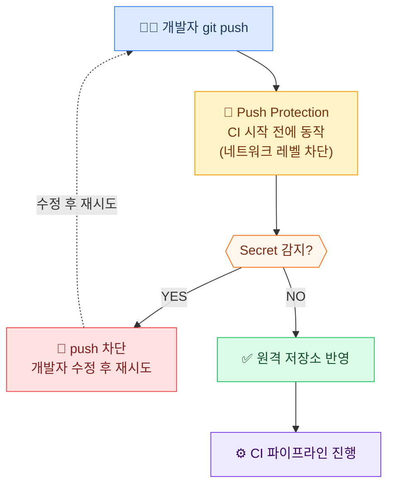
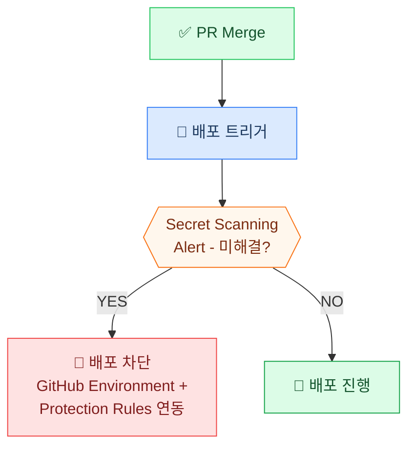

이 문서는 이전에 포스팅한 [GitHub Advanced Security의 Code Security로 구현하는 DevSecOps](2026-04-15-GHAS-Code-Scanning.md)에서 이어지는 시리즈로, GHAS의 **Secret Protection** 기능을 다룹니다.

Code Security가 코드 내 취약점을 탐지·수정하는 데 중점을 둔다면, Secret Protection은 비밀 키나 자격증명이 원격 저장소에 도달하기 **전에** 차단하는 역할을 합니다. 두 기능은 서로 보완적으로 작동하며, 함께 사용할 때 개발 프로세스 전반에 걸쳐 강력한 방어선을 구축할 수 있습니다.

이 문서는 실제 고객 질문을 바탕으로 기능과 활용 방법을 설명합니다. 고객사 신원 보호를 위해 질문은 일부 수정·일반화되었습니다.

---

## ❓ 고객 질문 리스트

| # | 질문 |
|---|------|
| Q | Secret Scanning과 Push Protection은 어떻게 다른가요? 각각 언제 동작하나요? |
| Q | Push Protection은 정확히 어떤 시점에 코드를 차단하나요? CI 파이프라인과의 관계가 궁금합니다. |
| Q | Secret Scanning은 어떤 종류의 시크릿을 탐지할 수 있나요? AWS 키나 Slack 토큰도 탐지되나요? |
| Q | 사내에서만 사용하는 자체 API 토큰 형식도 탐지할 수 있나요? |
| Q | AI 기반 비밀 탐지는 기존 패턴 탐지와 어떤 점이 다른가요? 오탐(False Positive)은 어떻게 줄이나요? |
| Q | 개발자가 Push Protection 경고를 무시하고 bypass할 경우 추적이 가능한가요? |
| Q | 이미 과거 커밋 히스토리에 시크릿이 올라간 경우 어떻게 처리해야 하나요? |
| Q | GitHub Actions 워크플로우에서 시크릿을 안전하게 참조하는 방법이 있나요? |
| Q | Secret Scanning 알림을 Slack, Teams 또는 SIEM(Sentinel/Splunk)에 연동할 수 있나요? |
| Q | 배포(CD) 단계에서도 시크릿 이슈가 있는 경우 배포를 자동으로 차단할 수 있나요? |
| Q | 조직 전체 저장소에 Push Protection을 강제로 적용할 수 있나요? 개별 저장소 단위로 끄는 것을 막을 수 있나요? |
---

## 📑 목차

1. [Secret Protection 개요 — GHAS 내 역할과 핵심 기능](#1-secret-protection-개요--ghas-내-역할과-핵심-기능)
2. [CI/CD 파이프라인에서의 동작 방식](#2-cicd-파이프라인에서의-동작-방식)
3. [탐지 방식 심층 비교 — 패턴 기반 vs AI 기반](#3-탐지-방식-심층-비교--패턴-기반-vs-ai-기반)
4. [조직 설정 가이드 — Push Protection·Custom Patterns·알림 연동](#4-조직-설정-가이드--push-protectioncustom-patterns알림-연동)
5. [시크릿 유출 사고 대응 절차](#5-시크릿-유출-사고-대응-절차)
6. [피해야 할 흔한 실수](#6-피해야-할-흔한-실수)
7. [요약](#요약)

---

## 1. Secret Protection 개요 — GHAS 내 역할과 핵심 기능

GHAS는 두 가지 보안 제품으로 구성됩니다.

| 제품명 | 포함 기능 | 목적 |
|---|---|---|
| GitHub Code Security | Code Scanning (CodeQL), Copilot Autofix, Security Campaigns, Premium Dependabot, Dependency Review | 취약점 탐지·수정 중심 (SAST + SCA) |
| **GitHub Secret Protection** | Secret Scanning, Push Protection, AI 기반 비밀 탐지, Custom Patterns 등 | 코드 내 비밀(토큰/키) 누출 탐지·방지 중심 |

이 문서에서는 **GitHub Secret Protection** 영역을 집중적으로 다룹니다. Code Security 관련 내용은 이전 포스팅 [GitHub Advanced Security의 Code Security로 구현하는 DevSecOps](2026-04-15-GHAS-Code-Scanning.md)를 참고하세요.

**Secret Protection 핵심 기능 5가지**

| 기능 | 설명 |
|---|---|
| **Secret Scanning** | 저장소 전체(커밋 히스토리 포함)에서 API 키·토큰·자격증명 패턴 탐지 |
| **Push Protection** | `git push` 시점에 시크릿 포함 여부를 차단 (코드가 원격에 도달하기 전) |
| **AI 기반 비밀 탐지** | 정규식 패턴 외 문맥(context)을 분석해 오탐 감소, 신규 패턴 자동 감지 |
| **Custom Patterns** | 조직 내부 토큰·키 형식을 정규식으로 직접 정의하여 탐지 |
| **Partner Validation** | 탐지된 시크릿을 서비스 제공사(AWS, Slack 등)에 실시간 전달 → 즉시 무효화 |

**업계 주요 활용 패턴**

| 활용 패턴 | 설명 |
|---|---|
| Partner Validation 자동 무효화 | AWS·GCP·Slack 등 200+ 파트너와 연동, 유출 즉시 키 무효화 (대부분의 기업 기본 설정) |
| Custom Patterns으로 내부 토큰 탐지 | JWT 포맷·사내 서비스 API 키 등 퍼블릭 패턴에 없는 토큰을 조직 단위로 등록 |
| Non-provider 패턴 AI 탐지 | 정형화되지 않은 비밀번호·연결 문자열을 AI로 탐지 |
| Webhook → SIEM 연동 | Secret Scanning Alert를 Webhook으로 받아 Sentinel/Splunk에서 실시간 모니터링 |
| Org-level 정책 강제 | Enterprise 설정에서 모든 저장소에 Push Protection 강제 활성화 |

---

## 2. CI/CD 파이프라인에서의 동작 방식

### CI 단계 — Push 시점 차단 (가장 중요)



- Pull Request가 생성되기도 **전에** 차단하므로, 시크릿이 히스토리에 남지 않음
- 기존 커밋 히스토리 전체를 대상으로 Secret Scanning이 백그라운드 실행

### CD 단계 — 배포 환경 보호



- 배포 환경(Environments)의 **Required Reviewers** 및 **Deployment Protection Rules**와 조합 활용
- Actions 워크플로우 내 시크릿은 `${{ secrets.MY_KEY }}` 형태로만 참조, 평문 노출 방지
    - Azure KeyVault 연동으로 보안성 강화 가능

---

## 3. 탐지 방식 심층 비교 — 패턴 기반 vs AI 기반

### 패턴(정규식) 기반 탐지

기존 Secret Scanning은 GitHub이 관리하는 **200+ 개의 정규식 패턴**을 기반으로 동작합니다. AWS Access Key(`AKIA[0-9A-Z]{16}`), Slack Token(`xox[baprs]-...`), GitHub PAT(`ghp_[A-Za-z0-9]{36}`) 등 형식이 명확히 정의된 서비스 토큰은 이 방식으로 높은 정밀도로 탐지됩니다.

그러나 형식이 정해지지 않은 비밀번호, DB 연결 문자열, 사내 인증 토큰 등 **비정형 시크릿(Generic Secret)** 은 정규식만으로 탐지하기 어렵습니다.

### AI 기반 탐지

| 구분 | 패턴(정규식) 기반 | AI 기반 |
|------|-------------------|---------|
| **탐지 대상** | 형식이 정해진 서비스 토큰 (AWS, Slack 등) | 비정형 Generic Secret (비밀번호, DB 연결 문자열 등) |
| **탐지 방식** | 문자열 패턴 매칭 | 변수명·값·주변 문맥 종합 분석 |
| **신규 패턴 대응** | GitHub이 패턴 추가할 때까지 탐지 불가 | 문맥 기반이므로 패턴 미등록 시크릿도 탐지 가능 |
| **오탐 가능성** | 낮음 (형식이 명확) | 상대적으로 높음 (플레이스홀더·테스트 값과 혼동) |

**AI 탐지가 작동하는 대표적인 경우**

```python
# 변수명 + 고엔트로피 값 조합 → AI가 시크릿으로 판단
password = "xK9#mP2$vL8nQ4@wZ"
db_connection = "Server=prod.db;Password=R7!kN3@mX5"
api_secret = "a8f3d2c1e9b4f7a2d5c8e1b4f7a2d5c8"
```

### 오탐(False Positive) 처리 방법

**오탐이 발생하는 전형적인 패턴**

| 오탐 원인 | 예시 |
|-----------|------|
| 테스트 코드의 더미 값 | `password = "test1234"`, `api_key = "dummy-key-for-test"` |
| 문서·예시 코드의 플레이스홀더 | `YOUR_API_KEY_HERE`, `<INSERT_SECRET>` |
| 무작위처럼 보이는 해시값 | Git 커밋 SHA, UUID 등 |
| 인코딩된 데이터 | Base64 인코딩 문자열 |

**개별 Alert 단위 처리**
```
Repository → Security → Secret scanning alerts
→ 해당 Alert 클릭 → "Close as" 선택
  - "False positive"  : 실제 시크릿이 아닌 경우
  - "Used in tests"   : 테스트 코드에서 의도적으로 사용한 경우
→ 코멘트에 사유 기록 (감사 추적용)
```

**저장소·조직 단위 예외 처리 (반복 오탐 방지)**
```yaml
# .github/secret_scanning.yml — 특정 경로를 스캔에서 제외
excluded_paths:
  - "tests/**"
  - "docs/examples/**"
  - "**/*.example"
```

> ⚠️ `excluded_paths`는 해당 경로 전체를 스캔에서 제외하므로 **실제 시크릿이 섞이지 않는 경로에만 적용**해야 합니다. 테스트 파일이라도 실제 운영 키를 사용하는 경우가 있으므로 주의가 필요합니다.

**AI 탐지의 한계**

- 완전히 새로운 형식의 사내 토큰은 AI도 놓칠 수 있음 → **Custom Patterns 병행 등록 필수**
- 오탐률이 패턴 기반보다 높으므로, Alert 알림 채널과 트리아지(분류) 프로세스를 사전에 정의해두는 것이 중요

---

## 4. 조직 설정 가이드 — Push Protection·Custom Patterns·알림 연동

### Push Protection 활성화 (조직 전체 강제)

**① 조직 전체에 Push Protection 적용 및 강제(Enforce)**

```
조직 Settings
  → 사이드바 Security 섹션 → Advanced Security → Configurations
  → New configuration (또는 기존 설정 편집)
  → Secret scanning 섹션: Push protection → Enabled
  → Policy 섹션: Enforce configuration → Enforce
  → Save configuration → 전체 저장소에 Apply
```

- `Enforce configuration`을 선택하면 개별 저장소 관리자가 해당 설정을 임의로 변경할 수 없음
- 신규 저장소에 자동 적용하려면 `Use as default for newly created repositories → All repositories` 설정

**② Bypass 제어 — Delegated Bypass 설정**

Push Protection의 Bypass를 완전 차단하거나 승인 프로세스로 관리하는 것이 **Delegated Bypass** 기능입니다.

```
위 Security Configuration 편집 화면에서:
  → Secret scanning → Push protection: Enabled 확인
  → Bypass privileges → "Specific actors" 선택
  → Select actors: 보안팀/Security Manager 등 지정된 역할만 추가
  → Save configuration
```

- Bypass 권한이 없는 일반 개발자가 push를 시도하면 **bypass 요청(Request)** 이 자동 생성됨
- 요청 시 반드시 사유(reason)를 입력해야 하며, 7일 내에 지정된 검토자가 승인/거절
- 모든 bypass 요청과 처리 내역은 **Audit Log**에 자동 기록

```
Audit Log 확인:
조직 Settings → Audit log → 이벤트 필터: push_protection_bypass
```

> ⚠️ `Exempt` 옵션은 특정 액터를 Push Protection에서 완전히 제외합니다. CI/CD 자동화 봇 등 신뢰할 수 있는 서비스 계정에만 부여하고 남용하지 않아야 합니다.

### Custom Patterns 등록

```yaml
# 사내 API 토큰 패턴 예시 (Settings → Secret scanning → Custom patterns)
Pattern name: Internal API Token
Secret format: COMP-[A-Z0-9]{32}
```
- 퍼블릭 패턴(200+개)에 잡히지 않는 내부 시크릿 탐지 (Q4 대응)
- AI 탐지와 병행하여 사각지대 최소화

### Alert 알림 채널 연결

```yaml
# Webhook → Slack/Teams 연동 (Q9 대응)
Repository Settings → Webhooks
Event: Secret scanning alert
```
- 탐지 즉시 담당자에게 알림, 대응 지연 방지
- Sentinel/Splunk 등 SIEM과 연동하여 실시간 모니터링 가능

### Actions 워크플로우에서 시크릿 참조 규칙

```yaml
# ✅ 올바른 방식 (Q8 대응)
env:
  API_KEY: ${{ secrets.API_KEY }}

# ❌ 절대 금지
env:
  API_KEY: "sk-abc123..."  # 평문 하드코딩
```
- Azure Key Vault 연동으로 보안성 추가 강화 가능

### 기존 히스토리 스캔 후 키 로테이션

- 저장소 활성화 직후 전체 히스토리 스캔 결과 확인
- 탐지된 시크릿은 **코드 수정 전에 먼저 키 로테이션** (삭제만으로는 부족)

---

## 5. 시크릿 유출 사고 대응 절차

### 왜 `git rm`만으로는 부족한가?

Git은 모든 커밋을 불변(immutable) 객체로 저장합니다. 파일을 삭제하는 새 커밋을 만들어도, 과거 커밋 객체는 히스토리에 그대로 남아 있습니다. 즉, `git log`나 `git show <commit>` 명령으로 누구든 과거 시크릿을 조회할 수 있습니다.

또한, 저장소를 GitHub에 push한 순간 GitHub의 Secret Scanning이 이미 해당 시크릿을 감지하고 Alert를 생성합니다. 코드에서 지웠다고 해서 Alert가 자동으로 해소되지 않습니다.

### 단계별 대응 순서

| 단계 | 작업 | 이유 |
|------|------|------|
| **1단계** | 해당 키/토큰 즉시 무효화·로테이션 | 히스토리 정리 전에 먼저 해야 노출 피해 최소화 |
| **2단계** | GitHub Secret Scanning Alert 확인 | 탐지 여부 및 Partner Validation 자동 무효화 확인 |
| **3단계** | `git filter-repo`로 히스토리에서 완전 제거 | `git rm`은 새 커밋만 추가, 히스토리는 그대로 남음 |
| **4단계** | `git push --force` 후 팀 전파 | 모든 팀원이 기존 로컬 clone을 버리고 재취득 필요 |
| **5단계** | Secret Scanning Alert 닫기 | 해결 완료 처리 및 감사 추적 기록 |

### `git filter-repo` 실제 사용 예시

```bash
# 설치 (pip 사용)
pip install git-filter-repo

# 특정 문자열(실제 시크릿 값)을 히스토리 전체에서 제거
git filter-repo --replace-text <(echo 'ACTUAL_SECRET_VALUE==>***REMOVED***')

# 특정 파일 자체를 히스토리 전체에서 제거 (예: .env 파일)
git filter-repo --path .env --invert-paths

# 히스토리 정리 후 강제 push
git push origin --force --all
git push origin --force --tags
```

> ⚠️ `git filter-repo`는 커밋 해시를 재작성합니다. 실행 후 **모든 팀원은 기존 로컬 clone을 삭제하고 재clone**해야 합니다. fork한 저장소가 있다면 해당 fork도 별도 처리가 필요합니다.

### Secret Scanning Alert 처리

```
Repository → Security → Secret scanning alerts
→ 해당 Alert 클릭 → "Close as" → "Revoked" 선택
→ 코멘트에 대응 내역 기록 (키 로테이션 완료, 히스토리 정리 완료 등)
```

- `Revoked`로 닫아야 감사 추적(Audit Log)에 '대응 완료'로 기록됨
- `False positive`나 `Used in tests`로 닫으면 실제 유출 사고임에도 잘못 분류됨

---

## 6. 피해야 할 흔한 실수

| 실수 | 올바른 대응 |
|---|---|
| Push Protection 알림을 `bypass`로 무시 | Bypass 사유를 필수 입력하도록 설정, Audit Log로 추적 |
| 시크릿 커밋 후 `git rm`으로만 삭제 | `git filter-repo`로 히스토리 정리 + 즉시 키 로테이션 |
| 개인 저장소는 예외 처리 | Enterprise 정책으로 private 저장소 포함 전체 강제 |
| Custom Pattern 없이 운영 | 내부 토큰 형식 반드시 등록 |

---

## 요약

| 기능 | 설명 | CI/CD 단계 |
|---|---|---|  
| Push Protection | 코드 유입 자체를 원천 차단 | CI 전단계 |
| Secret Scanning | 히스토리 전체 + 실시간 탐지 | CI 단계 |
| Custom Patterns | 내부 토큰까지 커버, 탐지 범위 확장 | CI 단계 |
| Partner Validation | 유출된 키 자동 무효화 | 사고 대응 |
| Webhook/SIEM 연동 | 실시간 모니터링 및 대응 | 운영 단계 |
---


> **핵심**: Secret Protection은 배포 이후 대응이 아닌, **코드가 저장소에 도달하기 전 차단**이 목표입니다.  
> Push Protection + Custom Patterns + 키 로테이션 프로세스를 조합하면 시크릿 유출 사고의 90% 이상을 예방할 수 있습니다.

